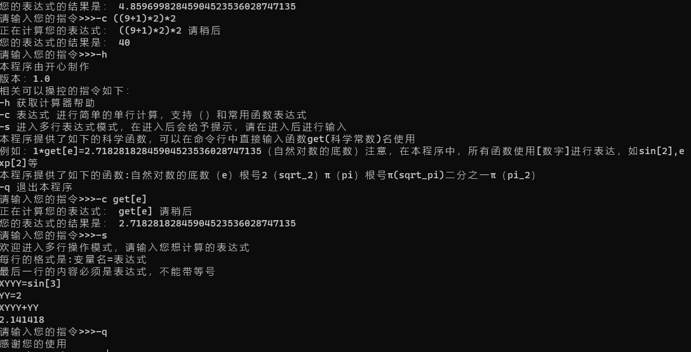
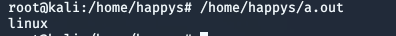

# CS205 C/C++ Programming Assignment 2
## 概况
##### 测试平台：windows10 x64 macOS 10.15 linux(kali)
##### 编码：UTF-8
##### C++标准：C++11
## 目录
- [设计思路与分析](#设计思路与分析)
- [代码](#代码)
- [测试结果](#测试结果)
- [亮点](#程序亮点)
## 设计思路与分析
本程序由于需要高精度运算，鉴于上次作业的方法具有一定局限性，所以本次我采用的是高精度的另一种算法，基本原理是通过对字符串输入分析，然后转换成int数组进行计算。  
本程序在设计的时候综合考虑了主流操作系统的不同，所以利用对操作系统的判断采取不同措施，从而实现了对不同系统进行不同的编译
```cpp
#if defined(__APPLE__)
# include <TargetConditionals.h>
#include <vector>
# if defined(TARGET_OS_MAC) && TARGET_OS_MAC
#   define MAC
# endif
#elif defined(__linux__) || defined(__linux)
#   define LINUX
#elif !defined(SAG_COM) && (defined(WIN32) || defined(_WIN32) || defined(__WIN32__) || defined(__NT__))
# define WIN32
#endif
string findout()
{
#if defined MAC
    return "mac";
#elif defined WIN32
    return "windows";
#elif defined LINUX
    return "linux";
#else
    return "unknown";
#endif
}
```
运行效果在平台上如下：      
windows平台    
    
Linux平台        
    
通过在不同操作系统环境下的实验，我得出了在中文版系统中只有window原生命令行不支持UTF-8的命令行输出，在macOS和Linux下均可以正常输出中文字符，所以我在判断完成后对windows操作系统进行了编码格式的更改
```cpp
void changetheconsle(){
    string sy=findout();
    if(sy=="windows"){
        system("chcp 65001");
    }
    if (sy=="unknown"){
        error(-1,__FILE_NAME__,__LINE__);
    }
    printf("您的系统是：%s\n",sy.c_str());
    printf("欢迎使用科学计算器中文版 版本号：1.0");
}
```
考虑到用户输入可能不只很短的式子，所以有可能存在现行scanf读取不够迅速等问题，采取了快速读取的方法（getchar）经过实验证明，这种方法可以比cin读取快数倍    
由于需要对不同的数据处理，原始代码量过于长，以至于难以维护，所以本次程序我将主程序和函数库加以分开，主程序内容如下：
```cpp
#include "main.h"
int main() {
    changethecnsle();
    mainloop();
}
```
所以本程序的主要部分在main.h文件下  
值得声明的是，本程序为了增强可读性，采取了从EA公司的源码学习的代码规范，在每个文件顶头会写明本文件的用途以及日前等信息，在每个模块采取了模块前注释的方法   
首先是基本对用户使用对提示信息，用户可以使用-q命令退出程序，且可以-h来获取帮助
```shell script
您的系统是：mac
欢迎使用科学计算器中文版 版本号：1.0本程序是一款高级智能的计算器，采用c++编写而成，通过控制台指令进行操控，如果您想获取帮助请输入-h，如果您想退出请输入-q
请输入您的指令>>>-h
本程序由开心制作
版本：1.0
相关可以操控的指令如下：
-h 获取计算器帮助
-c 表达式 进行简单的单行计算，支持（）和常用函数表达式
-s 进入多行表达式模式，在进入后会给予提示，请在进入后进行输入
-q 退出本程序
请输入您的指令>>>-q
感谢您的使用
```
对于主要运行部分我通过loop实现，从而保证在非严重错误情况下不会退出程序，为了增强可读性，增加了计算器类来保证代码的可读性。   
```cpp
void mainloop(){
    string cmd="";
    printf("本程序是一款高级智能的计算器，采用c++编写而成，通过控制台指令进行操控，如果您想获取帮助请输入-h，如果您想退出请输入-q\n");
    while (cmd!="-q"){
        printf("请输入您的指令>>>");
        cmd=readlinecmd();
        if (cmd[0]!='-'){
            error(-3,__FILE_NAME__,__LINE__);
            continue;
        } else if (cmd=="-h") gethelp();
        else if (cmd[1]=='c') onlyline(cmd);
        else if (cmd[1]=='s') multiline();
    }
    printf("感谢您的使用");
}
```
为了方便计算，提前定义了很多常见的科学函数
```cpp
#define M_exp "2.71828182845904523536028747135"
#define M_sqrt_2 "1.41421356237309504880168872421"
#define M_pi "3.14159265358979323846264338328"
#define M_sqrt_pi "1.77245385090551602729816748334"
#define M_pi_2 "1.57079632679489661923132169164"
```
通过流的操作实现了对科学计数法的处理，将可以对20位小数以内对数据进行精准处理，大于20位的则会报错，对于科学计数法负值如（1e-1）这种情况，我们最多在前面出现4个0，如果超过这个范围程序将会报错。   
例如（1e-4=0.0001)这种是合理的。   
```cpp
string doubletostr(long double num,int len){
        ostringstream out;
        if (len>20){
            return "wrong";
        }
        out.precision(len+1);
        out<<num;
        return out.str();
    }
    string changetonormal(string a1){
        int point=a1.find('e');
        string temp;
        for(int i=point+1;i<a1.length();i++){
            if(a1[i]<='9'&&a1[i]>='0') temp+=a1[i];
        }
        stringstream ss(a1),s2(temp);
        int len;
        long double d;
        ss>>d;
        s2>>len;
        if (a1.find('-')!=-1){
            int len2=a1.find('.');
            if (len-len2>3){return "wrong";}
        }
        return doubletostr(d,len);
    }
```
###这里是四则运算的板块内容说明
#### 加法
采取对浮点数可以精准运算的方法，通过上一次作业，可以很简单的对浮点数类型的方法进行运算，例如我们需要相加两个看似比较困难的数据   
1.0+9.99此时我们可以先查找数据中的.的位置，然后采取补0措施，同时对前面也采取补0，这样我们又转化成了之前的问题，从而实现了整个浮点数运算的方法   
相关代码如下：
```cpp
string addzeros(string str,int begin,int end){
    for (int i=begin;i<end;i++){
        str+="0";
    }
    return str;
}
string add(string a1,string a2){
    if (a1.find('.')==-1||a2.find('.')==-1){
        int a1len=a1.length()-a1.find('.')-1,a2len=a2.length()-a2.find('.')-1;
        if (a1.find('.')==-1){
            a1+='.';
            for (int i=0;i<a2len;i++){
                a1+='0';
            }
        } else if (a2.find('.')==-1){
            a2+='.';
            for (int i=0;i<a1len;i++){
                a2+='0';
            }
        } else if (a1len==a2len) {}
        else{
            if (a1len>a2len){
                for (int i=0;i<a1len-a2len;i++){
                    a1+='0';
                }
            } else{
                for (int i=0;i<a2len-a1len;i++){
                    a2+='0';
                }
            }
        }
        string temp= a1;
        for(int i=0;i<a1.length();++i){
            a1[i]=temp[a1.length()-i-1];
        }
        temp=a2;
        for(int i=0;i<a2.length();++i){
            a2[i]=temp[a2.length()-i-1];
        }
        a1+="0";a2+="0";
        int maxlength= a1.length()>a2.length()?a1.length():a2.length();
        a1.length()>a2.length()?a2=addzeros(a2,a2.length(),maxlength):a1=addzeros(a1,a1.length(),maxlength);
        string result,tempstr;
        int add;
        for(int i=0;i<maxlength;i++){
            add=a1[i]+a2[i]-'0'-'0';
            if (add>=10){
                if (a1[i+1]=='.'){
                    a1[i+2]+=1;
                    add-=10;
                    tempstr=(char(add) + '0');
                    result.insert(0, tempstr);
                    continue;
                }
                a1[i+1]+=1;
                add-=10;
            }
            tempstr=(char(add) + '0');
            result.insert(0, tempstr);
        }
        if(result[0]=='0'){
            result.erase(0,1);
        }
        return result;
    } else{
        string temp= a1;
        for(int i=0;i<a1.length();++i){
            a1[i]=temp[a1.length()-i-1];
        }
        temp=a2;
        for(int i=0;i<a2.length();++i){
            a2[i]=temp[a2.length()-i-1];
        }
        a1+="0";a2+="0";
        int maxlength= a1.length()>a2.length()?a1.length():a2.length();
        a1.length()>a2.length()?a2=addzeros(a2,a2.length(),maxlength):a1=addzeros(a1,a1.length(),maxlength);
        string result,tempstr;
        int add;
        for(int i=0;i<maxlength;i++){
            add=a1[i]+a2[i]-'0'-'0';
            if (add>=10){
                a1[i+1]+=1;
                add-=10;
            }
            tempstr=(char(add) + '0');
            result.insert(0, tempstr);
        }
        if(result[0]=='0'){
            result.erase(0,1);
        }
        return result;
    }
}
```
这里需要说明的是，此段代码参考了我上次的整数加法的方法，对于浮点数我采取的是当检测到小数点的时候直接跳过而将需要进位的数据向前移位，从而保证运算的准确性。
#### 减法
减法的思路和加法有所区别，主要是应该考虑前后两个数的大小差异，对于
#### 乘法
乘法原理告诉我们，乘以多少就相当于加多少次，所以乘法这里我直接是进行了循环相加来处理。
所以这样的实现是不能进行浮点数乘浮点数，只能进行浮点数乘以整数的实现    
这里对两个数进行了判断，将会对负负得正等情况进行判断。
```cpp
string multiple(string s1,string s2){
        if(s2.find('.')!=-1) {//浮点数乘法进行非精准计算
            string temp;
            long double a1=stod(s1),a2=stod(s2);
            temp=doubletostr(a1*a2,10);
            temp=delremin(temp);
            return temp;
        }
        long long needed=abs(stoll(s2));
        bool positve= true;
        if (s1[0]=='-'){
            string tmp="";
            for (long long i=1;i<s1.length();i++){
                tmp+=s1[i];
            }
            s1=tmp;
            positve= false;
        }
        if (needed<0){
            positve=(!positve);
        }
        string result="0",temp="0";
        for (long long i=0;i<needed;i++){
            temp=add(s1,temp);
        }
        temp=delremin(temp);
        if (positve){
            return temp;
        }
        result+='-';
        for (long long i=0;i<temp.length();i++){
            result+=temp[i];
        }
        return result;
    }
```
#### 除法
######目前尚未支持对除法的高精度运算
```cpp
string divide(string s1,string s2){
        long double a1=stold(s1),a2=stold(s2);
        string result= doubletostr(a1/a2,10);
        return delremin(result);
    }
```
### 其他科学函数
对于常用的科学函数，本程序并未实现更进一步的高精度计算，因为本身一部分的科学函数进行高精度计算是没有意义的，所以本程序对于绝大部分的函数都采取了使用原生C++库和一点优化的方法，其中三角函数等内容通过pi进行了伪高精度运算。
## 语法树分析
#### 对于单行计算，采取递归方法进行计算，利用对语法树的分析，从而对数据进行计算，优先计算括号内，然后再计算科学函数，然后是乘除法，最后进行加减计算，在计算时，会对负负得正的情况进行处理，从而简化计算。

#### 对于多行计算，采取类的方法进行处理，在处理这部分的时候调用了我上半年写的一个函数库的一部分，实现了仿照java的动态数组。

## 代码
```cpp

```
##测试结果
#### 对于不同平台的运行
Windows：

Linux：

macOS：

#### 单行复杂计算

#### 多行计算

## 程序亮点
- 多种平台的跨平台：可以自动识别几乎主流的三大操作系统（window平台，Linux平台和macOS平台）。
- 支持中文的输出：由于windows平台的限制，C++是不能直接在windows上输出中文的，但是本程序通过跨平台编译的方法实现了对windows平台上中的支持。
- 高精度的运算：通过直接使用计算机的字符串来操作数据从而实现了
- 快速读取用户输入：不使用cin而改用getchar的方法实现了对用户读取的快速录入，理论上会比cin的直接读取要快一倍以上。
- 多种模式：支持多种计算器模式运行。
- 科学计数法：本程序支持输入科学计数法的表达方法（例如：1e10）。
- 清晰的注释：采取仿照EA公司的注释规范，增强代码可读性。
- 更多的科学计算：参考了其他计算器的设计方法，实现了很多科学常数的存储，方便进行运算。