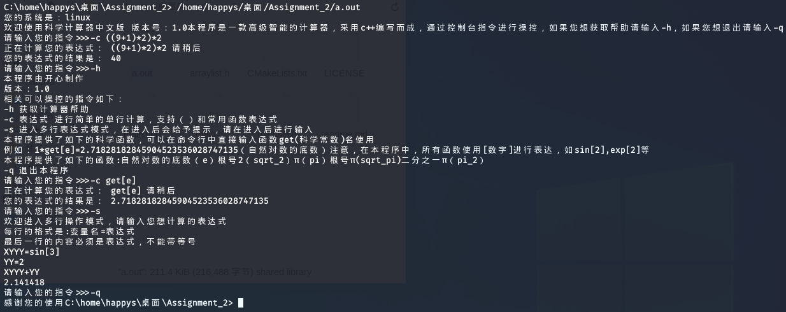

# CS205 C/C++ Programming Assignment 2
## 概况


##### 测试平台：`windows10 x64` `macOS 10.15` `linux(kali)`
##### 编码：`UTF-8`
##### C++标准：`C++11`
## 目录
- [设计思路与分析](#设计思路与分析)
- [代码](#代码)
- [测试结果](#测试结果)
- [亮点](#程序亮点)
## 设计思路与分析
本程序由于需要高精度运算，鉴于上次作业的方法具有一定局限性，所以本次我采用的是高精度的另一种算法，基本原理是通过对字符串输入分析。     
本程序在设计的时候综合考虑了主流操作系统的不同，所以利用对操作系统的判断采取不同措施，从而实现了对不同系统进行不同的编译
```cpp
/* 这部分函数负责对平台进行识别，如果发现是windows平台就会更改控制台为UTF-8编码，以此来实现中文支持
 * */
#if defined(__APPLE__)
# include <TargetConditionals.h>
#include <vector>

# if defined(TARGET_OS_MAC) && TARGET_OS_MAC
#   define MAC
# endif
#elif defined(__linux__) || defined(__linux)
#   define LINUX
#elif !defined(SAG_COM) && (defined(WIN32) || defined(_WIN32) || defined(__WIN32__) || defined(__NT__))
# define WIN32
#endif
string findout()
{
#if defined MAC
    return "mac";
#elif defined WIN32
#define __FILE_NAME__ __FILE__
    return "windows";
#elif defined LINUX
    return "linux";
#else
    return "unknown";
#endif
}
void changetheconsle(){
    string sy=findout();
    if(sy=="windows"){
        system("chcp 65001");
        system("cls");
    }
    if (sy=="unknown"){
        error(-1,__FILE_NAME__,__LINE__);
    }
    printf("您的系统是：%s\n",sy.c_str());
    printf("欢迎使用科学计算器中文版 版本号：1.0");
}
```
通过在不同操作系统环境下的实验，我得出了在中文版系统中只有window原生命令行不支持UTF-8的命令行输出，在macOS和Linux下均可以正常输出中文字符，所以我在判断完成后对windows操作系统进行了编码格式的更改
```cpp
void changetheconsle(){
    string sy=findout();
    if(sy=="windows"){
        system("chcp 65001");
    }
    if (sy=="unknown"){
        error(-1,__FILE_NAME__,__LINE__);
    }
    printf("您的系统是：%s\n",sy.c_str());
    printf("欢迎使用科学计算器中文版 版本号：1.0");
}
```
考虑到用户输入可能不只很短的式子，所以有可能存在现行scanf读取不够迅速等问题，采取了快速读取的方法（getchar）经过实验证明，这种方法可以比cin读取快数倍    
由于需要对不同的数据处理，原始代码量过于长，以至于难以维护，所以本次程序我将主程序和函数库加以分开，主程序内容如下：
```cpp
#include "main.h"
int main() {
    changethecnsle();
    mainloop();
}
```
所以本程序的主要部分在main.h文件下  
值得声明的是，本程序为了增强可读性，采取了从EA公司的源码学习的代码规范，在每个文件顶头会写明本文件的用途以及日前等信息，在每个模块采取了模块前注释的方法   
首先是基本对用户使用对提示信息，用户可以使用-q命令退出程序，且可以-h来获取帮助
```shell script
您的系统是：mac
欢迎使用科学计算器中文版 版本号：1.0本程序是一款高级智能的计算器，采用c++编写而成，通过控制台指令进行操控，如果您想获取帮助请输入-h，如果您想退出请输入-q
请输入您的指令>>>-h
本程序由开心制作
版本：1.0
相关可以操控的指令如下：
-h 获取计算器帮助
-c 表达式 进行简单的单行计算，支持（）和常用函数表达式
-s 进入多行表达式模式，在进入后会给予提示，请在进入后进行输入
-q 退出本程序
请输入您的指令>>>-q
感谢您的使用
```
对于主要运行部分我通过loop实现，从而保证在非严重错误情况下不会退出程序，为了增强可读性，增加了计算器类来保证代码的可读性。   
```cpp
void mainloop(){
    string cmd="";
    printf("本程序是一款高级智能的计算器，采用c++编写而成，通过控制台指令进行操控，如果您想获取帮助请输入-h，如果您想退出请输入-q\n");
    while (cmd!="-q"){
        printf("请输入您的指令>>>");
        cmd=readlinecmd();
        if (cmd[0]!='-'){
            error(-3,__FILE_NAME__,__LINE__);
            continue;
        } else if (cmd=="-h") gethelp();
        else if (cmd[1]=='c') onlyline(cmd);
        else if (cmd[1]=='s') multiline();
    }
    printf("感谢您的使用");
}
```
为了方便计算，提前定义了很多常见的科学函数
```cpp
#define M_exp "2.71828182845904523536028747135"
#define M_sqrt_2 "1.41421356237309504880168872421"
#define M_pi "3.14159265358979323846264338328"
#define M_sqrt_pi "1.77245385090551602729816748334"
#define M_pi_2 "1.57079632679489661923132169164"
```
通过流的操作实现了对科学计数法的处理，将可以对20位小数以内对数据进行精准处理，大于20位的则会报错，对于科学计数法负值如（1e-1）这种情况，我们最多在前面出现4个0，如果超过这个范围程序将会报错。   
例如（1e-4=0.0001)这种是合理的。   
```cpp
string doubletostr(long double num,int len){
        ostringstream out;
        if (len>20){
            return "wrong";
        }
        out.precision(len+1);
        out<<num;
        return out.str();
    }
    string changetonormal(string a1){
        int point=a1.find('e');
        string temp;
        for(int i=point+1;i<a1.length();i++){
            if(a1[i]<='9'&&a1[i]>='0') temp+=a1[i];
        }
        stringstream ss(a1),s2(temp);
        int len;
        long double d;
        ss>>d;
        s2>>len;
        if (a1.find('-')!=-1){
            int len2=a1.find('.');
            if (len-len2>3){return "wrong";}
        }
        return doubletostr(d,len);
    }
```
### 这里是四则运算的板块内容说明
#### 加法
采取对浮点数可以精准运算的方法，通过上一次作业，可以很简单的对浮点数类型的方法进行运算，例如我们需要相加两个看似比较困难的数据   
1.0+9.99此时我们可以先查找数据中的.的位置，然后采取补0措施，同时对前面也采取补0，这样我们又转化成了之前的问题，从而实现了整个浮点数运算的方法   
相关代码如下：
```cpp
string addzeros(string str,int begin,int end){
    for (int i=begin;i<end;i++){
        str+="0";
    }
    return str;
}
string add(string a1,string a2){
        int a1len=a1.length()-a1.find('.')-1,a2len=a2.length()-a2.find('.')-1;
        if (a1.find('.')==-1){
            a1+='.';
            for (int i=0;i<a2len;i++){
                a1+='0';
            }
        } else if (a2.find('.')==-1){
            a2+='.';
            for (int i=0;i<a1len;i++){
                a2+='0';
            }
        } else if (a1len==a2len) {}
        else{
            if (a1len>a2len){
                for (int i=0;i<a1len-a2len;i++){
                    a2+='0';
                }
            } else{
                for (int i=0;i<a2len-a1len;i++){
                    a1+='0';
                }
            }
        }
        string temp= a1;
        for(int i=0;i<a1.length();++i){
            a1[i]=temp[a1.length()-i-1];
        }
        temp=a2;
        for(int i=0;i<a2.length();++i){
            a2[i]=temp[a2.length()-i-1];
        }
        int maxlength= a1.length()>a2.length()?a1.length():a2.length();
        a1.length()>a2.length()?a2=addzeros(a2,a2.length(),maxlength):a1=addzeros(a1,a1.length(),maxlength);
        a1+="0";a2+="0";
        string result,tempstr;
        int add;
        for(int i=0;i<maxlength;i++){
            add=a1[i]+a2[i]-'0'-'0';
            if (add>=10){
                if (a1[i+1]=='.'){
                    a1[i+2]+=1;
                    add-=10;
                    tempstr=(char(add) + '0');
                    result.insert(0, tempstr);
                    result.insert(0,".");
                    i++;
                    continue;
                }
                a1[i+1]+=1;
                add-=10;
            }
            tempstr=(char(add) + '0');
            result.insert(0, tempstr);
        }
        if(result[0]=='0'){
            result.erase(0,1);
        }
        result=delremin(result);
        return result;
    }
```
这里需要说明的是，此段代码参考了我上次的整数加法的方法，对于浮点数我采取的是当检测到小数点的时候直接跳过而将需要进位的数据向前移位，从而保证运算的准确性。
#### 减法
减法的思想和加法相似，区别是需要在计算前对两个字符串全部进行比较，这里只需要考虑两个整数情况，对于存在负数的情况，会在语法树解析中进行处理    
首先需要对其大小比较
```cpp
 bool big(string str1,string str2){
         if(str1.find('.')>str2.find('.')){
             return true;
         }else if(str1.find('.')<str2.find('.')){
             return false;
         }else{
             int len1 = str1.length(),len2 = str2.length();
             int len=min(len1,len2);
             for(int i=0;i<len;i++){
                 if(str1<str2){
                     return false;
                 }
                 else if (str1>str2){
                     return true;
                 }
             }
             if (len1>len2) return true;
             else return false;
         }
     }
```
然后采取和加法相似的技巧进行运算
```cpp
string minusnum(string a1,string a2){
        bool positve;
        big(a1,a2)?positve=true:positve=false;
        int a1len=a1.length()-a1.find('.')-1,a2len=a2.length()-a2.find('.')-1;
        if (a1.find('.')==-1){
            a1+='.';
            for (int i=0;i<a2len;i++){
                a1+='0';
            }
        } else if (a2.find('.')==-1){
            a2+='.';
            for (int i=0;i<a1len;i++){
                a2+='0';
            }
        } else if (a1len==a2len) {}
        else{
            if (a1len>a2len){
                for (int i=0;i<a1len-a2len;i++){
                    a2+='0';
                }
            } else{
                for (int i=0;i<a2len-a1len;i++){
                    a1+='0';
                }
            }
        }
        if (!positve){
            string t=a1;
            a1=a2;
            a2=t;
        }
        string temp= a1;
        for(int i=0;i<a1.length();++i){
            a1[i]=temp[a1.length()-i-1];
        }
        temp=a2;
        for(int i=0;i<a2.length();++i){
            a2[i]=temp[a2.length()-i-1];
        }
        int maxlength= a1.length()>a2.length()?a1.length():a2.length();
        a1.length()>a2.length()?a2=addzeros(a2,a2.length(),maxlength):a1=addzeros(a1,a1.length(),maxlength);
        a1+="0";a2+="0";
        string result,tempstr;
        int add;
        for(int i=0;i<maxlength;i++){
            add=a1[i]-a2[i];
            if (add<0){
                if (a1[i+1]=='.'){
                    a1[i+2]-=1;
                    add+=10;
                    tempstr=(char(add) + '0');
                    result.insert(0, tempstr);
                    result.insert(0,".");
                    i++;
                    continue;
                }
                a1[i+1]-=1;
                add+=10;
            }
            if (a1[i+1]=='.'){
                tempstr=(char(add) + '0');
                result.insert(0, tempstr);
                result.insert(0,".");
                i++;
                continue;
            }
            tempstr=(char(add) + '0');
            result.insert(0, tempstr);
        }
        if(result[0]=='0'){
            result.erase(0,1);
        }
        result=delremin(result);
        if(positve) return result;
        result.insert(0,"-");
        return result;
    }
```
#### 乘法
乘法原理告诉我们，乘以多少就相当于加多少次，所以乘法这里我直接是进行了循环相加来处理。
所以这样的实现是不能进行浮点数乘浮点数，只能进行浮点数乘以整数的实现    
这里对两个数进行了判断，将会对负负得正等情况进行判断。
```cpp
string multiple(string s1,string s2){
        if(s2.find('.')!=-1) {//浮点数乘法进行非精准计算
            string temp;
            long double a1=stod(s1),a2=stod(s2);
            temp=doubletostr(a1*a2,10);
            temp=delremin(temp);
            return temp;
        }
        long long needed=abs(stoll(s2));
        bool positve= true;
        if (s1[0]=='-'){
            string tmp="";
            for (long long i=1;i<s1.length();i++){
                tmp+=s1[i];
            }
            s1=tmp;
            positve= false;
        }
        if (needed<0){
            positve=(!positve);
        }
        string result="0",temp="0";
        for (long long i=0;i<needed;i++){
            temp=add(s1,temp);
        }
        temp=delremin(temp);
        if (positve){
            return temp;
        }
        result+='-';
        for (long long i=0;i<temp.length();i++){
            result+=temp[i];
        }
        return result;
    }
```
#### 除法
###### 目前尚未支持对除法的高精度运算
```cpp
string divide(string s1,string s2){
        long double a1=stold(s1),a2=stold(s2);
        string result= doubletostr(a1/a2,10);
        return delremin(result);
    }
```
### 其他科学函数
对于常用的科学函数，本程序并未实现更进一步的高精度计算，因为本身一部分的科学函数进行高精度计算是没有意义的，所以本程序对于绝大部分的函数都采取了使用原生C++库和一点优化的方法，其中三角函数等内容通过pi进行了伪高精度运算。
这里我们实现了如下的函数   
**顺便这里需要说明一下的是，对于三角函数采用了查表法解决，降低运算量，提高准确度，表的内容从网上采取的现成查好的表**  
- sqrt[] 开根
- sin[] sin函数
- cos[] cos函数
- tan[] tan函数
- cot[] cot函数
- exp[] 自然指数
- pow[] 乘方
- fact[] 阶乘(只支持整数）
- abs[] 绝对值
- max[] 获取最大值
- min[] 获取最小值
- get[] 使用一个科学数值    
*本软件可以使用的科学数值使用方法如下，在get[]中输入如下内容即可调用*
- pi 圆周率
- sqrt_2 根号2
- e 自然对数底数
- sqrt_pi 根号下圆周率
- pi_2 圆周率一半
## 语法树分析
#### 对于单行计算，采取递归方法进行计算，利用对语法树的分析，从而对数据进行计算，优先计算括号内，然后再计算科学函数，然后是乘除法，最后进行加减计算，在计算时，会对负负得正的情况进行处理，从而简化计算。
这里实现的是一个对输入的详细分析   
_首先是对科学计数法进行处理_
```cpp
//处理科学计数法
//处理科学计数法
        int in=0;
        while (true){
            in=expression.find('e',in);
            if(in==-1) break;
            else{
                string num="",temp="";
                int left=0,right=expression.length();
                for(int i=in-1;i>=0;i--){
                    if((expression[i]>='0'&&expression[i]<='9')||expression[i]=='.'){
                        num = expression[i]+num;
                    }
                    else{
                        left=i+1;
                        break;
                    }
                }if(num==""){
                    in++;
                    continue;
                }
                num+="e";
                for(int i=in+1;i<expression.length();i++){
                    if((expression[i]>='0'&&expression[i]<='9')||expression[i]=='.'){
                        num += expression[i];
                    }
                    else{
                        right=i;
                        break;
                    }
                }
                expression=expression.replace(left,right-left,changetonormal(num));
            }
        }
```
接下来是对正负号处理，这里处理的是1+-2=1-2这种类似的情况
```cpp
//对正负号处理
        int index=0,index2=0;
        while (true){
            index=expression.find('+',index);
            index2=expression.find('-',index2);
            if(index==-1&&index2==-1) break;
            if(index!=-1){
                if(expression[index+1]!='+'&&expression[index+1]!='-') {index++; continue;}
                if(index==0){
                    if(expression[index+1]=='-') expression=expression.replace(0,2,"-");
                    else expression=expression.replace(0,2,"");
                }
                else{
                    if(expression[index+1]=='-') expression=expression.replace(index,2,"-");
                    else expression=expression.replace(index,2,"+");
                }
            }
            else if(index2!=-1){
                if(expression[index2+1]!='+'&&expression[index2+1]!='-') { index2++;continue;}
                if(index2==0){
                    if(expression[index2+1]=='-') expression=expression.replace(0,2,"");
                    else expression=expression.replace(0,2,"-");
                }
                else{
                    if(expression[index2+1]=='-') expression=expression.replace(index2,2,"+");
                    else expression=expression.replace(index2,2,"-");
                }
            }
        }
```
然后对剩余进行乘法除法处理
```cpp
while (true){
                string num1,num2,result;
                index=expression.find_first_of('*'),index2=expression.find_first_of('/');
                if(index==-1&&index2==-1) break;
                if(index==-1) index=expression.length();
                if(index2==-1) index2=expression.length();
                if(index<index2){
                    int po=0;
                    for(int i=index-1;i>=0;i--){
                        if(expression[i]>='0'&&expression[i]<='9'){
                            num1 =expression[i]+num1;
                            po=i;
                        } else break;
                    }for (int i=index+1;i<expression.length();i++){
                        if(expression[i]>='0'&&expression[i]<='9'||expression[i]=='-'){
                            num2 +=expression[i];
                        } else break;
                    }
                    if(num1.length()==0||num2.length()==0) error(9,__FILE_NAME__,__LINE__);
                    result=fun.multiple(num1,num2);
                    expression=expression.replace(po,num1.length()+num2.length()+1,result);
                }
                else{
                    int po=0;
                    for(int i=index2-1;i>=0;i--){
                        if(expression[i]>='0'&&expression[i]<='9'){
                            num1 =expression[i]+num1;
                            po=i;
                        } else break;
                    }
                    for (int i=index2+1;i<expression.length();i++){
                        if(expression[i]>='0'&&expression[i]<='9'){
                            num2 +=expression[i];
                        } else break;
                    }
                    if(num1.length()==0||num2.length()==0) error(9,__FILE_NAME__,__LINE__);
                    result=fun.divide(num1,num2);
                    expression=expression.replace(po,num1.length()+num2.length()+1,result);
                }
            }
```
最后对整个最终表达式进行一遍加减处理即可
```cpp
while (true) {
                string num1,num2,result;
                index=expression.find_first_of('+'),index2=expression.find_first_of('-');
                if(index<=0&&index2<=0) break;
                if(index==-1) index=expression.length();
                if(index2==-1) index2=expression.length();
                if(index<index2){
                    int po=0;
                    for(int i=index-1;i>=0;i--){
                        if(expression[i]>='0'&&expression[i]<='9'){
                            num1 =expression[i]+num1;
                            po=i;
                        } else break;
                    }for (int i=index+1;i<expression.length();i++){
                        if(expression[i]>='0'&&expression[i]<='9'){
                            num2 +=expression[i];
                        } else break;
                    }
                    if(num1.length()==0||num2.length()==0) error(9,__FILE_NAME__,__LINE__);
                    result=fun.add(num1,num2);
                    expression=expression.replace(po,num1.length()+num2.length()+1,result);
                }
                else{
                    int po=0;
                    for(int i=index2-1;i>=0;i--){
                        if(expression[i]>='0'&&expression[i]<='9'){
                            num1 =expression[i]+num1;
                            po=i;
                        } else break;
                    }
                    for (int i=index2+1;i<expression.length();i++){
                        if(expression[i]>='0'&&expression[i]<='9'){
                            num2 +=expression[i];
                        } else break;
                    }
                    if(num1.length()==0||num2.length()==0) error(9,__FILE_NAME__,__LINE__);
                    result=fun.minusnum(num1,num2);
                    expression=expression.replace(po,num1.length()+num2.length()+1,result);
                }
```
#### 对于多行计算，采取类的方法进行处理，在处理这部分的时候调用了我上半年写的一个函数库的一部分，实现了仿照java的动态数组。
这个库可以访问我上半年在CSDN的帖子，更多内容由于本次作业尚未涉及，所以这里我就没有把整个库的内容全部放出    
帖子地址：[C++中实现java的方法（二）](https://blog.csdn.net/u013441283/article/details/104188281)   
在每次记录的时候，会对其对value进行计算（相当于进行一次单行运算）然后将这个返回值传入该动态数组。     
最后进行最后一行的表达式计算，在运算前会进行遍历将所有未知数全部替换，然后进行一次单行运算
## 代码
*main.cpp*
```cpp
/* **********************************************************
 * Project name :Assignment 2
 * author: happys
 * date: 2020-9-23
 * file name: main.cpp
 * purpose : main function main entry of the program
 * **********************************************************/
#include "main.h"
using namespace std;
int main()
{
    changetheconsle();
    mainloop();
    return 0;
}
```
*arratlist.h*
```cpp
/* 本程序是参考Java迁移实现的一个动态数组库，由我在今年早期开发实现，在CSDN上可以找到我写的原文
 * */
//按照java原生ArrayList编写
// 由开心创建于2020年
//使用方法参考开发日志
// this method is from java original method called ArrayList
// made by happy on 2020
// please read the CAVA development logs
//version 1.0
//@email ：happys233@qq.com
#ifndef C___ARRAYLIST_H
#define C___ARRAYLIST_H
#include<iostream>
#include<string>
#include <sstream>
using namespace std;

template <class Object>
class ArrayList {
private:
    int DEFAULT_CAPACITY=10;
    int length =0;
    Object *arr=new Object[10];
    template<typename T> string TtoString(const T& t){
        ostringstream oss;
        oss<<t;
        return oss.str();
    }
    void makesure(){
        if(length==DEFAULT_CAPACITY){
            grow();
            if(length==DEFAULT_CAPACITY){
                DEFAULT_CAPACITY++;
                grow();
            }
        }
    }
    void grow(){
        DEFAULT_CAPACITY=DEFAULT_CAPACITY+(DEFAULT_CAPACITY>>1);
        Object* tmp=new Object[DEFAULT_CAPACITY];
        for (int i = 0; i <length; i++){
            tmp[i]=arr[i];
        }
        delete[] arr;
        arr=tmp;
    }
    int indexOfRange(Object o, int start, int end) {
        Object* tmp=clone();
        int i;
        if (o == NULL) {
            for(i = start; i < end; ++i) {
                if (tmp[i] == NULL) {
                    return i;
                }
            }
        } else {
            for(i = start; i < end; ++i) {
                if (o==tmp[i]) {
                    return i;
                }
            }
        }

        return -1;
    }
public :
    void replace(Object old, Object newobj) {
        for (int i=0;i<length;i++) {
            if (arr[i] == old) {
                arr[i]=newobj;
                return;
            }
        }
    }
    void replaceAll(Object old, Object newobj) {
        for (int i=0;i<length;i++) {
            if (arr[i] == old) {
                arr[i]=newobj;
            }
        }
    }
    void remove(int start, Object old, Object newobj) {
        if(start>=length||start<0) {
            string s="ArrayIndexOutOfBoundsException start: ";
            ostringstream oss;
            oss<<start;
            s.append(oss.str());
            s.append(", Size: ");
            ostringstream oss2;
            oss2<<length;
            s.append(oss2.str());
            cout<<s;
            exit(1);
        }
        for (int i=start; i<length;i++) {
            if (arr[i] == old) {
                arr[i]=newobj;
                return;
            }
        }
    }
    void trimToSize() {
        arr=clone();
        DEFAULT_CAPACITY=length;
    }
    bool contains(Object o) {
        return indexOf(o) >= 0;
    }
    Object* clone() {
        Object* o = new Object[length];
        for (int i = 0; i < length; i++){
            o[i]=arr[i];
        }
        return o;
    }
    bool isEmpty() {
        return length == 0;
    }
    int indexOf(Object o) {
        return indexOfRange(o, 0, length);
    }
    void add(Object t) {
        makesure();
        arr[length] = t;
        length++;
    }
    void add(int index, Object t) {
        if(index>length||index<0){
            string s="IndexOutOfBoundsException Index: ";
            ostringstream oss;
            oss<<index;
            s.append(oss.str());
            s.append(", Size: ");
            ostringstream oss2;
            oss2<<length;
            s.append(oss2.str());
            cout<<s;
            exit(1);
        }
        else if(index==length){
            add(t);
        }
        else{
            Object *ob;
            ob=new Object[length+1];
            for(int i=0;i<length+1;i++){
                if(i<index){
                    ob[i]=arr[i];
                }
                else if (i==index){
                    ob[index]=t;
                }
                else{
                    ob[i]=arr[i-1];
                }
            }
            delete[] arr;
            DEFAULT_CAPACITY++;
            arr=ob;
        }
        length++;
    }
    template  <class T>
    bool remove(T o) {
        for (int index = 0; index < length; index++){
            if (o==arr[index]) {
                remove(index);
                return true;
            }
        }
        return false;
    }
    void remove(int index){
        if(index>length||index<0){
            string s="IndexOutOfBoundsException Index: ";
            ostringstream oss;
            oss<<index;
            s.append(oss.str());
            s.append(", Size: ");
            ostringstream oss2;
            oss2<<length;
            s.append(oss2.str());
            cout<<s;
            exit(1);
        }
        else if(index==length){
            arr[index]=NULL;
        }
        else{
            for (int i = index; i <length-1 ; ++i) {
                arr[i]=arr[i+1];
            }
            arr[length]=NULL;
        }
        length--;
    }
    void set(int index, Object o){
        if (index>= length||index<0)
        {
            string s="ArrayIndexOutOfBoundsException Index: ";
            ostringstream oss;
            oss<<index;
            s.append(oss.str());
            s.append(", Size: ");
            ostringstream oss2;
            oss2<<length;
            s.append(oss2.str());
            cout<<s;
            exit(1);
        }
        else{
            arr[index]=o;
        }
    }
    int size() {
        return length;
    }
    void clear() {
        delete[] arr;
        DEFAULT_CAPACITY=10;
        length =0;
        arr=new Object[10];
    }
    Object get(int index) {
        if (index>= length||index<0)
        {
            string s="ArrayIndexOutOfBoundsException Index: ";
            ostringstream oss;
            oss<<index;
            s.append(oss.str());
            s.append(", Size: ");
            ostringstream oss2;
            oss2<<length;
            s.append(oss2.str());
            cout<<s;
            exit(1);
        }
        else
        {
            return arr[index];
        }
    }
    Object* toArray() {
        return arr;
    }
    string toString() {
        if (length==0)
        {
            string s2;
            s2="[]";
            return s2;
        }
        else
        {
            string s;
            s.append("[");
            int i=0;
            while(true){
                s.append(TtoString(get(i)));
                i++;
                if(i==length){
                    s.append("]");
                    return s;
                }
                s.append(", ");
            }
        }
    }
};
#endif //C___ARRAYLIST_H
```
*mathsin.h*
```cpp
#ifndef C___MATHSIN_H
#define C___MATHSIN_H
#include <cmath>
#define TableSize	8193
#define TWO_PI 		6.283185306
#define HALF_PI 	1.5707963265
extern const long double sinetable[8193];
extern long double lookup_sin (long double x);
extern long double lookup_cos (long double x);
extern long double lookup_tan (long double x);
extern long double lookup_cot (long double x);
const long double sinetable[8193] = {
        0.000000,0.000767,0.001534,0.002301,0.003068,0.003835,0.004602,0.005369,0.006136,0.006903,0.007670,0.008437,0.009204,0.009971,0.010738,0.011505,0.012272,0.013038,0.013805,0.014572,0.015339,0.016106,0.016873,0.017640,0.018407,0.019174,0.019940,0.020707,0.021474,0.022241,0.023008,0.023774,0.024541,
        0.025308,0.026075,0.026841,0.027608,0.028375,0.029142,0.029908,0.030675,0.031441,0.032208,0.032975,0.033741,0.034508,0.035274,0.036041,0.036807,0.037574,0.038340,0.039107,0.039873,0.040639,0.041406,0.042172,0.042938,0.043705,0.044471,0.045237,0.046003,0.046769,0.047535,0.048302,0.049068,
        0.049834,0.050600,0.051366,0.052132,0.052898,0.053664,0.054429,0.055195,0.055961,0.056727,0.057493,0.058258,0.059024,0.059790,0.060555,0.061321,0.062086,0.062852,0.063617,0.064383,0.065148,0.065913,0.066679,0.067444,0.068209,0.068974,0.069739,0.070505,0.071270,0.072035,0.072800,0.073565,
        0.074329,0.075094,0.075859,0.076624,0.077389,0.078153,0.078918,0.079682,0.080447,0.081211,0.081976,0.082740,0.083505,0.084269,0.085033,0.085797,0.086561,0.087326,0.088090,0.088854,0.089617,0.090381,0.091145,0.091909,0.092673,0.093436,0.094200,0.094963,0.095727,0.096490,0.097254,0.098017,
        0.098780,0.099544,0.100307,0.101070,0.101833,0.102596,0.103359,0.104122,0.104884,0.105647,0.106410,0.107172,0.107935,0.108697,0.109460,0.110222,0.110984,0.111747,0.112509,0.113271,0.114033,0.114795,0.115557,0.116319,0.117080,0.117842,0.118604,0.119365,0.120127,0.120888,0.121649,0.122411,
        0.123172,0.123933,0.124694,0.125455,0.126216,0.126977,0.127737,0.128498,0.129259,0.130019,0.130780,0.131540,0.132300,0.133061,0.133821,0.134581,0.135341,0.136101,0.136860,0.137620,0.138380,0.139139,0.139899,0.140658,0.141418,0.142177,0.142936,0.143695,0.144454,0.145213,0.145972,0.146730,
        0.147489,0.148248,0.149006,0.149765,0.150523,0.151281,0.152039,0.152797,0.153555,0.154313,0.155071,0.155828,0.156586,0.157343,0.158101,0.158858,0.159615,0.160372,0.161129,0.161886,0.162643,0.163400,0.164157,0.164913,0.165670,0.166426,0.167182,0.167938,0.168694,0.169450,0.170206,0.170962,
        0.171718,0.172473,0.173229,0.173984,0.174739,0.175494,0.176249,0.177004,0.177759,0.178514,0.179268,0.180023,0.180777,0.181532,0.182286,0.183040,0.183794,0.184548,0.185301,0.186055,0.186809,0.187562,0.188315,0.189069,0.189822,0.190575,0.191328,0.192080,0.192833,0.193586,0.194338,0.195090,
        0.195843,0.196595,0.197347,0.198098,0.198850,0.199602,0.200353,0.201105,0.201856,0.202607,0.203358,0.204109,0.204860,0.205610,0.206361,0.207111,0.207862,0.208612,0.209362,0.210112,0.210862,0.211611,0.212361,0.213110,0.213860,0.214609,0.215358,0.216107,0.216856,0.217604,0.218353,0.219101,
        0.219850,0.220598,0.221346,0.222094,0.222841,0.223589,0.224337,0.225084,0.225831,0.226578,0.227325,0.228072,0.228819,0.229565,0.230312,0.231058,0.231804,0.232550,0.233296,0.234042,0.234788,0.235533,0.236278,0.237024,0.237769,0.238514,0.239258,0.240003,0.240748,0.241492,0.242236,0.242980,
        0.243724,0.244468,0.245212,0.245955,0.246698,0.247442,0.248185,0.248928,0.249670,0.250413,0.251155,0.251898,0.252640,0.253382,0.254124,0.254866,0.255607,0.256349,0.257090,0.257831,0.258572,0.259313,0.260054,0.260794,0.261534,0.262275,0.263015,0.263755,0.264494,0.265234,0.265973,0.266713,
        0.267452,0.268191,0.268930,0.269668,0.270407,0.271145,0.271883,0.272621,0.273359,0.274097,0.274834,0.275572,0.276309,0.277046,0.277783,0.278520,0.279256,0.279993,0.280729,0.281465,0.282201,0.282937,0.283672,0.284408,0.285143,0.285878,0.286613,0.287347,0.288082,0.288816,0.289551,0.290285,
        0.291019,0.291752,0.292486,0.293219,0.293952,0.294685,0.295418,0.296151,0.296883,0.297616,0.298348,0.299080,0.299812,0.300543,0.301275,0.302006,0.302737,0.303468,0.304199,0.304929,0.305660,0.306390,0.307120,0.307850,0.308579,0.309309,0.310038,0.310767,0.311496,0.312225,0.312953,0.313682,
        0.314410,0.315138,0.315866,0.316593,0.317321,0.318048,0.318775,0.319502,0.320229,0.320955,0.321682,0.322408,0.323134,0.323859,0.324585,0.325310,0.326035,0.326760,0.327485,0.328210,0.328934,0.329658,0.330382,0.331106,0.331830,0.332553,0.333277,0.334000,0.334722,0.335445,0.336168,0.336890,
        0.337612,0.338334,0.339055,0.339777,0.340498,0.341219,0.341940,0.342661,0.343381,0.344101,0.344821,0.345541,0.346261,0.346980,0.347700,0.348419,0.349138,0.349856,0.350575,0.351293,0.352011,0.352729,0.353446,0.354164,0.354881,0.355598,0.356314,0.357031,0.357747,0.358463,0.359179,0.359895,
        0.360611,0.361326,0.362041,0.362756,0.363470,0.364185,0.364899,0.365613,0.366327,0.367040,0.367754,0.368467,0.369180,0.369892,0.370605,0.371317,0.372029,0.372741,0.373453,0.374164,0.374875,0.375586,0.376297,0.377007,0.377718,0.378428,0.379138,0.379847,0.380557,0.381266,0.381975,0.382683,
        0.383392,0.384100,0.384808,0.385516,0.386224,0.386931,0.387638,0.388345,0.389052,0.389758,0.390464,0.391170,0.391876,0.392582,0.393287,0.393992,0.394697,0.395401,0.396106,0.396810,0.397514,0.398218,0.398921,0.399624,0.400327,0.401030,0.401732,0.402435,0.403137,0.403838,0.404540,0.405241,
        0.405942,0.406643,0.407344,0.408044,0.408744,0.409444,0.410144,0.410843,0.411542,0.412241,0.412940,0.413638,0.414336,0.415034,0.415732,0.416430,0.417127,0.417824,0.418520,0.419217,0.419913,0.420609,0.421305,0.422000,0.422695,0.423390,0.424085,0.424780,0.425474,0.426168,0.426862,0.427555,
        0.428248,0.428941,0.429634,0.430326,0.431019,0.431711,0.432402,0.433094,0.433785,0.434476,0.435167,0.435857,0.436547,0.437237,0.437927,0.438616,0.439305,0.439994,0.440683,0.441371,0.442059,0.442747,0.443435,0.444122,0.444809,0.445496,0.446183,0.446869,0.447555,0.448241,0.448926,0.449611,
        0.450296,0.450981,0.451665,0.452350,0.453033,0.453717,0.454400,0.455084,0.455766,0.456449,0.457131,0.457813,0.458495,0.459177,0.459858,0.460539,0.461219,0.461900,0.462580,0.463260,0.463939,0.464619,0.465298,0.465976,0.466655,0.467333,0.468011,0.468689,0.469366,0.470043,0.470720,0.471397,
        0.472073,0.472749,0.473425,0.474100,0.474775,0.475450,0.476125,0.476799,0.477473,0.478147,0.478821,0.479494,0.480167,0.480839,0.481512,0.482184,0.482856,0.483527,0.484198,0.484869,0.485540,0.486210,0.486880,0.487550,0.488220,0.488889,0.489558,0.490226,0.490895,0.491563,0.492231,0.492898,
        0.493565,0.494232,0.494899,0.495565,0.496231,0.496897,0.497563,0.498228,0.498893,0.499557,0.500221,0.500885,0.501549,0.502212,0.502876,0.503538,0.504201,0.504863,0.505525,0.506187,0.506848,0.507509,0.508170,0.508830,0.509490,0.510150,0.510810,0.511469,0.512128,0.512786,0.513445,0.514103,
        0.514760,0.515418,0.516075,0.516732,0.517388,0.518045,0.518700,0.519356,0.520011,0.520666,0.521321,0.521975,0.522629,0.523283,0.523937,0.524590,0.525243,0.525895,0.526547,0.527199,0.527851,0.528502,0.529153,0.529804,0.530454,0.531104,0.531754,0.532403,0.533052,0.533701,0.534349,0.534998,
        0.535645,0.536293,0.536940,0.537587,0.538234,0.538880,0.539526,0.540171,0.540817,0.541462,0.542106,0.542751,0.543395,0.544039,0.544682,0.545325,0.545968,0.546610,0.547252,0.547894,0.548536,0.549177,0.549817,0.550458,0.551098,0.551738,0.552378,0.553017,0.553656,0.554294,0.554932,0.555570,
        0.556208,0.556845,0.557482,0.558119,0.558755,0.559391,0.560026,0.560662,0.561297,0.561931,0.562565,0.563199,0.563833,0.564466,0.565099,0.565732,0.566364,0.566996,0.567628,0.568259,0.568890,0.569521,0.570151,0.570781,0.571410,0.572040,0.572669,0.573297,0.573925,0.574553,0.575181,0.575808,
        0.576435,0.577062,0.577688,0.578314,0.578939,0.579565,0.580189,0.580814,0.581438,0.582062,0.582685,0.583309,0.583931,0.584554,0.585176,0.585798,0.586419,0.587040,0.587661,0.588282,0.588902,0.589521,0.590141,0.590760,0.591378,0.591997,0.592615,0.593232,0.593850,0.594466,0.595083,0.595699,
        0.596315,0.596931,0.597546,0.598161,0.598775,0.599389,0.600003,0.600616,0.601230,0.601842,0.602455,0.603067,0.603678,0.604290,0.604900,0.605511,0.606121,0.606731,0.607341,0.607950,0.608559,0.609167,0.609775,0.610383,0.610990,0.611597,0.612204,0.612810,0.613416,0.614022,0.614627,0.615232,
        0.615836,0.616440,0.617044,0.617647,0.618250,0.618853,0.619455,0.620057,0.620659,0.621260,0.621861,0.622461,0.623061,0.623661,0.624260,0.624859,0.625458,0.626056,0.626654,0.627252,0.627849,0.628446,0.629042,0.629638,0.630234,0.630829,0.631424,0.632019,0.632613,0.633207,0.633800,0.634393,
        0.634986,0.635578,0.636170,0.636762,0.637353,0.637944,0.638534,0.639124,0.639714,0.640303,0.640892,0.641481,0.642069,0.642657,0.643244,0.643832,0.644418,0.645005,0.645590,0.646176,0.646761,0.647346,0.647930,0.648514,0.649098,0.649681,0.650264,0.650847,0.651429,0.652011,0.652592,0.653173,
        0.653753,0.654334,0.654913,0.655493,0.656072,0.656651,0.657229,0.657807,0.658384,0.658961,0.659538,0.660114,0.660690,0.661266,0.661841,0.662416,0.662990,0.663564,0.664138,0.664711,0.665284,0.665856,0.666428,0.667000,0.667571,0.668142,0.668713,0.669283,0.669852,0.670422,0.670990,0.671559,
        0.672127,0.672695,0.673262,0.673829,0.674396,0.674962,0.675527,0.676093,0.676658,0.677222,0.677786,0.678350,0.678913,0.679476,0.680039,0.680601,0.681163,0.681724,0.682285,0.682846,0.683406,0.683965,0.684525,0.685084,0.685642,0.686200,0.686758,0.687315,0.687872,0.688429,0.688985,0.689541,
        0.690096,0.690651,0.691205,0.691759,0.692313,0.692866,0.693419,0.693971,0.694523,0.695075,0.695626,0.696177,0.696728,0.697278,0.697827,0.698376,0.698925,0.699473,0.700021,0.700569,0.701116,0.701663,0.702209,0.702755,0.703300,0.703845,0.704390,0.704934,0.705478,0.706021,0.706564,0.707107,
        0.707649,0.708191,0.708732,0.709273,0.709813,0.710353,0.710893,0.711432,0.711971,0.712509,0.713047,0.713585,0.714122,0.714659,0.715195,0.715731,0.716266,0.716801,0.717336,0.717870,0.718404,0.718937,0.719470,0.720003,0.720535,0.721066,0.721597,0.722128,0.722659,0.723188,0.723718,0.724247,
        0.724776,0.725304,0.725832,0.726359,0.726886,0.727413,0.727939,0.728464,0.728990,0.729514,0.730039,0.730563,0.731086,0.731609,0.732132,0.732654,0.733176,0.733697,0.734218,0.734739,0.735259,0.735779,0.736298,0.736817,0.737335,0.737853,0.738370,0.738887,0.739404,0.739920,0.740436,0.740951,
        0.741466,0.741980,0.742494,0.743008,0.743521,0.744034,0.744546,0.745058,0.745569,0.746080,0.746591,0.747101,0.747610,0.748119,0.748628,0.749136,0.749644,0.750152,0.750659,0.751165,0.751671,0.752177,0.752682,0.753187,0.753691,0.754195,0.754698,0.755201,0.755704,0.756206,0.756708,0.757209,
        0.757710,0.758210,0.758710,0.759209,0.759708,0.760207,0.760705,0.761202,0.761700,0.762196,0.762693,0.763188,0.763684,0.764179,0.764673,0.765167,0.765661,0.766154,0.766647,0.767139,0.767631,0.768122,0.768613,0.769103,0.769593,0.770083,0.770572,0.771061,0.771549,0.772036,0.772524,0.773010,
        0.773497,0.773983,0.774468,0.774953,0.775438,0.775922,0.776405,0.776888,0.777371,0.777853,0.778335,0.778817,0.779297,0.779778,0.780258,0.780737,0.781216,0.781695,0.782173,0.782651,0.783128,0.783605,0.784081,0.784557,0.785032,0.785507,0.785981,0.786455,0.786929,0.787402,0.787874,0.788346,
        0.788818,0.789289,0.789760,0.790230,0.790700,0.791169,0.791638,0.792107,0.792575,0.793042,0.793509,0.793975,0.794442,0.794907,0.795372,0.795837,0.796301,0.796765,0.797228,0.797691,0.798153,0.798615,0.799076,0.799537,0.799998,0.800458,0.800917,0.801376,0.801835,0.802293,0.802750,0.803208,
        0.803664,0.804120,0.804576,0.805031,0.805486,0.805940,0.806394,0.806848,0.807300,0.807753,0.808205,0.808656,0.809107,0.809558,0.810008,0.810457,0.810906,0.811355,0.811803,0.812251,0.812698,0.813144,0.813591,0.814036,0.814482,0.814926,0.815371,0.815814,0.816258,0.816701,0.817143,0.817585,
        0.818026,0.818467,0.818908,0.819348,0.819787,0.820226,0.820664,0.821103,0.821540,0.821977,0.822414,0.822850,0.823285,0.823721,0.824155,0.824589,0.825023,0.825456,0.825889,0.826321,0.826753,0.827184,0.827615,0.828045,0.828475,0.828904,0.829333,0.829761,0.830189,0.830616,0.831043,0.831470,
        0.831895,0.832321,0.832746,0.833170,0.833594,0.834018,0.834440,0.834863,0.835285,0.835706,0.836127,0.836548,0.836968,0.837387,0.837806,0.838225,0.838643,0.839060,0.839477,0.839894,0.840310,0.840725,0.841140,0.841555,0.841969,0.842383,0.842796,0.843208,0.843620,0.844032,0.844443,0.844854,
        0.845264,0.845673,0.846082,0.846491,0.846899,0.847307,0.847714,0.848120,0.848526,0.848932,0.849337,0.849742,0.850146,0.850549,0.850953,0.851355,0.851757,0.852159,0.852560,0.852961,0.853361,0.853760,0.854159,0.854558,0.854956,0.855354,0.855751,0.856147,0.856543,0.856939,0.857334,0.857729,
        0.858123,0.858516,0.858909,0.859302,0.859694,0.860085,0.860476,0.860867,0.861257,0.861646,0.862035,0.862424,0.862812,0.863199,0.863586,0.863973,0.864359,0.864744,0.865129,0.865514,0.865898,0.866281,0.866664,0.867046,0.867428,0.867809,0.868190,0.868571,0.868951,0.869330,0.869709,0.870087,
        0.870465,0.870842,0.871219,0.871595,0.871971,0.872346,0.872721,0.873095,0.873469,0.873842,0.874215,0.874587,0.874958,0.875329,0.875700,0.876070,0.876440,0.876809,0.877177,0.877545,0.877913,0.878280,0.878646,0.879012,0.879378,0.879743,0.880107,0.880471,0.880834,0.881197,0.881559,0.881921,
        0.882283,0.882643,0.883004,0.883363,0.883723,0.884081,0.884439,0.884797,0.885154,0.885511,0.885867,0.886223,0.886578,0.886932,0.887286,0.887640,0.887993,0.888345,0.888697,0.889048,0.889399,0.889750,0.890099,0.890449,0.890798,0.891146,0.891493,0.891841,0.892187,0.892534,0.892879,0.893224,
        0.893569,0.893913,0.894256,0.894599,0.894942,0.895284,0.895625,0.895966,0.896307,0.896646,0.896986,0.897325,0.897663,0.898001,0.898338,0.898674,0.899011,0.899346,0.899681,0.900016,0.900350,0.900683,0.901016,0.901349,0.901681,0.902012,0.902343,0.902673,0.903003,0.903332,0.903661,0.903989,
        0.904317,0.904644,0.904971,0.905297,0.905622,0.905947,0.906272,0.906596,0.906919,0.907242,0.907564,0.907886,0.908207,0.908528,0.908848,0.909168,0.909487,0.909806,0.910124,0.910441,0.910758,0.911075,0.911391,0.911706,0.912021,0.912335,0.912649,0.912962,0.913275,0.913587,0.913899,0.914210,
        0.914520,0.914830,0.915140,0.915449,0.915757,0.916065,0.916372,0.916679,0.916985,0.917291,0.917596,0.917901,0.918205,0.918508,0.918811,0.919114,0.919416,0.919717,0.920018,0.920318,0.920618,0.920917,0.921216,0.921514,0.921812,0.922109,0.922405,0.922701,0.922997,0.923291,0.923586,0.923880,
        0.924173,0.924465,0.924758,0.925049,0.925340,0.925631,0.925921,0.926210,0.926499,0.926787,0.927075,0.927363,0.927649,0.927935,0.928221,0.928506,0.928791,0.929075,0.929358,0.929641,0.929923,0.930205,0.930486,0.930767,0.931047,0.931327,0.931606,0.931884,0.932162,0.932440,0.932716,0.932993,
        0.933269,0.933544,0.933818,0.934093,0.934366,0.934639,0.934912,0.935184,0.935455,0.935726,0.935996,0.936266,0.936535,0.936803,0.937072,0.937339,0.937606,0.937872,0.938138,0.938404,0.938668,0.938932,0.939196,0.939459,0.939722,0.939984,0.940245,0.940506,0.940766,0.941026,0.941285,0.941544,
        0.941802,0.942060,0.942317,0.942573,0.942829,0.943084,0.943339,0.943593,0.943847,0.944100,0.944353,0.944605,0.944856,0.945107,0.945358,0.945607,0.945857,0.946105,0.946353,0.946601,0.946848,0.947094,0.947340,0.947586,0.947830,0.948075,0.948318,0.948561,0.948804,0.949046,0.949287,0.949528,
        0.949768,0.950008,0.950247,0.950486,0.950724,0.950962,0.951199,0.951435,0.951671,0.951906,0.952141,0.952375,0.952609,0.952842,0.953074,0.953306,0.953537,0.953768,0.953998,0.954228,0.954457,0.954686,0.954914,0.955141,0.955368,0.955594,0.955820,0.956045,0.956270,0.956494,0.956717,0.956940,
        0.957163,0.957385,0.957606,0.957826,0.958047,0.958266,0.958485,0.958703,0.958921,0.959139,0.959355,0.959572,0.959787,0.960002,0.960217,0.960431,0.960644,0.960857,0.961069,0.961280,0.961492,0.961702,0.961912,0.962121,0.962330,0.962538,0.962746,0.962953,0.963160,0.963366,0.963571,0.963776,
        0.963980,0.964184,0.964387,0.964590,0.964792,0.964993,0.965194,0.965394,0.965594,0.965793,0.965992,0.966190,0.966387,0.966584,0.966781,0.966976,0.967172,0.967366,0.967560,0.967754,0.967947,0.968139,0.968331,0.968522,0.968713,0.968903,0.969092,0.969281,0.969470,0.969657,0.969845,0.970031,
        0.970217,0.970403,0.970588,0.970772,0.970956,0.971139,0.971322,0.971504,0.971685,0.971866,0.972047,0.972226,0.972406,0.972584,0.972762,0.972940,0.973117,0.973293,0.973469,0.973644,0.973819,0.973993,0.974166,0.974339,0.974512,0.974684,0.974855,0.975025,0.975195,0.975365,0.975534,0.975702,
        0.975870,0.976037,0.976204,0.976370,0.976535,0.976700,0.976864,0.977028,0.977191,0.977354,0.977516,0.977677,0.977838,0.977999,0.978158,0.978317,0.978476,0.978634,0.978791,0.978948,0.979104,0.979260,0.979415,0.979570,0.979724,0.979877,0.980030,0.980182,0.980334,0.980485,0.980635,0.980785,
        0.980935,0.981083,0.981232,0.981379,0.981526,0.981673,0.981819,0.981964,0.982109,0.982253,0.982396,0.982539,0.982682,0.982824,0.982965,0.983105,0.983246,0.983385,0.983524,0.983662,0.983800,0.983937,0.984074,0.984210,0.984346,0.984480,0.984615,0.984749,0.984882,0.985014,0.985146,0.985278,
        0.985408,0.985539,0.985668,0.985798,0.985926,0.986054,0.986181,0.986308,0.986434,0.986560,0.986685,0.986809,0.986933,0.987057,0.987179,0.987301,0.987423,0.987544,0.987664,0.987784,0.987903,0.988022,0.988140,0.988258,0.988374,0.988491,0.988607,0.988722,0.988836,0.988950,0.989064,0.989177,
        0.989289,0.989400,0.989512,0.989622,0.989732,0.989841,0.989950,0.990058,0.990166,0.990273,0.990379,0.990485,0.990590,0.990695,0.990799,0.990903,0.991006,0.991108,0.991210,0.991311,0.991411,0.991511,0.991611,0.991710,0.991808,0.991906,0.992003,0.992099,0.992195,0.992291,0.992385,0.992480,
        0.992573,0.992666,0.992759,0.992850,0.992942,0.993032,0.993122,0.993212,0.993301,0.993389,0.993477,0.993564,0.993651,0.993737,0.993822,0.993907,0.993991,0.994075,0.994158,0.994240,0.994322,0.994404,0.994484,0.994565,0.994644,0.994723,0.994802,0.994879,0.994957,0.995033,0.995109,0.995185,
        0.995260,0.995334,0.995408,0.995481,0.995553,0.995625,0.995697,0.995767,0.995838,0.995907,0.995976,0.996045,0.996113,0.996180,0.996247,0.996313,0.996378,0.996443,0.996507,0.996571,0.996634,0.996697,0.996759,0.996820,0.996881,0.996941,0.997001,0.997060,0.997119,0.997176,0.997234,0.997290,
        0.997347,0.997402,0.997457,0.997511,0.997565,0.997618,0.997671,0.997723,0.997775,0.997825,0.997876,0.997925,0.997974,0.998023,0.998071,0.998118,0.998165,0.998211,0.998257,0.998302,0.998346,0.998390,0.998433,0.998476,0.998518,0.998559,0.998600,0.998640,0.998680,0.998719,0.998758,0.998795,
        0.998833,0.998870,0.998906,0.998941,0.998976,0.999011,0.999045,0.999078,0.999110,0.999142,0.999174,0.999205,0.999235,0.999265,0.999294,0.999322,0.999350,0.999378,0.999404,0.999431,0.999456,0.999481,0.999506,0.999529,0.999553,0.999575,0.999597,0.999619,0.999640,0.999660,0.999680,0.999699,
        0.999717,0.999735,0.999753,0.999769,0.999786,0.999801,0.999816,0.999831,0.999844,0.999858,0.999870,0.999882,0.999894,0.999905,0.999915,0.999925,0.999934,0.999942,0.999950,0.999958,0.999964,0.999971,0.999976,0.999981,0.999986,0.999989,0.999993,0.999995,0.999997,0.999999,1.000000,1.000000,
        1.000000,0.999999,0.999997,0.999995,0.999993,0.999989,0.999986,0.999981,0.999976,0.999971,0.999964,0.999958,0.999950,0.999942,0.999934,0.999925,0.999915,0.999905,0.999894,0.999882,0.999870,0.999858,0.999844,0.999831,0.999816,0.999801,0.999786,0.999769,0.999753,0.999735,0.999717,0.999699,
        0.999680,0.999660,0.999640,0.999619,0.999597,0.999575,0.999553,0.999529,0.999506,0.999481,0.999456,0.999431,0.999404,0.999378,0.999350,0.999322,0.999294,0.999265,0.999235,0.999205,0.999174,0.999142,0.999110,0.999078,0.999045,0.999011,0.998976,0.998941,0.998906,0.998870,0.998833,0.998795,
        0.998758,0.998719,0.998680,0.998640,0.998600,0.998559,0.998518,0.998476,0.998433,0.998390,0.998346,0.998302,0.998257,0.998211,0.998165,0.998118,0.998071,0.998023,0.997974,0.997925,0.997876,0.997825,0.997775,0.997723,0.997671,0.997618,0.997565,0.997511,0.997457,0.997402,0.997347,0.997290,
        0.997234,0.997176,0.997119,0.997060,0.997001,0.996941,0.996881,0.996820,0.996759,0.996697,0.996634,0.996571,0.996507,0.996443,0.996378,0.996313,0.996247,0.996180,0.996113,0.996045,0.995976,0.995907,0.995838,0.995767,0.995697,0.995625,0.995553,0.995481,0.995408,0.995334,0.995260,0.995185,
        0.995109,0.995033,0.994957,0.994879,0.994802,0.994723,0.994644,0.994565,0.994484,0.994404,0.994322,0.994240,0.994158,0.994075,0.993991,0.993907,0.993822,0.993737,0.993651,0.993564,0.993477,0.993389,0.993301,0.993212,0.993122,0.993032,0.992942,0.992850,0.992759,0.992666,0.992573,0.992480,
        0.992385,0.992291,0.992195,0.992099,0.992003,0.991906,0.991808,0.991710,0.991611,0.991511,0.991411,0.991311,0.991210,0.991108,0.991006,0.990903,0.990799,0.990695,0.990590,0.990485,0.990379,0.990273,0.990166,0.990058,0.989950,0.989841,0.989732,0.989622,0.989512,0.989400,0.989289,0.989177,
        0.989064,0.988950,0.988836,0.988722,0.988607,0.988491,0.988374,0.988258,0.988140,0.988022,0.987903,0.987784,0.987664,0.987544,0.987423,0.987301,0.987179,0.987057,0.986933,0.986809,0.986685,0.986560,0.986434,0.986308,0.986181,0.986054,0.985926,0.985798,0.985668,0.985539,0.985408,0.985278,
        0.985146,0.985014,0.984882,0.984749,0.984615,0.984480,0.984346,0.984210,0.984074,0.983937,0.983800,0.983662,0.983524,0.983385,0.983246,0.983105,0.982965,0.982824,0.982682,0.982539,0.982396,0.982253,0.982109,0.981964,0.981819,0.981673,0.981526,0.981379,0.981232,0.981083,0.980935,0.980785,
        0.980635,0.980485,0.980334,0.980182,0.980030,0.979877,0.979724,0.979570,0.979415,0.979260,0.979104,0.978948,0.978791,0.978634,0.978476,0.978317,0.978158,0.977999,0.977838,0.977677,0.977516,0.977354,0.977191,0.977028,0.976864,0.976700,0.976535,0.976370,0.976204,0.976037,0.975870,0.975702,
        0.975534,0.975365,0.975195,0.975025,0.974855,0.974684,0.974512,0.974339,0.974166,0.973993,0.973819,0.973644,0.973469,0.973293,0.973117,0.972940,0.972762,0.972584,0.972406,0.972226,0.972047,0.971866,0.971685,0.971504,0.971322,0.971139,0.970956,0.970772,0.970588,0.970403,0.970217,0.970031,
        0.969845,0.969657,0.969470,0.969281,0.969092,0.968903,0.968713,0.968522,0.968331,0.968139,0.967947,0.967754,0.967560,0.967366,0.967172,0.966976,0.966781,0.966584,0.966387,0.966190,0.965992,0.965793,0.965594,0.965394,0.965194,0.964993,0.964792,0.964590,0.964387,0.964184,0.963980,0.963776,
        0.963571,0.963366,0.963160,0.962953,0.962746,0.962538,0.962330,0.962121,0.961912,0.961702,0.961492,0.961280,0.961069,0.960857,0.960644,0.960431,0.960217,0.960002,0.959787,0.959572,0.959355,0.959139,0.958921,0.958703,0.958485,0.958266,0.958047,0.957826,0.957606,0.957385,0.957163,0.956940,
        0.956717,0.956494,0.956270,0.956045,0.955820,0.955594,0.955368,0.955141,0.954914,0.954686,0.954457,0.954228,0.953998,0.953768,0.953537,0.953306,0.953074,0.952842,0.952609,0.952375,0.952141,0.951906,0.951671,0.951435,0.951199,0.950962,0.950724,0.950486,0.950247,0.950008,0.949768,0.949528,
        0.949287,0.949046,0.948804,0.948561,0.948318,0.948075,0.947830,0.947586,0.947340,0.947094,0.946848,0.946601,0.946353,0.946105,0.945857,0.945607,0.945358,0.945107,0.944856,0.944605,0.944353,0.944100,0.943847,0.943593,0.943339,0.943084,0.942829,0.942573,0.942317,0.942060,0.941802,0.941544,
        0.941285,0.941026,0.940766,0.940506,0.940245,0.939984,0.939722,0.939459,0.939196,0.938932,0.938668,0.938404,0.938138,0.937872,0.937606,0.937339,0.937072,0.936803,0.936535,0.936266,0.935996,0.935726,0.935455,0.935184,0.934912,0.934639,0.934366,0.934093,0.933818,0.933544,0.933269,0.932993,
        0.932716,0.932440,0.932162,0.931884,0.931606,0.931327,0.931047,0.930767,0.930486,0.930205,0.929923,0.929641,0.929358,0.929075,0.928791,0.928506,0.928221,0.927935,0.927649,0.927363,0.927075,0.926787,0.926499,0.926210,0.925921,0.925631,0.925340,0.925049,0.924758,0.924465,0.924173,0.923880,
        0.923586,0.923291,0.922997,0.922701,0.922405,0.922109,0.921812,0.921514,0.921216,0.920917,0.920618,0.920318,0.920018,0.919717,0.919416,0.919114,0.918811,0.918508,0.918205,0.917901,0.917596,0.917291,0.916985,0.916679,0.916372,0.916065,0.915757,0.915449,0.915140,0.914830,0.914520,0.914210,
        0.913899,0.913587,0.913275,0.912962,0.912649,0.912335,0.912021,0.911706,0.911391,0.911075,0.910758,0.910441,0.910124,0.909806,0.909487,0.909168,0.908848,0.908528,0.908207,0.907886,0.907564,0.907242,0.906919,0.906596,0.906272,0.905947,0.905622,0.905297,0.904971,0.904644,0.904317,0.903989,
        0.903661,0.903332,0.903003,0.902673,0.902343,0.902012,0.901681,0.901349,0.901016,0.900683,0.900350,0.900016,0.899681,0.899346,0.899011,0.898674,0.898338,0.898001,0.897663,0.897325,0.896986,0.896646,0.896307,0.895966,0.895625,0.895284,0.894942,0.894599,0.894256,0.893913,0.893569,0.893224,
        0.892879,0.892534,0.892187,0.891841,0.891493,0.891146,0.890798,0.890449,0.890099,0.889750,0.889399,0.889048,0.888697,0.888345,0.887993,0.887640,0.887286,0.886932,0.886578,0.886223,0.885867,0.885511,0.885154,0.884797,0.884439,0.884081,0.883723,0.883363,0.883004,0.882643,0.882283,0.881921,
        0.881559,0.881197,0.880834,0.880471,0.880107,0.879743,0.879378,0.879012,0.878646,0.878280,0.877913,0.877545,0.877177,0.876809,0.876440,0.876070,0.875700,0.875329,0.874958,0.874587,0.874215,0.873842,0.873469,0.873095,0.872721,0.872346,0.871971,0.871595,0.871219,0.870842,0.870465,0.870087,
        0.869709,0.869330,0.868951,0.868571,0.868190,0.867809,0.867428,0.867046,0.866664,0.866281,0.865898,0.865514,0.865129,0.864744,0.864359,0.863973,0.863586,0.863199,0.862812,0.862424,0.862035,0.861646,0.861257,0.860867,0.860476,0.860085,0.859694,0.859302,0.858909,0.858516,0.858123,0.857729,
        0.857334,0.856939,0.856543,0.856147,0.855751,0.855354,0.854956,0.854558,0.854159,0.853760,0.853361,0.852961,0.852560,0.852159,0.851757,0.851355,0.850953,0.850549,0.850146,0.849742,0.849337,0.848932,0.848526,0.848120,0.847714,0.847307,0.846899,0.846491,0.846082,0.845673,0.845264,0.844854,
        0.844443,0.844032,0.843620,0.843208,0.842796,0.842383,0.841969,0.841555,0.841140,0.840725,0.840310,0.839894,0.839477,0.839060,0.838643,0.838225,0.837806,0.837387,0.836968,0.836548,0.836127,0.835706,0.835285,0.834863,0.834440,0.834018,0.833594,0.833170,0.832746,0.832321,0.831895,0.831470,
        0.831043,0.830616,0.830189,0.829761,0.829333,0.828904,0.828475,0.828045,0.827615,0.827184,0.826753,0.826321,0.825889,0.825456,0.825023,0.824589,0.824155,0.823721,0.823285,0.822850,0.822414,0.821977,0.821540,0.821103,0.820664,0.820226,0.819787,0.819348,0.818908,0.818467,0.818026,0.817585,
        0.817143,0.816701,0.816258,0.815814,0.815371,0.814926,0.814482,0.814036,0.813591,0.813144,0.812698,0.812251,0.811803,0.811355,0.810906,0.810457,0.810008,0.809558,0.809107,0.808656,0.808205,0.807753,0.807300,0.806848,0.806394,0.805940,0.805486,0.805031,0.804576,0.804120,0.803664,0.803208,
        0.802750,0.802293,0.801835,0.801376,0.800917,0.800458,0.799998,0.799537,0.799076,0.798615,0.798153,0.797691,0.797228,0.796765,0.796301,0.795837,0.795372,0.794907,0.794442,0.793975,0.793509,0.793042,0.792575,0.792107,0.791638,0.791169,0.790700,0.790230,0.789760,0.789289,0.788818,0.788346,
        0.787874,0.787402,0.786929,0.786455,0.785981,0.785507,0.785032,0.784557,0.784081,0.783605,0.783128,0.782651,0.782173,0.781695,0.781216,0.780737,0.780258,0.779778,0.779297,0.778817,0.778335,0.777853,0.777371,0.776888,0.776405,0.775922,0.775438,0.774953,0.774468,0.773983,0.773497,0.773010,
        0.772524,0.772036,0.771549,0.771061,0.770572,0.770083,0.769593,0.769103,0.768613,0.768122,0.767631,0.767139,0.766647,0.766154,0.765661,0.765167,0.764673,0.764179,0.763684,0.763188,0.762693,0.762196,0.761700,0.761202,0.760705,0.760207,0.759708,0.759209,0.758710,0.758210,0.757710,0.757209,
        0.756708,0.756206,0.755704,0.755201,0.754698,0.754195,0.753691,0.753187,0.752682,0.752177,0.751671,0.751165,0.750659,0.750152,0.749644,0.749136,0.748628,0.748119,0.747610,0.747101,0.746591,0.746080,0.745569,0.745058,0.744546,0.744034,0.743521,0.743008,0.742494,0.741980,0.741466,0.740951,
        0.740436,0.739920,0.739404,0.738887,0.738370,0.737853,0.737335,0.736817,0.736298,0.735779,0.735259,0.734739,0.734218,0.733697,0.733176,0.732654,0.732132,0.731609,0.731086,0.730563,0.730039,0.729514,0.728990,0.728464,0.727939,0.727413,0.726886,0.726359,0.725832,0.725304,0.724776,0.724247,
        0.723718,0.723188,0.722659,0.722128,0.721597,0.721066,0.720535,0.720003,0.719470,0.718937,0.718404,0.717870,0.717336,0.716801,0.716266,0.715731,0.715195,0.714659,0.714122,0.713585,0.713047,0.712509,0.711971,0.711432,0.710893,0.710353,0.709813,0.709273,0.708732,0.708191,0.707649,0.707107,
        0.706564,0.706021,0.705478,0.704934,0.704390,0.703845,0.703300,0.702755,0.702209,0.701663,0.701116,0.700569,0.700021,0.699473,0.698925,0.698376,0.697827,0.697278,0.696728,0.696177,0.695626,0.695075,0.694523,0.693971,0.693419,0.692866,0.692313,0.691759,0.691205,0.690651,0.690096,0.689541,
        0.688985,0.688429,0.687872,0.687315,0.686758,0.686200,0.685642,0.685084,0.684525,0.683965,0.683406,0.682846,0.682285,0.681724,0.681163,0.680601,0.680039,0.679476,0.678913,0.678350,0.677786,0.677222,0.676658,0.676093,0.675527,0.674962,0.674396,0.673829,0.673262,0.672695,0.672127,0.671559,
        0.670990,0.670422,0.669852,0.669283,0.668713,0.668142,0.667571,0.667000,0.666428,0.665856,0.665284,0.664711,0.664138,0.663564,0.662990,0.662416,0.661841,0.661266,0.660690,0.660114,0.659538,0.658961,0.658384,0.657807,0.657229,0.656651,0.656072,0.655493,0.654913,0.654334,0.653753,0.653173,
        0.652592,0.652011,0.651429,0.650847,0.650264,0.649681,0.649098,0.648514,0.647930,0.647346,0.646761,0.646176,0.645590,0.645005,0.644418,0.643832,0.643244,0.642657,0.642069,0.641481,0.640892,0.640303,0.639714,0.639124,0.638534,0.637944,0.637353,0.636762,0.636170,0.635578,0.634986,0.634393,
        0.633800,0.633207,0.632613,0.632019,0.631424,0.630829,0.630234,0.629638,0.629042,0.628446,0.627849,0.627252,0.626654,0.626056,0.625458,0.624859,0.624260,0.623661,0.623061,0.622461,0.621861,0.621260,0.620659,0.620057,0.619455,0.618853,0.618250,0.617647,0.617044,0.616440,0.615836,0.615232,
        0.614627,0.614022,0.613416,0.612810,0.612204,0.611597,0.610990,0.610383,0.609775,0.609167,0.608559,0.607950,0.607341,0.606731,0.606121,0.605511,0.604900,0.604290,0.603678,0.603067,0.602455,0.601842,0.601230,0.600616,0.600003,0.599389,0.598775,0.598161,0.597546,0.596931,0.596315,0.595699,
        0.595083,0.594466,0.593850,0.593232,0.592615,0.591997,0.591378,0.590760,0.590141,0.589521,0.588902,0.588282,0.587661,0.587040,0.586419,0.585798,0.585176,0.584554,0.583931,0.583309,0.582685,0.582062,0.581438,0.580814,0.580189,0.579565,0.578939,0.578314,0.577688,0.577062,0.576435,0.575808,
        0.575181,0.574553,0.573925,0.573297,0.572669,0.572040,0.571410,0.570781,0.570151,0.569521,0.568890,0.568259,0.567628,0.566996,0.566364,0.565732,0.565099,0.564466,0.563833,0.563199,0.562565,0.561931,0.561297,0.560662,0.560026,0.559391,0.558755,0.558119,0.557482,0.556845,0.556208,0.555570,
        0.554932,0.554294,0.553656,0.553017,0.552378,0.551738,0.551098,0.550458,0.549817,0.549177,0.548536,0.547894,0.547252,0.546610,0.545968,0.545325,0.544682,0.544039,0.543395,0.542751,0.542106,0.541462,0.540817,0.540171,0.539526,0.538880,0.538234,0.537587,0.536940,0.536293,0.535645,0.534998,
        0.534349,0.533701,0.533052,0.532403,0.531754,0.531104,0.530454,0.529804,0.529153,0.528502,0.527851,0.527199,0.526547,0.525895,0.525243,0.524590,0.523937,0.523283,0.522629,0.521975,0.521321,0.520666,0.520011,0.519356,0.518700,0.518045,0.517388,0.516732,0.516075,0.515418,0.514760,0.514103,
        0.513445,0.512786,0.512128,0.511469,0.510810,0.510150,0.509490,0.508830,0.508170,0.507509,0.506848,0.506187,0.505525,0.504863,0.504201,0.503538,0.502876,0.502212,0.501549,0.500885,0.500221,0.499557,0.498893,0.498228,0.497563,0.496897,0.496231,0.495565,0.494899,0.494232,0.493565,0.492898,
        0.492231,0.491563,0.490895,0.490226,0.489558,0.488889,0.488220,0.487550,0.486880,0.486210,0.485540,0.484869,0.484198,0.483527,0.482856,0.482184,0.481512,0.480839,0.480167,0.479494,0.478821,0.478147,0.477473,0.476799,0.476125,0.475450,0.474775,0.474100,0.473425,0.472749,0.472073,0.471397,
        0.470720,0.470043,0.469366,0.468689,0.468011,0.467333,0.466655,0.465976,0.465298,0.464619,0.463939,0.463260,0.462580,0.461900,0.461219,0.460539,0.459858,0.459177,0.458495,0.457813,0.457131,0.456449,0.455766,0.455084,0.454400,0.453717,0.453033,0.452350,0.451665,0.450981,0.450296,0.449611,
        0.448926,0.448241,0.447555,0.446869,0.446183,0.445496,0.444809,0.444122,0.443435,0.442747,0.442059,0.441371,0.440683,0.439994,0.439305,0.438616,0.437927,0.437237,0.436547,0.435857,0.435167,0.434476,0.433785,0.433094,0.432402,0.431711,0.431019,0.430326,0.429634,0.428941,0.428248,0.427555,
        0.426862,0.426168,0.425474,0.424780,0.424085,0.423390,0.422695,0.422000,0.421305,0.420609,0.419913,0.419217,0.418520,0.417824,0.417127,0.416430,0.415732,0.415034,0.414336,0.413638,0.412940,0.412241,0.411542,0.410843,0.410144,0.409444,0.408744,0.408044,0.407344,0.406643,0.405942,0.405241,
        0.404540,0.403838,0.403137,0.402435,0.401732,0.401030,0.400327,0.399624,0.398921,0.398218,0.397514,0.396810,0.396106,0.395401,0.394697,0.393992,0.393287,0.392582,0.391876,0.391170,0.390464,0.389758,0.389052,0.388345,0.387638,0.386931,0.386224,0.385516,0.384808,0.384100,0.383392,0.382683,
        0.381975,0.381266,0.380557,0.379847,0.379138,0.378428,0.377718,0.377007,0.376297,0.375586,0.374875,0.374164,0.373453,0.372741,0.372029,0.371317,0.370605,0.369892,0.369180,0.368467,0.367754,0.367040,0.366327,0.365613,0.364899,0.364185,0.363470,0.362756,0.362041,0.361326,0.360611,0.359895,
        0.359179,0.358463,0.357747,0.357031,0.356314,0.355598,0.354881,0.354164,0.353446,0.352729,0.352011,0.351293,0.350575,0.349856,0.349138,0.348419,0.347700,0.346980,0.346261,0.345541,0.344821,0.344101,0.343381,0.342661,0.341940,0.341219,0.340498,0.339777,0.339055,0.338334,0.337612,0.336890,
        0.336168,0.335445,0.334722,0.334000,0.333277,0.332553,0.331830,0.331106,0.330382,0.329658,0.328934,0.328210,0.327485,0.326760,0.326035,0.325310,0.324585,0.323859,0.323134,0.322408,0.321682,0.320955,0.320229,0.319502,0.318775,0.318048,0.317321,0.316593,0.315866,0.315138,0.314410,0.313682,
        0.312953,0.312225,0.311496,0.310767,0.310038,0.309309,0.308579,0.307850,0.307120,0.306390,0.305660,0.304929,0.304199,0.303468,0.302737,0.302006,0.301275,0.300543,0.299812,0.299080,0.298348,0.297616,0.296883,0.296151,0.295418,0.294685,0.293952,0.293219,0.292486,0.291752,0.291019,0.290285,
        0.289551,0.288816,0.288082,0.287347,0.286613,0.285878,0.285143,0.284408,0.283672,0.282937,0.282201,0.281465,0.280729,0.279993,0.279256,0.278520,0.277783,0.277046,0.276309,0.275572,0.274834,0.274097,0.273359,0.272621,0.271883,0.271145,0.270407,0.269668,0.268930,0.268191,0.267452,0.266713,
        0.265973,0.265234,0.264494,0.263755,0.263015,0.262275,0.261534,0.260794,0.260054,0.259313,0.258572,0.257831,0.257090,0.256349,0.255607,0.254866,0.254124,0.253382,0.252640,0.251898,0.251155,0.250413,0.249670,0.248928,0.248185,0.247442,0.246698,0.245955,0.245212,0.244468,0.243724,0.242980,
        0.242236,0.241492,0.240748,0.240003,0.239258,0.238514,0.237769,0.237024,0.236278,0.235533,0.234788,0.234042,0.233296,0.232550,0.231804,0.231058,0.230312,0.229565,0.228819,0.228072,0.227325,0.226578,0.225831,0.225084,0.224337,0.223589,0.222841,0.222094,0.221346,0.220598,0.219850,0.219101,
        0.218353,0.217604,0.216856,0.216107,0.215358,0.214609,0.213860,0.213110,0.212361,0.211611,0.210862,0.210112,0.209362,0.208612,0.207862,0.207111,0.206361,0.205610,0.204860,0.204109,0.203358,0.202607,0.201856,0.201105,0.200353,0.199602,0.198850,0.198098,0.197347,0.196595,0.195843,0.195090,
        0.194338,0.193586,0.192833,0.192080,0.191328,0.190575,0.189822,0.189069,0.188315,0.187562,0.186809,0.186055,0.185301,0.184548,0.183794,0.183040,0.182286,0.181532,0.180777,0.180023,0.179268,0.178514,0.177759,0.177004,0.176249,0.175494,0.174739,0.173984,0.173229,0.172473,0.171718,0.170962,
        0.170206,0.169450,0.168694,0.167938,0.167182,0.166426,0.165670,0.164913,0.164157,0.163400,0.162643,0.161886,0.161129,0.160372,0.159615,0.158858,0.158101,0.157343,0.156586,0.155828,0.155071,0.154313,0.153555,0.152797,0.152039,0.151281,0.150523,0.149765,0.149006,0.148248,0.147489,0.146730,
        0.145972,0.145213,0.144454,0.143695,0.142936,0.142177,0.141418,0.140658,0.139899,0.139139,0.138380,0.137620,0.136860,0.136101,0.135341,0.134581,0.133821,0.133061,0.132300,0.131540,0.130780,0.130019,0.129259,0.128498,0.127737,0.126977,0.126216,0.125455,0.124694,0.123933,0.123172,0.122411,
        0.121649,0.120888,0.120127,0.119365,0.118604,0.117842,0.117080,0.116319,0.115557,0.114795,0.114033,0.113271,0.112509,0.111747,0.110984,0.110222,0.109460,0.108697,0.107935,0.107172,0.106410,0.105647,0.104884,0.104122,0.103359,0.102596,0.101833,0.101070,0.100307,0.099544,0.098780,0.098017,
        0.097254,0.096490,0.095727,0.094963,0.094200,0.093436,0.092673,0.091909,0.091145,0.090381,0.089617,0.088854,0.088090,0.087326,0.086561,0.085797,0.085033,0.084269,0.083505,0.082740,0.081976,0.081211,0.080447,0.079682,0.078918,0.078153,0.077389,0.076624,0.075859,0.075094,0.074329,0.073565,
        0.072800,0.072035,0.071270,0.070505,0.069739,0.068974,0.068209,0.067444,0.066679,0.065913,0.065148,0.064383,0.063617,0.062852,0.062086,0.061321,0.060555,0.059790,0.059024,0.058258,0.057493,0.056727,0.055961,0.055195,0.054429,0.053664,0.052898,0.052132,0.051366,0.050600,0.049834,0.049068,
        0.048302,0.047535,0.046769,0.046003,0.045237,0.044471,0.043705,0.042938,0.042172,0.041406,0.040639,0.039873,0.039107,0.038340,0.037574,0.036807,0.036041,0.035274,0.034508,0.033741,0.032975,0.032208,0.031441,0.030675,0.029908,0.029142,0.028375,0.027608,0.026841,0.026075,0.025308,0.024541,
        0.023774,0.023008,0.022241,0.021474,0.020707,0.019940,0.019174,0.018407,0.017640,0.016873,0.016106,0.015339,0.014572,0.013805,0.013038,0.012272,0.011505,0.010738,0.009971,0.009204,0.008437,0.007670,0.006903,0.006136,0.005369,0.004602,0.003835,0.003068,0.002301,0.001534,0.000767,0.000000,
        -0.000767,-0.001534,-0.002301,-0.003068,-0.003835,-0.004602,-0.005369,-0.006136,-0.006903,-0.007670,-0.008437,-0.009204,-0.009971,-0.010738,-0.011505,-0.012272,-0.013038,-0.013805,-0.014572,-0.015339,-0.016106,-0.016873,-0.017640,-0.018407,-0.019174,-0.019940,-0.020707,-0.021474,-0.022241,-0.023008,-0.023774,-0.024541,
        -0.025308,-0.026075,-0.026841,-0.027608,-0.028375,-0.029142,-0.029908,-0.030675,-0.031441,-0.032208,-0.032975,-0.033741,-0.034508,-0.035274,-0.036041,-0.036807,-0.037574,-0.038340,-0.039107,-0.039873,-0.040639,-0.041406,-0.042172,-0.042938,-0.043705,-0.044471,-0.045237,-0.046003,-0.046769,-0.047535,-0.048302,-0.049068,
        -0.049834,-0.050600,-0.051366,-0.052132,-0.052898,-0.053664,-0.054429,-0.055195,-0.055961,-0.056727,-0.057493,-0.058258,-0.059024,-0.059790,-0.060555,-0.061321,-0.062086,-0.062852,-0.063617,-0.064383,-0.065148,-0.065913,-0.066679,-0.067444,-0.068209,-0.068974,-0.069739,-0.070505,-0.071270,-0.072035,-0.072800,-0.073565,
        -0.074329,-0.075094,-0.075859,-0.076624,-0.077389,-0.078153,-0.078918,-0.079682,-0.080447,-0.081211,-0.081976,-0.082740,-0.083505,-0.084269,-0.085033,-0.085797,-0.086561,-0.087326,-0.088090,-0.088854,-0.089617,-0.090381,-0.091145,-0.091909,-0.092673,-0.093436,-0.094200,-0.094963,-0.095727,-0.096490,-0.097254,-0.098017,
        -0.098780,-0.099544,-0.100307,-0.101070,-0.101833,-0.102596,-0.103359,-0.104122,-0.104884,-0.105647,-0.106410,-0.107172,-0.107935,-0.108697,-0.109460,-0.110222,-0.110984,-0.111747,-0.112509,-0.113271,-0.114033,-0.114795,-0.115557,-0.116319,-0.117080,-0.117842,-0.118604,-0.119365,-0.120127,-0.120888,-0.121649,-0.122411,
        -0.123172,-0.123933,-0.124694,-0.125455,-0.126216,-0.126977,-0.127737,-0.128498,-0.129259,-0.130019,-0.130780,-0.131540,-0.132300,-0.133061,-0.133821,-0.134581,-0.135341,-0.136101,-0.136860,-0.137620,-0.138380,-0.139139,-0.139899,-0.140658,-0.141418,-0.142177,-0.142936,-0.143695,-0.144454,-0.145213,-0.145972,-0.146730,
        -0.147489,-0.148248,-0.149006,-0.149765,-0.150523,-0.151281,-0.152039,-0.152797,-0.153555,-0.154313,-0.155071,-0.155828,-0.156586,-0.157343,-0.158101,-0.158858,-0.159615,-0.160372,-0.161129,-0.161886,-0.162643,-0.163400,-0.164157,-0.164913,-0.165670,-0.166426,-0.167182,-0.167938,-0.168694,-0.169450,-0.170206,-0.170962,
        -0.171718,-0.172473,-0.173229,-0.173984,-0.174739,-0.175494,-0.176249,-0.177004,-0.177759,-0.178514,-0.179268,-0.180023,-0.180777,-0.181532,-0.182286,-0.183040,-0.183794,-0.184548,-0.185301,-0.186055,-0.186809,-0.187562,-0.188315,-0.189069,-0.189822,-0.190575,-0.191328,-0.192080,-0.192833,-0.193586,-0.194338,-0.195090,
        -0.195843,-0.196595,-0.197347,-0.198098,-0.198850,-0.199602,-0.200353,-0.201105,-0.201856,-0.202607,-0.203358,-0.204109,-0.204860,-0.205610,-0.206361,-0.207111,-0.207862,-0.208612,-0.209362,-0.210112,-0.210862,-0.211611,-0.212361,-0.213110,-0.213860,-0.214609,-0.215358,-0.216107,-0.216856,-0.217604,-0.218353,-0.219101,
        -0.219850,-0.220598,-0.221346,-0.222094,-0.222841,-0.223589,-0.224337,-0.225084,-0.225831,-0.226578,-0.227325,-0.228072,-0.228819,-0.229565,-0.230312,-0.231058,-0.231804,-0.232550,-0.233296,-0.234042,-0.234788,-0.235533,-0.236278,-0.237024,-0.237769,-0.238514,-0.239258,-0.240003,-0.240748,-0.241492,-0.242236,-0.242980,
        -0.243724,-0.244468,-0.245212,-0.245955,-0.246698,-0.247442,-0.248185,-0.248928,-0.249670,-0.250413,-0.251155,-0.251898,-0.252640,-0.253382,-0.254124,-0.254866,-0.255607,-0.256349,-0.257090,-0.257831,-0.258572,-0.259313,-0.260054,-0.260794,-0.261534,-0.262275,-0.263015,-0.263755,-0.264494,-0.265234,-0.265973,-0.266713,
        -0.267452,-0.268191,-0.268930,-0.269668,-0.270407,-0.271145,-0.271883,-0.272621,-0.273359,-0.274097,-0.274834,-0.275572,-0.276309,-0.277046,-0.277783,-0.278520,-0.279256,-0.279993,-0.280729,-0.281465,-0.282201,-0.282937,-0.283672,-0.284408,-0.285143,-0.285878,-0.286613,-0.287347,-0.288082,-0.288816,-0.289551,-0.290285,
        -0.291019,-0.291752,-0.292486,-0.293219,-0.293952,-0.294685,-0.295418,-0.296151,-0.296883,-0.297616,-0.298348,-0.299080,-0.299812,-0.300543,-0.301275,-0.302006,-0.302737,-0.303468,-0.304199,-0.304929,-0.305660,-0.306390,-0.307120,-0.307850,-0.308579,-0.309309,-0.310038,-0.310767,-0.311496,-0.312225,-0.312953,-0.313682,
        -0.314410,-0.315138,-0.315866,-0.316593,-0.317321,-0.318048,-0.318775,-0.319502,-0.320229,-0.320955,-0.321682,-0.322408,-0.323134,-0.323859,-0.324585,-0.325310,-0.326035,-0.326760,-0.327485,-0.328210,-0.328934,-0.329658,-0.330382,-0.331106,-0.331830,-0.332553,-0.333277,-0.334000,-0.334722,-0.335445,-0.336168,-0.336890,
        -0.337612,-0.338334,-0.339055,-0.339777,-0.340498,-0.341219,-0.341940,-0.342661,-0.343381,-0.344101,-0.344821,-0.345541,-0.346261,-0.346980,-0.347700,-0.348419,-0.349138,-0.349856,-0.350575,-0.351293,-0.352011,-0.352729,-0.353446,-0.354164,-0.354881,-0.355598,-0.356314,-0.357031,-0.357747,-0.358463,-0.359179,-0.359895,
        -0.360611,-0.361326,-0.362041,-0.362756,-0.363470,-0.364185,-0.364899,-0.365613,-0.366327,-0.367040,-0.367754,-0.368467,-0.369180,-0.369892,-0.370605,-0.371317,-0.372029,-0.372741,-0.373453,-0.374164,-0.374875,-0.375586,-0.376297,-0.377007,-0.377718,-0.378428,-0.379138,-0.379847,-0.380557,-0.381266,-0.381975,-0.382683,
        -0.383392,-0.384100,-0.384808,-0.385516,-0.386224,-0.386931,-0.387638,-0.388345,-0.389052,-0.389758,-0.390464,-0.391170,-0.391876,-0.392582,-0.393287,-0.393992,-0.394697,-0.395401,-0.396106,-0.396810,-0.397514,-0.398218,-0.398921,-0.399624,-0.400327,-0.401030,-0.401732,-0.402435,-0.403137,-0.403838,-0.404540,-0.405241,
        -0.405942,-0.406643,-0.407344,-0.408044,-0.408744,-0.409444,-0.410144,-0.410843,-0.411542,-0.412241,-0.412940,-0.413638,-0.414336,-0.415034,-0.415732,-0.416430,-0.417127,-0.417824,-0.418520,-0.419217,-0.419913,-0.420609,-0.421305,-0.422000,-0.422695,-0.423390,-0.424085,-0.424780,-0.425474,-0.426168,-0.426862,-0.427555,
        -0.428248,-0.428941,-0.429634,-0.430326,-0.431019,-0.431711,-0.432402,-0.433094,-0.433785,-0.434476,-0.435167,-0.435857,-0.436547,-0.437237,-0.437927,-0.438616,-0.439305,-0.439994,-0.440683,-0.441371,-0.442059,-0.442747,-0.443435,-0.444122,-0.444809,-0.445496,-0.446183,-0.446869,-0.447555,-0.448241,-0.448926,-0.449611,
        -0.450296,-0.450981,-0.451665,-0.452350,-0.453033,-0.453717,-0.454400,-0.455084,-0.455766,-0.456449,-0.457131,-0.457813,-0.458495,-0.459177,-0.459858,-0.460539,-0.461219,-0.461900,-0.462580,-0.463260,-0.463939,-0.464619,-0.465298,-0.465976,-0.466655,-0.467333,-0.468011,-0.468689,-0.469366,-0.470043,-0.470720,-0.471397,
        -0.472073,-0.472749,-0.473425,-0.474100,-0.474775,-0.475450,-0.476125,-0.476799,-0.477473,-0.478147,-0.478821,-0.479494,-0.480167,-0.480839,-0.481512,-0.482184,-0.482856,-0.483527,-0.484198,-0.484869,-0.485540,-0.486210,-0.486880,-0.487550,-0.488220,-0.488889,-0.489558,-0.490226,-0.490895,-0.491563,-0.492231,-0.492898,
        -0.493565,-0.494232,-0.494899,-0.495565,-0.496231,-0.496897,-0.497563,-0.498228,-0.498893,-0.499557,-0.500221,-0.500885,-0.501549,-0.502212,-0.502876,-0.503538,-0.504201,-0.504863,-0.505525,-0.506187,-0.506848,-0.507509,-0.508170,-0.508830,-0.509490,-0.510150,-0.510810,-0.511469,-0.512128,-0.512786,-0.513445,-0.514103,
        -0.514760,-0.515418,-0.516075,-0.516732,-0.517388,-0.518045,-0.518700,-0.519356,-0.520011,-0.520666,-0.521321,-0.521975,-0.522629,-0.523283,-0.523937,-0.524590,-0.525243,-0.525895,-0.526547,-0.527199,-0.527851,-0.528502,-0.529153,-0.529804,-0.530454,-0.531104,-0.531754,-0.532403,-0.533052,-0.533701,-0.534349,-0.534998,
        -0.535645,-0.536293,-0.536940,-0.537587,-0.538234,-0.538880,-0.539526,-0.540171,-0.540817,-0.541462,-0.542106,-0.542751,-0.543395,-0.544039,-0.544682,-0.545325,-0.545968,-0.546610,-0.547252,-0.547894,-0.548536,-0.549177,-0.549817,-0.550458,-0.551098,-0.551738,-0.552378,-0.553017,-0.553656,-0.554294,-0.554932,-0.555570,
        -0.556208,-0.556845,-0.557482,-0.558119,-0.558755,-0.559391,-0.560026,-0.560662,-0.561297,-0.561931,-0.562565,-0.563199,-0.563833,-0.564466,-0.565099,-0.565732,-0.566364,-0.566996,-0.567628,-0.568259,-0.568890,-0.569521,-0.570151,-0.570781,-0.571410,-0.572040,-0.572669,-0.573297,-0.573925,-0.574553,-0.575181,-0.575808,
        -0.576435,-0.577062,-0.577688,-0.578314,-0.578939,-0.579565,-0.580189,-0.580814,-0.581438,-0.582062,-0.582685,-0.583309,-0.583931,-0.584554,-0.585176,-0.585798,-0.586419,-0.587040,-0.587661,-0.588282,-0.588902,-0.589521,-0.590141,-0.590760,-0.591378,-0.591997,-0.592615,-0.593232,-0.593850,-0.594466,-0.595083,-0.595699,
        -0.596315,-0.596931,-0.597546,-0.598161,-0.598775,-0.599389,-0.600003,-0.600616,-0.601230,-0.601842,-0.602455,-0.603067,-0.603678,-0.604290,-0.604900,-0.605511,-0.606121,-0.606731,-0.607341,-0.607950,-0.608559,-0.609167,-0.609775,-0.610383,-0.610990,-0.611597,-0.612204,-0.612810,-0.613416,-0.614022,-0.614627,-0.615232,
        -0.615836,-0.616440,-0.617044,-0.617647,-0.618250,-0.618853,-0.619455,-0.620057,-0.620659,-0.621260,-0.621861,-0.622461,-0.623061,-0.623661,-0.624260,-0.624859,-0.625458,-0.626056,-0.626654,-0.627252,-0.627849,-0.628446,-0.629042,-0.629638,-0.630234,-0.630829,-0.631424,-0.632019,-0.632613,-0.633207,-0.633800,-0.634393,
        -0.634986,-0.635578,-0.636170,-0.636762,-0.637353,-0.637944,-0.638534,-0.639124,-0.639714,-0.640303,-0.640892,-0.641481,-0.642069,-0.642657,-0.643244,-0.643832,-0.644418,-0.645005,-0.645590,-0.646176,-0.646761,-0.647346,-0.647930,-0.648514,-0.649098,-0.649681,-0.650264,-0.650847,-0.651429,-0.652011,-0.652592,-0.653173,
        -0.653753,-0.654334,-0.654913,-0.655493,-0.656072,-0.656651,-0.657229,-0.657807,-0.658384,-0.658961,-0.659538,-0.660114,-0.660690,-0.661266,-0.661841,-0.662416,-0.662990,-0.663564,-0.664138,-0.664711,-0.665284,-0.665856,-0.666428,-0.667000,-0.667571,-0.668142,-0.668713,-0.669283,-0.669852,-0.670422,-0.670990,-0.671559,
        -0.672127,-0.672695,-0.673262,-0.673829,-0.674396,-0.674962,-0.675527,-0.676093,-0.676658,-0.677222,-0.677786,-0.678350,-0.678913,-0.679476,-0.680039,-0.680601,-0.681163,-0.681724,-0.682285,-0.682846,-0.683406,-0.683965,-0.684525,-0.685084,-0.685642,-0.686200,-0.686758,-0.687315,-0.687872,-0.688429,-0.688985,-0.689541,
        -0.690096,-0.690651,-0.691205,-0.691759,-0.692313,-0.692866,-0.693419,-0.693971,-0.694523,-0.695075,-0.695626,-0.696177,-0.696728,-0.697278,-0.697827,-0.698376,-0.698925,-0.699473,-0.700021,-0.700569,-0.701116,-0.701663,-0.702209,-0.702755,-0.703300,-0.703845,-0.704390,-0.704934,-0.705478,-0.706021,-0.706564,-0.707107,
        -0.707649,-0.708191,-0.708732,-0.709273,-0.709813,-0.710353,-0.710893,-0.711432,-0.711971,-0.712509,-0.713047,-0.713585,-0.714122,-0.714659,-0.715195,-0.715731,-0.716266,-0.716801,-0.717336,-0.717870,-0.718404,-0.718937,-0.719470,-0.720003,-0.720535,-0.721066,-0.721597,-0.722128,-0.722659,-0.723188,-0.723718,-0.724247,
        -0.724776,-0.725304,-0.725832,-0.726359,-0.726886,-0.727413,-0.727939,-0.728464,-0.728990,-0.729514,-0.730039,-0.730563,-0.731086,-0.731609,-0.732132,-0.732654,-0.733176,-0.733697,-0.734218,-0.734739,-0.735259,-0.735779,-0.736298,-0.736817,-0.737335,-0.737853,-0.738370,-0.738887,-0.739404,-0.739920,-0.740436,-0.740951,
        -0.741466,-0.741980,-0.742494,-0.743008,-0.743521,-0.744034,-0.744546,-0.745058,-0.745569,-0.746080,-0.746591,-0.747101,-0.747610,-0.748119,-0.748628,-0.749136,-0.749644,-0.750152,-0.750659,-0.751165,-0.751671,-0.752177,-0.752682,-0.753187,-0.753691,-0.754195,-0.754698,-0.755201,-0.755704,-0.756206,-0.756708,-0.757209,
        -0.757710,-0.758210,-0.758710,-0.759209,-0.759708,-0.760207,-0.760705,-0.761202,-0.761700,-0.762196,-0.762693,-0.763188,-0.763684,-0.764179,-0.764673,-0.765167,-0.765661,-0.766154,-0.766647,-0.767139,-0.767631,-0.768122,-0.768613,-0.769103,-0.769593,-0.770083,-0.770572,-0.771061,-0.771549,-0.772036,-0.772524,-0.773010,
        -0.773497,-0.773983,-0.774468,-0.774953,-0.775438,-0.775922,-0.776405,-0.776888,-0.777371,-0.777853,-0.778335,-0.778817,-0.779297,-0.779778,-0.780258,-0.780737,-0.781216,-0.781695,-0.782173,-0.782651,-0.783128,-0.783605,-0.784081,-0.784557,-0.785032,-0.785507,-0.785981,-0.786455,-0.786929,-0.787402,-0.787874,-0.788346,
        -0.788818,-0.789289,-0.789760,-0.790230,-0.790700,-0.791169,-0.791638,-0.792107,-0.792575,-0.793042,-0.793509,-0.793975,-0.794442,-0.794907,-0.795372,-0.795837,-0.796301,-0.796765,-0.797228,-0.797691,-0.798153,-0.798615,-0.799076,-0.799537,-0.799998,-0.800458,-0.800917,-0.801376,-0.801835,-0.802293,-0.802750,-0.803208,
        -0.803664,-0.804120,-0.804576,-0.805031,-0.805486,-0.805940,-0.806394,-0.806848,-0.807300,-0.807753,-0.808205,-0.808656,-0.809107,-0.809558,-0.810008,-0.810457,-0.810906,-0.811355,-0.811803,-0.812251,-0.812698,-0.813144,-0.813591,-0.814036,-0.814482,-0.814926,-0.815371,-0.815814,-0.816258,-0.816701,-0.817143,-0.817585,
        -0.818026,-0.818467,-0.818908,-0.819348,-0.819787,-0.820226,-0.820664,-0.821103,-0.821540,-0.821977,-0.822414,-0.822850,-0.823285,-0.823721,-0.824155,-0.824589,-0.825023,-0.825456,-0.825889,-0.826321,-0.826753,-0.827184,-0.827615,-0.828045,-0.828475,-0.828904,-0.829333,-0.829761,-0.830189,-0.830616,-0.831043,-0.831470,
        -0.831895,-0.832321,-0.832746,-0.833170,-0.833594,-0.834018,-0.834440,-0.834863,-0.835285,-0.835706,-0.836127,-0.836548,-0.836968,-0.837387,-0.837806,-0.838225,-0.838643,-0.839060,-0.839477,-0.839894,-0.840310,-0.840725,-0.841140,-0.841555,-0.841969,-0.842383,-0.842796,-0.843208,-0.843620,-0.844032,-0.844443,-0.844854,
        -0.845264,-0.845673,-0.846082,-0.846491,-0.846899,-0.847307,-0.847714,-0.848120,-0.848526,-0.848932,-0.849337,-0.849742,-0.850146,-0.850549,-0.850953,-0.851355,-0.851757,-0.852159,-0.852560,-0.852961,-0.853361,-0.853760,-0.854159,-0.854558,-0.854956,-0.855354,-0.855751,-0.856147,-0.856543,-0.856939,-0.857334,-0.857729,
        -0.858123,-0.858516,-0.858909,-0.859302,-0.859694,-0.860085,-0.860476,-0.860867,-0.861257,-0.861646,-0.862035,-0.862424,-0.862812,-0.863199,-0.863586,-0.863973,-0.864359,-0.864744,-0.865129,-0.865514,-0.865898,-0.866281,-0.866664,-0.867046,-0.867428,-0.867809,-0.868190,-0.868571,-0.868951,-0.869330,-0.869709,-0.870087,
        -0.870465,-0.870842,-0.871219,-0.871595,-0.871971,-0.872346,-0.872721,-0.873095,-0.873469,-0.873842,-0.874215,-0.874587,-0.874958,-0.875329,-0.875700,-0.876070,-0.876440,-0.876809,-0.877177,-0.877545,-0.877913,-0.878280,-0.878646,-0.879012,-0.879378,-0.879743,-0.880107,-0.880471,-0.880834,-0.881197,-0.881559,-0.881921,
        -0.882283,-0.882643,-0.883004,-0.883363,-0.883723,-0.884081,-0.884439,-0.884797,-0.885154,-0.885511,-0.885867,-0.886223,-0.886578,-0.886932,-0.887286,-0.887640,-0.887993,-0.888345,-0.888697,-0.889048,-0.889399,-0.889750,-0.890099,-0.890449,-0.890798,-0.891146,-0.891493,-0.891841,-0.892187,-0.892534,-0.892879,-0.893224,
        -0.893569,-0.893913,-0.894256,-0.894599,-0.894942,-0.895284,-0.895625,-0.895966,-0.896307,-0.896646,-0.896986,-0.897325,-0.897663,-0.898001,-0.898338,-0.898674,-0.899011,-0.899346,-0.899681,-0.900016,-0.900350,-0.900683,-0.901016,-0.901349,-0.901681,-0.902012,-0.902343,-0.902673,-0.903003,-0.903332,-0.903661,-0.903989,
        -0.904317,-0.904644,-0.904971,-0.905297,-0.905622,-0.905947,-0.906272,-0.906596,-0.906919,-0.907242,-0.907564,-0.907886,-0.908207,-0.908528,-0.908848,-0.909168,-0.909487,-0.909806,-0.910124,-0.910441,-0.910758,-0.911075,-0.911391,-0.911706,-0.912021,-0.912335,-0.912649,-0.912962,-0.913275,-0.913587,-0.913899,-0.914210,
        -0.914520,-0.914830,-0.915140,-0.915449,-0.915757,-0.916065,-0.916372,-0.916679,-0.916985,-0.917291,-0.917596,-0.917901,-0.918205,-0.918508,-0.918811,-0.919114,-0.919416,-0.919717,-0.920018,-0.920318,-0.920618,-0.920917,-0.921216,-0.921514,-0.921812,-0.922109,-0.922405,-0.922701,-0.922997,-0.923291,-0.923586,-0.923880,
        -0.924173,-0.924465,-0.924758,-0.925049,-0.925340,-0.925631,-0.925921,-0.926210,-0.926499,-0.926787,-0.927075,-0.927363,-0.927649,-0.927935,-0.928221,-0.928506,-0.928791,-0.929075,-0.929358,-0.929641,-0.929923,-0.930205,-0.930486,-0.930767,-0.931047,-0.931327,-0.931606,-0.931884,-0.932162,-0.932440,-0.932716,-0.932993,
        -0.933269,-0.933544,-0.933818,-0.934093,-0.934366,-0.934639,-0.934912,-0.935184,-0.935455,-0.935726,-0.935996,-0.936266,-0.936535,-0.936803,-0.937072,-0.937339,-0.937606,-0.937872,-0.938138,-0.938404,-0.938668,-0.938932,-0.939196,-0.939459,-0.939722,-0.939984,-0.940245,-0.940506,-0.940766,-0.941026,-0.941285,-0.941544,
        -0.941802,-0.942060,-0.942317,-0.942573,-0.942829,-0.943084,-0.943339,-0.943593,-0.943847,-0.944100,-0.944353,-0.944605,-0.944856,-0.945107,-0.945358,-0.945607,-0.945857,-0.946105,-0.946353,-0.946601,-0.946848,-0.947094,-0.947340,-0.947586,-0.947830,-0.948075,-0.948318,-0.948561,-0.948804,-0.949046,-0.949287,-0.949528,
        -0.949768,-0.950008,-0.950247,-0.950486,-0.950724,-0.950962,-0.951199,-0.951435,-0.951671,-0.951906,-0.952141,-0.952375,-0.952609,-0.952842,-0.953074,-0.953306,-0.953537,-0.953768,-0.953998,-0.954228,-0.954457,-0.954686,-0.954914,-0.955141,-0.955368,-0.955594,-0.955820,-0.956045,-0.956270,-0.956494,-0.956717,-0.956940,
        -0.957163,-0.957385,-0.957606,-0.957826,-0.958047,-0.958266,-0.958485,-0.958703,-0.958921,-0.959139,-0.959355,-0.959572,-0.959787,-0.960002,-0.960217,-0.960431,-0.960644,-0.960857,-0.961069,-0.961280,-0.961492,-0.961702,-0.961912,-0.962121,-0.962330,-0.962538,-0.962746,-0.962953,-0.963160,-0.963366,-0.963571,-0.963776,
        -0.963980,-0.964184,-0.964387,-0.964590,-0.964792,-0.964993,-0.965194,-0.965394,-0.965594,-0.965793,-0.965992,-0.966190,-0.966387,-0.966584,-0.966781,-0.966976,-0.967172,-0.967366,-0.967560,-0.967754,-0.967947,-0.968139,-0.968331,-0.968522,-0.968713,-0.968903,-0.969092,-0.969281,-0.969470,-0.969657,-0.969845,-0.970031,
        -0.970217,-0.970403,-0.970588,-0.970772,-0.970956,-0.971139,-0.971322,-0.971504,-0.971685,-0.971866,-0.972047,-0.972226,-0.972406,-0.972584,-0.972762,-0.972940,-0.973117,-0.973293,-0.973469,-0.973644,-0.973819,-0.973993,-0.974166,-0.974339,-0.974512,-0.974684,-0.974855,-0.975025,-0.975195,-0.975365,-0.975534,-0.975702,
        -0.975870,-0.976037,-0.976204,-0.976370,-0.976535,-0.976700,-0.976864,-0.977028,-0.977191,-0.977354,-0.977516,-0.977677,-0.977838,-0.977999,-0.978158,-0.978317,-0.978476,-0.978634,-0.978791,-0.978948,-0.979104,-0.979260,-0.979415,-0.979570,-0.979724,-0.979877,-0.980030,-0.980182,-0.980334,-0.980485,-0.980635,-0.980785,
        -0.980935,-0.981083,-0.981232,-0.981379,-0.981526,-0.981673,-0.981819,-0.981964,-0.982109,-0.982253,-0.982396,-0.982539,-0.982682,-0.982824,-0.982965,-0.983105,-0.983246,-0.983385,-0.983524,-0.983662,-0.983800,-0.983937,-0.984074,-0.984210,-0.984346,-0.984480,-0.984615,-0.984749,-0.984882,-0.985014,-0.985146,-0.985278,
        -0.985408,-0.985539,-0.985668,-0.985798,-0.985926,-0.986054,-0.986181,-0.986308,-0.986434,-0.986560,-0.986685,-0.986809,-0.986933,-0.987057,-0.987179,-0.987301,-0.987423,-0.987544,-0.987664,-0.987784,-0.987903,-0.988022,-0.988140,-0.988258,-0.988374,-0.988491,-0.988607,-0.988722,-0.988836,-0.988950,-0.989064,-0.989177,
        -0.989289,-0.989400,-0.989512,-0.989622,-0.989732,-0.989841,-0.989950,-0.990058,-0.990166,-0.990273,-0.990379,-0.990485,-0.990590,-0.990695,-0.990799,-0.990903,-0.991006,-0.991108,-0.991210,-0.991311,-0.991411,-0.991511,-0.991611,-0.991710,-0.991808,-0.991906,-0.992003,-0.992099,-0.992195,-0.992291,-0.992385,-0.992480,
        -0.992573,-0.992666,-0.992759,-0.992850,-0.992942,-0.993032,-0.993122,-0.993212,-0.993301,-0.993389,-0.993477,-0.993564,-0.993651,-0.993737,-0.993822,-0.993907,-0.993991,-0.994075,-0.994158,-0.994240,-0.994322,-0.994404,-0.994484,-0.994565,-0.994644,-0.994723,-0.994802,-0.994879,-0.994957,-0.995033,-0.995109,-0.995185,
        -0.995260,-0.995334,-0.995408,-0.995481,-0.995553,-0.995625,-0.995697,-0.995767,-0.995838,-0.995907,-0.995976,-0.996045,-0.996113,-0.996180,-0.996247,-0.996313,-0.996378,-0.996443,-0.996507,-0.996571,-0.996634,-0.996697,-0.996759,-0.996820,-0.996881,-0.996941,-0.997001,-0.997060,-0.997119,-0.997176,-0.997234,-0.997290,
        -0.997347,-0.997402,-0.997457,-0.997511,-0.997565,-0.997618,-0.997671,-0.997723,-0.997775,-0.997825,-0.997876,-0.997925,-0.997974,-0.998023,-0.998071,-0.998118,-0.998165,-0.998211,-0.998257,-0.998302,-0.998346,-0.998390,-0.998433,-0.998476,-0.998518,-0.998559,-0.998600,-0.998640,-0.998680,-0.998719,-0.998758,-0.998795,
        -0.998833,-0.998870,-0.998906,-0.998941,-0.998976,-0.999011,-0.999045,-0.999078,-0.999110,-0.999142,-0.999174,-0.999205,-0.999235,-0.999265,-0.999294,-0.999322,-0.999350,-0.999378,-0.999404,-0.999431,-0.999456,-0.999481,-0.999506,-0.999529,-0.999553,-0.999575,-0.999597,-0.999619,-0.999640,-0.999660,-0.999680,-0.999699,
        -0.999717,-0.999735,-0.999753,-0.999769,-0.999786,-0.999801,-0.999816,-0.999831,-0.999844,-0.999858,-0.999870,-0.999882,-0.999894,-0.999905,-0.999915,-0.999925,-0.999934,-0.999942,-0.999950,-0.999958,-0.999964,-0.999971,-0.999976,-0.999981,-0.999986,-0.999989,-0.999993,-0.999995,-0.999997,-0.999999,-1.000000,-1.000000,
        -1.000000,-0.999999,-0.999997,-0.999995,-0.999993,-0.999989,-0.999986,-0.999981,-0.999976,-0.999971,-0.999964,-0.999958,-0.999950,-0.999942,-0.999934,-0.999925,-0.999915,-0.999905,-0.999894,-0.999882,-0.999870,-0.999858,-0.999844,-0.999831,-0.999816,-0.999801,-0.999786,-0.999769,-0.999753,-0.999735,-0.999717,-0.999699,
        -0.999680,-0.999660,-0.999640,-0.999619,-0.999597,-0.999575,-0.999553,-0.999529,-0.999506,-0.999481,-0.999456,-0.999431,-0.999404,-0.999378,-0.999350,-0.999322,-0.999294,-0.999265,-0.999235,-0.999205,-0.999174,-0.999142,-0.999110,-0.999078,-0.999045,-0.999011,-0.998976,-0.998941,-0.998906,-0.998870,-0.998833,-0.998795,
        -0.998758,-0.998719,-0.998680,-0.998640,-0.998600,-0.998559,-0.998518,-0.998476,-0.998433,-0.998390,-0.998346,-0.998302,-0.998257,-0.998211,-0.998165,-0.998118,-0.998071,-0.998023,-0.997974,-0.997925,-0.997876,-0.997825,-0.997775,-0.997723,-0.997671,-0.997618,-0.997565,-0.997511,-0.997457,-0.997402,-0.997347,-0.997290,
        -0.997234,-0.997176,-0.997119,-0.997060,-0.997001,-0.996941,-0.996881,-0.996820,-0.996759,-0.996697,-0.996634,-0.996571,-0.996507,-0.996443,-0.996378,-0.996313,-0.996247,-0.996180,-0.996113,-0.996045,-0.995976,-0.995907,-0.995838,-0.995767,-0.995697,-0.995625,-0.995553,-0.995481,-0.995408,-0.995334,-0.995260,-0.995185,
        -0.995109,-0.995033,-0.994957,-0.994879,-0.994802,-0.994723,-0.994644,-0.994565,-0.994484,-0.994404,-0.994322,-0.994240,-0.994158,-0.994075,-0.993991,-0.993907,-0.993822,-0.993737,-0.993651,-0.993564,-0.993477,-0.993389,-0.993301,-0.993212,-0.993122,-0.993032,-0.992942,-0.992850,-0.992759,-0.992666,-0.992573,-0.992480,
        -0.992385,-0.992291,-0.992195,-0.992099,-0.992003,-0.991906,-0.991808,-0.991710,-0.991611,-0.991511,-0.991411,-0.991311,-0.991210,-0.991108,-0.991006,-0.990903,-0.990799,-0.990695,-0.990590,-0.990485,-0.990379,-0.990273,-0.990166,-0.990058,-0.989950,-0.989841,-0.989732,-0.989622,-0.989512,-0.989400,-0.989289,-0.989177,
        -0.989064,-0.988950,-0.988836,-0.988722,-0.988607,-0.988491,-0.988374,-0.988258,-0.988140,-0.988022,-0.987903,-0.987784,-0.987664,-0.987544,-0.987423,-0.987301,-0.987179,-0.987057,-0.986933,-0.986809,-0.986685,-0.986560,-0.986434,-0.986308,-0.986181,-0.986054,-0.985926,-0.985798,-0.985668,-0.985539,-0.985408,-0.985278,
        -0.985146,-0.985014,-0.984882,-0.984749,-0.984615,-0.984480,-0.984346,-0.984210,-0.984074,-0.983937,-0.983800,-0.983662,-0.983524,-0.983385,-0.983246,-0.983105,-0.982965,-0.982824,-0.982682,-0.982539,-0.982396,-0.982253,-0.982109,-0.981964,-0.981819,-0.981673,-0.981526,-0.981379,-0.981232,-0.981083,-0.980935,-0.980785,
        -0.980635,-0.980485,-0.980334,-0.980182,-0.980030,-0.979877,-0.979724,-0.979570,-0.979415,-0.979260,-0.979104,-0.978948,-0.978791,-0.978634,-0.978476,-0.978317,-0.978158,-0.977999,-0.977838,-0.977677,-0.977516,-0.977354,-0.977191,-0.977028,-0.976864,-0.976700,-0.976535,-0.976370,-0.976204,-0.976037,-0.975870,-0.975702,
        -0.975534,-0.975365,-0.975195,-0.975025,-0.974855,-0.974684,-0.974512,-0.974339,-0.974166,-0.973993,-0.973819,-0.973644,-0.973469,-0.973293,-0.973117,-0.972940,-0.972762,-0.972584,-0.972406,-0.972226,-0.972047,-0.971866,-0.971685,-0.971504,-0.971322,-0.971139,-0.970956,-0.970772,-0.970588,-0.970403,-0.970217,-0.970031,
        -0.969845,-0.969657,-0.969470,-0.969281,-0.969092,-0.968903,-0.968713,-0.968522,-0.968331,-0.968139,-0.967947,-0.967754,-0.967560,-0.967366,-0.967172,-0.966976,-0.966781,-0.966584,-0.966387,-0.966190,-0.965992,-0.965793,-0.965594,-0.965394,-0.965194,-0.964993,-0.964792,-0.964590,-0.964387,-0.964184,-0.963980,-0.963776,
        -0.963571,-0.963366,-0.963160,-0.962953,-0.962746,-0.962538,-0.962330,-0.962121,-0.961912,-0.961702,-0.961492,-0.961280,-0.961069,-0.960857,-0.960644,-0.960431,-0.960217,-0.960002,-0.959787,-0.959572,-0.959355,-0.959139,-0.958921,-0.958703,-0.958485,-0.958266,-0.958047,-0.957826,-0.957606,-0.957385,-0.957163,-0.956940,
        -0.956717,-0.956494,-0.956270,-0.956045,-0.955820,-0.955594,-0.955368,-0.955141,-0.954914,-0.954686,-0.954457,-0.954228,-0.953998,-0.953768,-0.953537,-0.953306,-0.953074,-0.952842,-0.952609,-0.952375,-0.952141,-0.951906,-0.951671,-0.951435,-0.951199,-0.950962,-0.950724,-0.950486,-0.950247,-0.950008,-0.949768,-0.949528,
        -0.949287,-0.949046,-0.948804,-0.948561,-0.948318,-0.948075,-0.947830,-0.947586,-0.947340,-0.947094,-0.946848,-0.946601,-0.946353,-0.946105,-0.945857,-0.945607,-0.945358,-0.945107,-0.944856,-0.944605,-0.944353,-0.944100,-0.943847,-0.943593,-0.943339,-0.943084,-0.942829,-0.942573,-0.942317,-0.942060,-0.941802,-0.941544,
        -0.941285,-0.941026,-0.940766,-0.940506,-0.940245,-0.939984,-0.939722,-0.939459,-0.939196,-0.938932,-0.938668,-0.938404,-0.938138,-0.937872,-0.937606,-0.937339,-0.937072,-0.936803,-0.936535,-0.936266,-0.935996,-0.935726,-0.935455,-0.935184,-0.934912,-0.934639,-0.934366,-0.934093,-0.933818,-0.933544,-0.933269,-0.932993,
        -0.932716,-0.932440,-0.932162,-0.931884,-0.931606,-0.931327,-0.931047,-0.930767,-0.930486,-0.930205,-0.929923,-0.929641,-0.929358,-0.929075,-0.928791,-0.928506,-0.928221,-0.927935,-0.927649,-0.927363,-0.927075,-0.926787,-0.926499,-0.926210,-0.925921,-0.925631,-0.925340,-0.925049,-0.924758,-0.924465,-0.924173,-0.923880,
        -0.923586,-0.923291,-0.922997,-0.922701,-0.922405,-0.922109,-0.921812,-0.921514,-0.921216,-0.920917,-0.920618,-0.920318,-0.920018,-0.919717,-0.919416,-0.919114,-0.918811,-0.918508,-0.918205,-0.917901,-0.917596,-0.917291,-0.916985,-0.916679,-0.916372,-0.916065,-0.915757,-0.915449,-0.915140,-0.914830,-0.914520,-0.914210,
        -0.913899,-0.913587,-0.913275,-0.912962,-0.912649,-0.912335,-0.912021,-0.911706,-0.911391,-0.911075,-0.910758,-0.910441,-0.910124,-0.909806,-0.909487,-0.909168,-0.908848,-0.908528,-0.908207,-0.907886,-0.907564,-0.907242,-0.906919,-0.906596,-0.906272,-0.905947,-0.905622,-0.905297,-0.904971,-0.904644,-0.904317,-0.903989,
        -0.903661,-0.903332,-0.903003,-0.902673,-0.902343,-0.902012,-0.901681,-0.901349,-0.901016,-0.900683,-0.900350,-0.900016,-0.899681,-0.899346,-0.899011,-0.898674,-0.898338,-0.898001,-0.897663,-0.897325,-0.896986,-0.896646,-0.896307,-0.895966,-0.895625,-0.895284,-0.894942,-0.894599,-0.894256,-0.893913,-0.893569,-0.893224,
        -0.892879,-0.892534,-0.892187,-0.891841,-0.891493,-0.891146,-0.890798,-0.890449,-0.890099,-0.889750,-0.889399,-0.889048,-0.888697,-0.888345,-0.887993,-0.887640,-0.887286,-0.886932,-0.886578,-0.886223,-0.885867,-0.885511,-0.885154,-0.884797,-0.884439,-0.884081,-0.883723,-0.883363,-0.883004,-0.882643,-0.882283,-0.881921,
        -0.881559,-0.881197,-0.880834,-0.880471,-0.880107,-0.879743,-0.879378,-0.879012,-0.878646,-0.878280,-0.877913,-0.877545,-0.877177,-0.876809,-0.876440,-0.876070,-0.875700,-0.875329,-0.874958,-0.874587,-0.874215,-0.873842,-0.873469,-0.873095,-0.872721,-0.872346,-0.871971,-0.871595,-0.871219,-0.870842,-0.870465,-0.870087,
        -0.869709,-0.869330,-0.868951,-0.868571,-0.868190,-0.867809,-0.867428,-0.867046,-0.866664,-0.866281,-0.865898,-0.865514,-0.865129,-0.864744,-0.864359,-0.863973,-0.863586,-0.863199,-0.862812,-0.862424,-0.862035,-0.861646,-0.861257,-0.860867,-0.860476,-0.860085,-0.859694,-0.859302,-0.858909,-0.858516,-0.858123,-0.857729,
        -0.857334,-0.856939,-0.856543,-0.856147,-0.855751,-0.855354,-0.854956,-0.854558,-0.854159,-0.853760,-0.853361,-0.852961,-0.852560,-0.852159,-0.851757,-0.851355,-0.850953,-0.850549,-0.850146,-0.849742,-0.849337,-0.848932,-0.848526,-0.848120,-0.847714,-0.847307,-0.846899,-0.846491,-0.846082,-0.845673,-0.845264,-0.844854,
        -0.844443,-0.844032,-0.843620,-0.843208,-0.842796,-0.842383,-0.841969,-0.841555,-0.841140,-0.840725,-0.840310,-0.839894,-0.839477,-0.839060,-0.838643,-0.838225,-0.837806,-0.837387,-0.836968,-0.836548,-0.836127,-0.835706,-0.835285,-0.834863,-0.834440,-0.834018,-0.833594,-0.833170,-0.832746,-0.832321,-0.831895,-0.831470,
        -0.831043,-0.830616,-0.830189,-0.829761,-0.829333,-0.828904,-0.828475,-0.828045,-0.827615,-0.827184,-0.826753,-0.826321,-0.825889,-0.825456,-0.825023,-0.824589,-0.824155,-0.823721,-0.823285,-0.822850,-0.822414,-0.821977,-0.821540,-0.821103,-0.820664,-0.820226,-0.819787,-0.819348,-0.818908,-0.818467,-0.818026,-0.817585,
        -0.817143,-0.816701,-0.816258,-0.815814,-0.815371,-0.814926,-0.814482,-0.814036,-0.813591,-0.813144,-0.812698,-0.812251,-0.811803,-0.811355,-0.810906,-0.810457,-0.810008,-0.809558,-0.809107,-0.808656,-0.808205,-0.807753,-0.807300,-0.806848,-0.806394,-0.805940,-0.805486,-0.805031,-0.804576,-0.804120,-0.803664,-0.803208,
        -0.802750,-0.802293,-0.801835,-0.801376,-0.800917,-0.800458,-0.799998,-0.799537,-0.799076,-0.798615,-0.798153,-0.797691,-0.797228,-0.796765,-0.796301,-0.795837,-0.795372,-0.794907,-0.794442,-0.793975,-0.793509,-0.793042,-0.792575,-0.792107,-0.791638,-0.791169,-0.790700,-0.790230,-0.789760,-0.789289,-0.788818,-0.788346,
        -0.787874,-0.787402,-0.786929,-0.786455,-0.785981,-0.785507,-0.785032,-0.784557,-0.784081,-0.783605,-0.783128,-0.782651,-0.782173,-0.781695,-0.781216,-0.780737,-0.780258,-0.779778,-0.779297,-0.778817,-0.778335,-0.777853,-0.777371,-0.776888,-0.776405,-0.775922,-0.775438,-0.774953,-0.774468,-0.773983,-0.773497,-0.773010,
        -0.772524,-0.772036,-0.771549,-0.771061,-0.770572,-0.770083,-0.769593,-0.769103,-0.768613,-0.768122,-0.767631,-0.767139,-0.766647,-0.766154,-0.765661,-0.765167,-0.764673,-0.764179,-0.763684,-0.763188,-0.762693,-0.762196,-0.761700,-0.761202,-0.760705,-0.760207,-0.759708,-0.759209,-0.758710,-0.758210,-0.757710,-0.757209,
        -0.756708,-0.756206,-0.755704,-0.755201,-0.754698,-0.754195,-0.753691,-0.753187,-0.752682,-0.752177,-0.751671,-0.751165,-0.750659,-0.750152,-0.749644,-0.749136,-0.748628,-0.748119,-0.747610,-0.747101,-0.746591,-0.746080,-0.745569,-0.745058,-0.744546,-0.744034,-0.743521,-0.743008,-0.742494,-0.741980,-0.741466,-0.740951,
        -0.740436,-0.739920,-0.739404,-0.738887,-0.738370,-0.737853,-0.737335,-0.736817,-0.736298,-0.735779,-0.735259,-0.734739,-0.734218,-0.733697,-0.733176,-0.732654,-0.732132,-0.731609,-0.731086,-0.730563,-0.730039,-0.729514,-0.728990,-0.728464,-0.727939,-0.727413,-0.726886,-0.726359,-0.725832,-0.725304,-0.724776,-0.724247,
        -0.723718,-0.723188,-0.722659,-0.722128,-0.721597,-0.721066,-0.720535,-0.720003,-0.719470,-0.718937,-0.718404,-0.717870,-0.717336,-0.716801,-0.716266,-0.715731,-0.715195,-0.714659,-0.714122,-0.713585,-0.713047,-0.712509,-0.711971,-0.711432,-0.710893,-0.710353,-0.709813,-0.709273,-0.708732,-0.708191,-0.707649,-0.707107,
        -0.706564,-0.706021,-0.705478,-0.704934,-0.704390,-0.703845,-0.703300,-0.702755,-0.702209,-0.701663,-0.701116,-0.700569,-0.700021,-0.699473,-0.698925,-0.698376,-0.697827,-0.697278,-0.696728,-0.696177,-0.695626,-0.695075,-0.694523,-0.693971,-0.693419,-0.692866,-0.692313,-0.691759,-0.691205,-0.690651,-0.690096,-0.689541,
        -0.688985,-0.688429,-0.687872,-0.687315,-0.686758,-0.686200,-0.685642,-0.685084,-0.684525,-0.683965,-0.683406,-0.682846,-0.682285,-0.681724,-0.681163,-0.680601,-0.680039,-0.679476,-0.678913,-0.678350,-0.677786,-0.677222,-0.676658,-0.676093,-0.675527,-0.674962,-0.674396,-0.673829,-0.673262,-0.672695,-0.672127,-0.671559,
        -0.670990,-0.670422,-0.669852,-0.669283,-0.668713,-0.668142,-0.667571,-0.667000,-0.666428,-0.665856,-0.665284,-0.664711,-0.664138,-0.663564,-0.662990,-0.662416,-0.661841,-0.661266,-0.660690,-0.660114,-0.659538,-0.658961,-0.658384,-0.657807,-0.657229,-0.656651,-0.656072,-0.655493,-0.654913,-0.654334,-0.653753,-0.653173,
        -0.652592,-0.652011,-0.651429,-0.650847,-0.650264,-0.649681,-0.649098,-0.648514,-0.647930,-0.647346,-0.646761,-0.646176,-0.645590,-0.645005,-0.644418,-0.643832,-0.643244,-0.642657,-0.642069,-0.641481,-0.640892,-0.640303,-0.639714,-0.639124,-0.638534,-0.637944,-0.637353,-0.636762,-0.636170,-0.635578,-0.634986,-0.634393,
        -0.633800,-0.633207,-0.632613,-0.632019,-0.631424,-0.630829,-0.630234,-0.629638,-0.629042,-0.628446,-0.627849,-0.627252,-0.626654,-0.626056,-0.625458,-0.624859,-0.624260,-0.623661,-0.623061,-0.622461,-0.621861,-0.621260,-0.620659,-0.620057,-0.619455,-0.618853,-0.618250,-0.617647,-0.617044,-0.616440,-0.615836,-0.615232,
        -0.614627,-0.614022,-0.613416,-0.612810,-0.612204,-0.611597,-0.610990,-0.610383,-0.609775,-0.609167,-0.608559,-0.607950,-0.607341,-0.606731,-0.606121,-0.605511,-0.604900,-0.604290,-0.603678,-0.603067,-0.602455,-0.601842,-0.601230,-0.600616,-0.600003,-0.599389,-0.598775,-0.598161,-0.597546,-0.596931,-0.596315,-0.595699,
        -0.595083,-0.594467,-0.593850,-0.593232,-0.592615,-0.591997,-0.591378,-0.590760,-0.590141,-0.589521,-0.588902,-0.588282,-0.587661,-0.587040,-0.586419,-0.585798,-0.585176,-0.584554,-0.583931,-0.583309,-0.582685,-0.582062,-0.581438,-0.580814,-0.580189,-0.579565,-0.578939,-0.578314,-0.577688,-0.577062,-0.576435,-0.575808,
        -0.575181,-0.574553,-0.573925,-0.573297,-0.572669,-0.572040,-0.571410,-0.570781,-0.570151,-0.569521,-0.568890,-0.568259,-0.567628,-0.566996,-0.566364,-0.565732,-0.565099,-0.564466,-0.563833,-0.563199,-0.562565,-0.561931,-0.561297,-0.560662,-0.560026,-0.559391,-0.558755,-0.558119,-0.557482,-0.556845,-0.556208,-0.555570,
        -0.554932,-0.554294,-0.553656,-0.553017,-0.552378,-0.551738,-0.551098,-0.550458,-0.549817,-0.549177,-0.548536,-0.547894,-0.547252,-0.546610,-0.545968,-0.545325,-0.544682,-0.544039,-0.543395,-0.542751,-0.542106,-0.541462,-0.540817,-0.540171,-0.539526,-0.538880,-0.538234,-0.537587,-0.536940,-0.536293,-0.535645,-0.534998,
        -0.534349,-0.533701,-0.533052,-0.532403,-0.531754,-0.531104,-0.530454,-0.529804,-0.529153,-0.528502,-0.527851,-0.527199,-0.526547,-0.525895,-0.525243,-0.524590,-0.523937,-0.523283,-0.522629,-0.521975,-0.521321,-0.520666,-0.520011,-0.519356,-0.518700,-0.518045,-0.517388,-0.516732,-0.516075,-0.515418,-0.514760,-0.514103,
        -0.513445,-0.512786,-0.512128,-0.511469,-0.510810,-0.510150,-0.509490,-0.508830,-0.508170,-0.507509,-0.506848,-0.506187,-0.505525,-0.504863,-0.504201,-0.503538,-0.502876,-0.502212,-0.501549,-0.500885,-0.500221,-0.499557,-0.498893,-0.498228,-0.497563,-0.496897,-0.496231,-0.495565,-0.494899,-0.494232,-0.493565,-0.492898,
        -0.492231,-0.491563,-0.490895,-0.490226,-0.489558,-0.488889,-0.488220,-0.487550,-0.486880,-0.486210,-0.485540,-0.484869,-0.484198,-0.483527,-0.482856,-0.482184,-0.481512,-0.480839,-0.480167,-0.479494,-0.478821,-0.478147,-0.477473,-0.476799,-0.476125,-0.475450,-0.474775,-0.474100,-0.473425,-0.472749,-0.472073,-0.471397,
        -0.470720,-0.470043,-0.469366,-0.468689,-0.468011,-0.467333,-0.466655,-0.465976,-0.465298,-0.464619,-0.463939,-0.463260,-0.462580,-0.461900,-0.461219,-0.460539,-0.459858,-0.459177,-0.458495,-0.457813,-0.457131,-0.456449,-0.455766,-0.455084,-0.454400,-0.453717,-0.453033,-0.452350,-0.451665,-0.450981,-0.450296,-0.449611,
        -0.448926,-0.448241,-0.447555,-0.446869,-0.446183,-0.445496,-0.444809,-0.444122,-0.443435,-0.442747,-0.442059,-0.441371,-0.440683,-0.439994,-0.439305,-0.438616,-0.437927,-0.437237,-0.436547,-0.435857,-0.435167,-0.434476,-0.433785,-0.433094,-0.432402,-0.431711,-0.431019,-0.430326,-0.429634,-0.428941,-0.428248,-0.427555,
        -0.426862,-0.426168,-0.425474,-0.424780,-0.424085,-0.423390,-0.422695,-0.422000,-0.421305,-0.420609,-0.419913,-0.419217,-0.418520,-0.417824,-0.417127,-0.416430,-0.415732,-0.415034,-0.414336,-0.413638,-0.412940,-0.412241,-0.411542,-0.410843,-0.410144,-0.409444,-0.408744,-0.408044,-0.407344,-0.406643,-0.405942,-0.405241,
        -0.404540,-0.403838,-0.403137,-0.402435,-0.401732,-0.401030,-0.400327,-0.399624,-0.398921,-0.398218,-0.397514,-0.396810,-0.396106,-0.395401,-0.394697,-0.393992,-0.393287,-0.392582,-0.391876,-0.391170,-0.390464,-0.389758,-0.389052,-0.388345,-0.387638,-0.386931,-0.386224,-0.385516,-0.384808,-0.384100,-0.383392,-0.382683,
        -0.381975,-0.381266,-0.380557,-0.379847,-0.379138,-0.378428,-0.377718,-0.377007,-0.376297,-0.375586,-0.374875,-0.374164,-0.373453,-0.372741,-0.372029,-0.371317,-0.370605,-0.369892,-0.369180,-0.368467,-0.367754,-0.367040,-0.366327,-0.365613,-0.364899,-0.364185,-0.363470,-0.362756,-0.362041,-0.361326,-0.360611,-0.359895,
        -0.359179,-0.358463,-0.357747,-0.357031,-0.356314,-0.355598,-0.354881,-0.354164,-0.353446,-0.352729,-0.352011,-0.351293,-0.350575,-0.349856,-0.349138,-0.348419,-0.347700,-0.346980,-0.346261,-0.345541,-0.344821,-0.344101,-0.343381,-0.342661,-0.341940,-0.341219,-0.340498,-0.339777,-0.339055,-0.338334,-0.337612,-0.336890,
        -0.336168,-0.335445,-0.334722,-0.334000,-0.333277,-0.332553,-0.331830,-0.331106,-0.330382,-0.329658,-0.328934,-0.328210,-0.327485,-0.326760,-0.326035,-0.325310,-0.324585,-0.323859,-0.323134,-0.322408,-0.321682,-0.320955,-0.320229,-0.319502,-0.318775,-0.318048,-0.317321,-0.316593,-0.315866,-0.315138,-0.314410,-0.313682,
        -0.312953,-0.312225,-0.311496,-0.310767,-0.310038,-0.309309,-0.308579,-0.307850,-0.307120,-0.306390,-0.305660,-0.304929,-0.304199,-0.303468,-0.302737,-0.302006,-0.301275,-0.300543,-0.299812,-0.299080,-0.298348,-0.297616,-0.296883,-0.296151,-0.295418,-0.294685,-0.293952,-0.293219,-0.292486,-0.291752,-0.291019,-0.290285,
        -0.289551,-0.288816,-0.288082,-0.287347,-0.286613,-0.285878,-0.285143,-0.284408,-0.283672,-0.282937,-0.282201,-0.281465,-0.280729,-0.279993,-0.279256,-0.278520,-0.277783,-0.277046,-0.276309,-0.275572,-0.274834,-0.274097,-0.273359,-0.272621,-0.271883,-0.271145,-0.270407,-0.269668,-0.268930,-0.268191,-0.267452,-0.266713,
        -0.265973,-0.265234,-0.264494,-0.263755,-0.263015,-0.262275,-0.261534,-0.260794,-0.260054,-0.259313,-0.258572,-0.257831,-0.257090,-0.256349,-0.255607,-0.254866,-0.254124,-0.253382,-0.252640,-0.251898,-0.251155,-0.250413,-0.249670,-0.248928,-0.248185,-0.247442,-0.246698,-0.245955,-0.245212,-0.244468,-0.243724,-0.242980,
        -0.242236,-0.241492,-0.240748,-0.240003,-0.239258,-0.238514,-0.237769,-0.237024,-0.236278,-0.235533,-0.234788,-0.234042,-0.233296,-0.232550,-0.231804,-0.231058,-0.230312,-0.229565,-0.228819,-0.228072,-0.227325,-0.226578,-0.225831,-0.225084,-0.224337,-0.223589,-0.222841,-0.222094,-0.221346,-0.220598,-0.219850,-0.219101,
        -0.218353,-0.217604,-0.216856,-0.216107,-0.215358,-0.214609,-0.213860,-0.213110,-0.212361,-0.211611,-0.210862,-0.210112,-0.209362,-0.208612,-0.207862,-0.207111,-0.206361,-0.205610,-0.204860,-0.204109,-0.203358,-0.202607,-0.201856,-0.201105,-0.200353,-0.199602,-0.198850,-0.198098,-0.197347,-0.196595,-0.195843,-0.195090,
        -0.194338,-0.193586,-0.192833,-0.192080,-0.191328,-0.190575,-0.189822,-0.189069,-0.188315,-0.187562,-0.186809,-0.186055,-0.185301,-0.184548,-0.183794,-0.183040,-0.182286,-0.181532,-0.180777,-0.180023,-0.179268,-0.178514,-0.177759,-0.177004,-0.176249,-0.175494,-0.174739,-0.173984,-0.173229,-0.172473,-0.171718,-0.170962,
        -0.170206,-0.169450,-0.168694,-0.167938,-0.167182,-0.166426,-0.165670,-0.164913,-0.164157,-0.163400,-0.162643,-0.161886,-0.161129,-0.160372,-0.159615,-0.158858,-0.158101,-0.157343,-0.156586,-0.155828,-0.155071,-0.154313,-0.153555,-0.152797,-0.152039,-0.151281,-0.150523,-0.149765,-0.149006,-0.148248,-0.147489,-0.146730,
        -0.145972,-0.145213,-0.144454,-0.143695,-0.142936,-0.142177,-0.141418,-0.140658,-0.139899,-0.139139,-0.138380,-0.137620,-0.136860,-0.136101,-0.135341,-0.134581,-0.133821,-0.133061,-0.132300,-0.131540,-0.130780,-0.130019,-0.129259,-0.128498,-0.127737,-0.126977,-0.126216,-0.125455,-0.124694,-0.123933,-0.123172,-0.122411,
        -0.121649,-0.120888,-0.120127,-0.119365,-0.118604,-0.117842,-0.117080,-0.116319,-0.115557,-0.114795,-0.114033,-0.113271,-0.112509,-0.111747,-0.110984,-0.110222,-0.109460,-0.108697,-0.107935,-0.107172,-0.106410,-0.105647,-0.104884,-0.104122,-0.103359,-0.102596,-0.101833,-0.101070,-0.100307,-0.099544,-0.098780,-0.098017,
        -0.097254,-0.096490,-0.095727,-0.094963,-0.094200,-0.093436,-0.092673,-0.091909,-0.091145,-0.090381,-0.089617,-0.088854,-0.088090,-0.087326,-0.086561,-0.085797,-0.085033,-0.084269,-0.083505,-0.082740,-0.081976,-0.081211,-0.080447,-0.079682,-0.078918,-0.078153,-0.077389,-0.076624,-0.075859,-0.075094,-0.074329,-0.073565,
        -0.072800,-0.072035,-0.071270,-0.070505,-0.069739,-0.068974,-0.068209,-0.067444,-0.066679,-0.065913,-0.065148,-0.064383,-0.063617,-0.062852,-0.062086,-0.061321,-0.060555,-0.059790,-0.059024,-0.058258,-0.057493,-0.056727,-0.055961,-0.055195,-0.054429,-0.053664,-0.052898,-0.052132,-0.051366,-0.050600,-0.049834,-0.049068,
        -0.048302,-0.047535,-0.046769,-0.046003,-0.045237,-0.044471,-0.043705,-0.042938,-0.042172,-0.041406,-0.040639,-0.039873,-0.039107,-0.038340,-0.037574,-0.036807,-0.036041,-0.035274,-0.034508,-0.033741,-0.032975,-0.032208,-0.031441,-0.030675,-0.029908,-0.029142,-0.028375,-0.027608,-0.026841,-0.026075,-0.025308,-0.024541,
        -0.023774,-0.023008,-0.022241,-0.021474,-0.020707,-0.019940,-0.019174,-0.018407,-0.017640,-0.016873,-0.016106,-0.015339,-0.014572,-0.013805,-0.013038,-0.012272,-0.011505,-0.010738,-0.009971,-0.009204,-0.008437,-0.007670,-0.006903,-0.006136,-0.005369,-0.004602,-0.003835,-0.003068,-0.002301,-0.001534,-0.000767,-0.000000
};

long double lookup_sin(long double x)
{
    while(x > TWO_PI)
    {
        x -= TWO_PI;
    }
    while(x < -TWO_PI)
    {
        x += TWO_PI;
    }

    if(x<0)
    {
        return -sinetable[(int)(TableSize*fabs(x)/(TWO_PI))];
    }

    return sinetable[(int)(TableSize*x/(TWO_PI))];

}
long double lookup_cos(long double x)
{
    return lookup_sin(HALF_PI - fabs(x));
}
long double lookup_tan(long double x)
{
    return lookup_sin(x)/lookup_cos(x);
}

long double lookup_cot(long double x)
{
    return lookup_cos(x)/lookup_sin(x);
}


#endif //C___MATHSIN_H
```
*main.h*
```cpp
/* **********************************************************
 * Project name :Assignment 2
 * author: happys
 * date: 2020-9-23
 * file name: main.h
 * purpose : provide some function for main function to use
 * **********************************************************/
#ifndef C___FIND_H
#define C___FIND_H
#include "string"
#include <vector>
#include "arraylist.h"
#include <algorithm>
#include "mathsin.h"
using namespace std;
/* 这里是一些常用的科学函数
 * */
#define M_e "2.71828182845904523536028747135"
#define M_sqrt_2 "1.41421356237309504880168872421"
#define M_pi "3.14159265358979323846264338328"
#define M_sqrt_pi "1.77245385090551602729816748334"
#define M_pi_2 "1.57079632679489661923132169164"
//报错板块
void error(int code,string filename,int line){
    switch (code) {
        case -1:
            printf("Error: unsupported system please use other system and try again.\n"
                   "Error reports: in file %s in line %d",filename.c_str(),line);
            exit(-1);
        case -2:
            printf("Error: unsupported command, please check your input\n"
                   "Error reports: in file %s in line %d",filename.c_str(),line);
            exit(-2);
        case -3:
            printf("Error: wrong command please try again\n"
                   "Error reports: in file %s in line %d",filename.c_str(),line);
            exit(-3);
        case -4:
            printf("There is an error in the expression you typed, please retype it\n"
                   "Error reports: in file %s in line %d",filename.c_str(),line);
            exit(-4);
        case -5:
            printf("You shouldn't divide a number by zero!\n"
                   "Error reports: in file %s in line %d",filename.c_str(),line);
            exit(-5);
        default:
            printf("Error: Unknown error, please connect with the author \n"
                   "Error reports: in file %s in line %d",filename.c_str(),line);
            exit(2);
    }
}
//快速读取
inline string readlinecmd(){
    string a;
    char ch=getchar();
    while (ch!='\n'){
        a+=ch;
        ch=getchar();
    }
    return a;
}

/* 这部分函数负责对平台进行识别，如果发现是windows平台就会更改控制台为UTF-8编码，以此来实现中文支持
 * */
#if defined(__APPLE__)
# include <TargetConditionals.h>
#include <vector>

# if defined(TARGET_OS_MAC) && TARGET_OS_MAC
#   define MAC
# endif
#elif defined(__linux__) || defined(__linux)
#   define LINUX
#elif !defined(SAG_COM) && (defined(WIN32) || defined(_WIN32) || defined(__WIN32__) || defined(__NT__))
# define WIN32
#endif
string findout()
{
#if defined MAC
    return "mac";
#elif defined WIN32
    return "windows";
#elif defined LINUX
    return "linux";
#else
    return "unknown";
#endif
}
void changetheconsle(){
    string sy=findout();
    if(sy=="windows"){
        system("chcp 65001");
    }
    if (sy=="unknown"){
        error(-1,__FILE_NAME__,__LINE__);
    }
    printf("您的系统是：%s\n",sy.c_str());
    printf("欢迎使用科学计算器中文版 版本号：1.0");
}
string delblock(string s1){
    string result;
    for (int i=0;i<s1.length();i++){
        if (s1[i]==' '){continue;}
        result+=s1[i];
    }
    return result;
}
class Fuction{
public:
    string delremin(string s1){
        if(s1.find('.')==-1){
            return s1;
        }
        int len=s1.length();
        for (int i=len-1;i>=s1.find('.');i--){
            if (s1[i]=='0'||s1[i]=='.'){
                s1.pop_back();
            } else{
                break;
            }
        }
        return s1;
    }
    string doubletostr(long double num,int len){
        ostringstream out;
        if (len>20){
            error(-4,__FILE_NAME__,__LINE__);
            return "wrong";
        }
        out.precision(len+1);
        out<<num;
        return delremin(out.str());
    }
    string addzeros(string str,int begin,int end){
        for (int i=begin;i<end;i++){
            str+="0";
        }
        return str;
    }
    string add(string a1,string a2){
        int a1len=a1.length()-a1.find('.')-1,a2len=a2.length()-a2.find('.')-1;
        if(a1.find('.')==-1&&a2.find('.')==-1){
        }
        else if (a1.find('.')==-1){
            a1+='.';
            for (int i=0;i<a2len;i++){
                a1+='0';
            }
        }
        else if (a2.find('.')==-1){
            a2+='.';
            for (int i=0;i<a1len;i++){
                a2+='0';
            }
        }
        else if (a1len==a2len) {}
        else{
            if (a1len>a2len){
                for (int i=0;i<a1len-a2len;i++){
                    a2+='0';
                }
            } else{
                for (int i=0;i<a2len-a1len;i++){
                    a1+='0';
                }
            }
        }
        string temp= a1;
        for(int i=0;i<a1.length();++i){
            a1[i]=temp[a1.length()-i-1];
        }
        temp=a2;
        for(int i=0;i<a2.length();++i){
            a2[i]=temp[a2.length()-i-1];
        }
        int maxlength= a1.length()>a2.length()?a1.length():a2.length();
        a1.length()>a2.length()?a2=addzeros(a2,a2.length(),maxlength):a1=addzeros(a1,a1.length(),maxlength);
        a1+="0";a2+="0";
        string result,tempstr;
        int add;
        for(int i=0;i<=maxlength;i++){
            add=a1[i]+a2[i]-'0'-'0';
            if (add>=10){
                if (a1[i+1]=='.'){
                    a1[i+2]+=1;
                    add-=10;
                    tempstr=(char(add) + '0');
                    result.insert(0, tempstr);
                    result.insert(0,".");
                    i++;
                    continue;
                }
                a1[i+1]+=1;
                add-=10;
                tempstr=(char(add) + '0');
                result.insert(0, tempstr);
                continue;
            }
            if (a1[i+1]=='.'){
                tempstr=(char(add) + '0');
                result.insert(0, tempstr);
                result.insert(0,".");
                i++;
                continue;
            }
            tempstr=(char(add) + '0');
            result.insert(0, tempstr);
        }
        if(result[0]=='0'&&result[1]!='.'){
            result.erase(0,1);
        }
        result=delremin(result);
        return result;
    }
    bool big(string str1,string str2){
        if(str1.find('.')>str2.find('.')){
            return true;
        }else if(str1.find('.')<str2.find('.')){
            return false;
        }else{
            int len1 = str1.length(),len2 = str2.length();
            int len=min(len1,len2);
            for(int i=0;i<len;i++){
                if(str1<str2){
                    return false;
                }
                else if (str1>str2){
                    return true;
                }
            }
            if (len1>=len2) return true;
            else return false;
        }
    }
    string minusnum(string a1,string a2){
        bool positve;
        big(a1,a2)?positve=true:positve=false;
        int a1len=a1.length()-a1.find('.')-1,a2len=a2.length()-a2.find('.')-1;
        if(a1.find('.')==-1&&a2.find('.')==-1){
        }
       else if (a1.find('.')==-1){
            a1+='.';
            for (int i=0;i<a2len;i++){
                a1+='0';
            }
        }
        else if (a2.find('.')==-1){
            a2+='.';
            for (int i=0;i<a1len;i++){
                a2+='0';
            }
        }
        else if (a1len==a2len) {}
        else{
            if (a1len>a2len){
                for (int i=0;i<a1len-a2len;i++){
                    a2+='0';
                }
            } else{
                for (int i=0;i<a2len-a1len;i++){
                    a1+='0';
                }
            }
        }
       intager: if (!positve){
            string t=a1;
            a1=a2;
            a2=t;
        }
        string temp= a1;
        for(int i=0;i<a1.length();++i){
            a1[i]=temp[a1.length()-i-1];
        }
        temp=a2;
        for(int i=0;i<a2.length();++i){
            a2[i]=temp[a2.length()-i-1];
        }
        int maxlength= a1.length()>a2.length()?a1.length():a2.length();
        a1.length()>a2.length()?a2=addzeros(a2,a2.length(),maxlength):a1=addzeros(a1,a1.length(),maxlength);
        a1+="0";a2+="0";
        string result,tempstr;
        int add;
        for(int i=0;i<maxlength;i++){
            add=a1[i]-a2[i];
            if (add<0){
                if (a1[i+1]=='.'){
                    a1[i+2]-=1;
                    add+=10;
                    tempstr=(char(add) + '0');
                    result.insert(0, tempstr);
                    result.insert(0,".");
                    i++;
                    continue;
                }
                a1[i+1]-=1;
                add+=10;
            }
            if (a1[i+1]=='.'){
                tempstr=(char(add) + '0');
                result.insert(0, tempstr);
                result.insert(0,".");
                i++;
                continue;
            }
            tempstr=(char(add) + '0');
            result.insert(0, tempstr);
        }
        if(result[0]=='0'&&result[1]!='.'){
            result.erase(0,1);
        }
        result=delremin(result);
        if(positve) return result;
        result.insert(0,"-");
        return result;
    }
    string multiple(string s1,string s2){
        if(s1=="0"||s2=="0"){return "0";}
        if(s2.find('.')!=-1) {//浮点数乘法进行非精准计算
            string temp;
            long double a1=stod(s1),a2=stod(s2);
            temp=doubletostr(a1*a2,10);
            temp=delremin(temp);
            return temp;
        }
        long long needed=abs(stoll(s2));
        bool positve= true;
        if (s1[0]=='-'){
            string tmp="";
            for (long long i=1;i<s1.length();i++){
                tmp+=s1[i];
            }
            s1=tmp;
            positve= !positve;
        }
        if(s2[0]=='-') positve = !positve;
        string result="",temp="0";
        for (long long i=0;i<needed;i++){
            temp=add(s1,temp);
        }
        temp=delremin(temp);
        if (positve){
            return temp;
        }
        result+='-';
        for (long long i=0;i<temp.length();i++){
            result+=temp[i];
        }
        return result;
    }
    string divide(string s1,string s2){
        if(s2=="0"){
            error(-5,__FILE_NAME__,__LINE__);
        }
        long double a1=stold(s1),a2=stold(s2);
        string result= doubletostr(a1/a2,10);
        return delremin(result);
    }
    string sqrts(string str){
        if (str=="2") return M_sqrt_2;
        if (str=="pi") return M_sqrt_pi;
        long double a1=stold(str);
        string result= doubletostr(sqrt(a1),10);
        return delremin(result);
    }
    string pows(string num, string times){
        long double a1=stold(num);
        long double time=stold(times);
        long double re=pow(a1,time);
        string result= doubletostr(re,10);
        return delremin(result);
    }
    string sins(string x){
        return doubletostr(lookup_sin(stold(x)),7);
    }
    string coss(string x){
        return doubletostr(lookup_cos(stold(x)),7);
    }
    string tans(string x){
        return doubletostr(lookup_tan(stold(x)),7);
    }
    string cots(string x){
        return doubletostr(lookup_cot(stold(x)),7);
    }
    string abss(string x){
        if(x[0]=='-'){return x.erase(0,1);}
        else{return x;}
    }
    string gets(string x){
        if(x=="pi") return M_pi;
        if(x=="sqrt_2") return M_sqrt_2;
        if(x=="sqrt_pi") return M_sqrt_pi;
        if(x=="e") return M_e;
        if(x=="pi_2") return M_pi_2;
        error(2,__FILE_NAME__,__LINE__);
    }
    string facts(string x){
        if(x[0]=='-') error(-4,__FILE_NAME__,__LINE__);
        if(x=="1"||x=="0") return "1";
        string result="0";
        long long ned=stoll(x);
        long long finalr=ned;
        for(long long i=ned-1;i>0;i--){
            ned = ned * i;
        }
        result = to_string(ned);
        return result;
    }
    string exps(string x){
        return doubletostr(exp(stold(x)),10);
    }
    string getMax(string x,string y){
        if(big(x,y)) return x;
        return y;
    }
    string getMin(string x,string y){
        if(big(x,y)) return y;
        return x;
    }

}fun;
//计算器主要区域：包括整个对数据的分析与处理，计算的内容等。
class Calculator{
public:
    ArrayList<string> split(string original,string need){
        ArrayList<string> result;
        string temp,pattern;
        size_t len=need.length();
        for(size_t i = 0; i < original.length(); i++)
        {
            if(need[0] == original[i])
            {
                pattern = original.substr(i, len);
                if(pattern == need)
                {
                    i += len - 1;
                    if(!temp.empty())
                    {
                        result.add(temp);
                        temp.clear();
                    }
                }
                else
                {
                    temp.push_back(original[i]);
                }
            }
            else
            {
                temp.push_back(original[i]);
            }
        }
        if(!temp.empty()){
            result.add(temp);
        }
        return result;
    }
    string doubletostr(long double num,int len){
        ostringstream out;
        if (len>20){
            return "wrong";
        }
        out.precision(len+1);
        out<<num;
        return out.str();
    }
    string changetonormal(string a1){
        int point=a1.find_first_of('e');
        string temp;
        for(int i=point+1;i<a1.length();i++){
            if(a1[i]<='9'&&a1[i]>='0') temp+=a1[i];
        }
        stringstream ss(a1),s2(temp);
        int len;
        long double d;
        ss>>d;
        s2>>len;
        if (a1.find_first_of('-')!=-1){
            int len2=a1.find('.');
            if (len-len2>3){return "wrong";}
        }
        return doubletostr(d,len);
    }
    /*
     * 这里是对命令行的处理，通过递归实现
     * */
    string getSub(string needed,int begin, int end){
        if(begin==-1 ||end==-1){
            error(2,__FILE_NAME__,__LINE__);
        }
        if (begin>end){
            error(2,__FILE_NAME__,__LINE__);
        }
        string result;
        for(int i=begin; i<end;i++){
            result +=needed[i];
        }
        return result;
    }
    string calcut(string expression){
        //处理科学计数法
        int in=0;
        while (true){
            in=expression.find_first_of('e',in);
            if(in==-1) break;
            else{
                string num="",temp="";
                int left=0,right=expression.length();
                for(int i=in-1;i>=0;i--){
                    if((expression[i]>='0'&&expression[i]<='9'||expression[i]=='.')||expression[i]=='.'){
                        num = expression[i]+num;
                    }
                    else{
                        left=i+1;
                        break;
                    }
                }if(num==""){
                    in++;
                    continue;
                }
                num+="e";
                for(int i=in+1;i<expression.length();i++){
                    if((expression[i]>='0'&&expression[i]<='9'||expression[i]=='.')||expression[i]=='.'){
                        num += expression[i];
                    }
                    else{
                        right=i;
                        break;
                    }
                }
                in=0;
                expression=expression.replace(left,right-left,changetonormal(num));
            }
        }
        //对正负号处理
        int index=0,index2=0;
        while (true){
            index=expression.find_first_of('+',index);
            index2=expression.find_first_of('-',index2);
            if(index==-1&&index2==-1) break;
            if(index!=-1){
                if(expression[index+1]!='+'&&expression[index+1]!='-') {index++; continue;}
                if(index==0){
                    if(expression[index+1]=='-') expression=expression.replace(0,2,"-");
                    else expression=expression.replace(0,2,"");
                }
                else{
                    if(expression[index+1]=='-') expression=expression.replace(index,2,"-");
                    else expression=expression.replace(index,2,"+");
                }
            }
            else if(index2!=-1){
                if(expression[index2+1]!='+'&&expression[index2+1]!='-') { index2++;continue;}
                if(index2==0){
                    if(expression[index2+1]=='-') expression=expression.replace(0,2,"");
                    else expression=expression.replace(0,2,"-");
                }
                else{
                    if(expression[index2+1]=='-') expression=expression.replace(index2,2,"+");
                    else expression=expression.replace(index2,2,"-");
                }
            }
        }
        string num1,num2,dosomething,tmp;
        while (true){
            int left=expression.find_first_of('('),right=expression.find_first_of(')');
            if (left==-1&&right==-1){break;}
            if (left==-1&&right!=-1){
                error(2,__FILE_NAME__,__LINE__);
            }
            if (right==-1&&left!=-1){
                error(2,__FILE_NAME__,__LINE__);
            }int mark=left;
            while (left<right){
                if (left!=-1){
                    mark=left;
                }
                if(left==-1){ break;}
                left=expression.find_first_of('(',left+1);
            }
            left=mark;
            tmp = getSub(expression,left+1,right);
            tmp = calcut(tmp);
            expression=expression.replace(left,right-left+1,tmp);
        }
          int low=0,high=0;
            //先遍历第一次实现对所有科学函数的处理转化
            while (true){
                low=expression.find_first_of('[');
                high=expression.find_first_of(']');
                if(high==-1&&low!=-1) error(2,__FILE_NAME__,__LINE__);
                else if(high!=-1&&low==-1) error(2,__FILE_NAME__,__LINE__);
                else if(high==-1&&low==-1) break;
                else{
                    switch(expression[low-1]){
                        case 'w':{
                            string temp=getSub(expression,low+1,high);
                            num1=getSub(temp,0,temp.find_first_of(','));
                            num2=getSub(temp,temp.find_first_of(',')+1,temp.length());
                            temp=fun.pows(num1,num2);
                            expression=expression.replace(low-3,3+high-low+1,temp);
                            break;
                        } //pow
                        case 'p':{
                            string temp=getSub(expression,low+1,high);
                            temp=fun.exps(temp);
                            expression=expression.replace(low-3,3+high-low+1,temp);
                            break;
                        }  //exp
                        case 'x':{
                            string temp=getSub(expression,low+1,high);
                            num1=getSub(temp,0,temp.find_first_of(','));
                            num2=getSub(temp,temp.find_first_of(',')+1,temp.length());
                            temp=fun.getMax(num1,num2);
                            expression=expression.replace(low-3,3+high-low+1,temp);
                            break;
                        } //max

                        case 'n': //min and sin and tan
                            switch(expression[low-3]){
                                case 'm':{
                                    string temp=getSub(expression,low+1,high);
                                    num1=getSub(temp,0,temp.find_first_of(','));
                                    num2=getSub(temp,temp.find_first_of(',')+1,temp.length());
                                    temp=fun.getMin(num1,num2);
                                    expression=expression.replace(low-3,3+high-low+1,temp);
                                    break;
                                }
                                case 's':{
                                    string temp=getSub(expression,low+1,high);
                                    temp=fun.sins(temp);
                                    expression=expression.replace(low-3,3+high-low+1,temp);
                                    break;
                                }

                                case 't':{
                                    string temp=getSub(expression,low+1,high);
                                    temp=fun.tans(temp);
                                    expression=expression.replace(low-3,3+high-low+1,temp);
                                    break;
                                }

                            }
                            break;
                        case 's': //cos and abs
                            switch(expression[low-3]){
                                case 'c':{
                                    string temp=getSub(expression,low+1,high);
                                    temp=fun.coss(temp);
                                    expression=expression.replace(low-3,3+high-low+1,temp);
                                    break;
                                }

                                case 'a':{
                                    string temp=getSub(expression,low+1,high);
                                    temp=fun.abss(temp);
                                    expression=expression.replace(low-3,3+high-low+1,temp);
                                    break;
                                }
                            }
                            break;
                        case 't': //cot and fact and sqrt get
                            switch(expression[low-2]){
                                case 'o':{
                                    string temp=getSub(expression,low+1,high);
                                    temp=fun.cots(temp);
                                    expression=expression.replace(low-3,3+high-low+1,temp);
                                    break;
                                }
                                case 'r':{
                                    string temp=getSub(expression,low+1,high);
                                    temp=fun.sqrts(temp);
                                    expression=expression.replace(low-4,4+high-low+1,temp);
                                    break;
                                }
                                case 'c':{
                                    string temp=getSub(expression,low+1,high);
                                    temp=fun.facts(temp);
                                    expression=expression.replace(low-4,4+high-low+1,temp);
                                    break;
                                }
                                case 'e':{
                                    string temp=getSub(expression,low+1,high);
                                    temp=fun.gets(temp);
                                    expression=expression.replace(low-3,3+high-low+1,temp);
                                    break;
                                }
                            }
                            break;
                        default:
                            error(-4,__FILE_NAME__,__LINE__);
                    }
                }
            }
            string temp=expression;
            index=0,index2=0;
            //第二次遍历处理乘除法
            while (true){
                string num1,num2,result;
                index=expression.find_first_of('*'),index2=expression.find_first_of('/');
                if(index==-1&&index2==-1) break;
                if(index==-1) index=expression.length();
                if(index2==-1) index2=expression.length();
                if(index<index2){
                    int po=0;
                    for(int i=index-1;i>=0;i--){
                        if(expression[i]>='0'&&expression[i]<='9'||expression[i]=='.'||expression[i]=='-'){
                            num1 =expression[i]+num1;
                            po=i;
                        } else break;
                    }for (int i=index+1;i<expression.length();i++){
                        if(expression[i]>='0'&&expression[i]<='9'||expression[i]=='.'||expression[i]=='-'){
                            num2 +=expression[i];
                        } else break;
                    }
                    if(num1.length()==0||num2.length()==0) error(9,__FILE_NAME__,__LINE__);
                    result=fun.multiple(num1,num2);
                    expression=expression.replace(po,num1.length()+num2.length()+1,result);
                }
                else{
                    int po=0;
                    for(int i=index2-1;i>=0;i--){
                        if(expression[i]>='0'&&expression[i]<='9'||expression[i]=='.'){
                            num1 =expression[i]+num1;
                            po=i;
                        } else break;
                    }
                    for (int i=index2+1;i<expression.length();i++){
                        if(expression[i]>='0'&&expression[i]<='9'||expression[i]=='.'){
                            num2 +=expression[i];
                        } else break;
                    }
                    if(num1.length()==0||num2.length()==0) error(9,__FILE_NAME__,__LINE__);
                    result=fun.divide(num1,num2);
                    expression=expression.replace(po,num1.length()+num2.length()+1,result);
                }
            }
            //重新处理相关符号问题
        index=0,index2=0;
        while (true){
            index=expression.find_first_of('+',index);
            index2=expression.find_first_of('-',index2);
            if(index==-1&&index2==-1) break;
            if(index!=-1){
                if(expression[index+1]!='+'&&expression[index+1]!='-') {index++; continue;}
                if(index==0){
                    if(expression[index+1]=='-') expression=expression.replace(0,2,"-");
                    else expression=expression.replace(0,2,"");
                }
                else{
                    if(expression[index+1]=='-') expression=expression.replace(index,2,"-");
                    else expression=expression.replace(index,2,"+");
                }
            }
            else if(index2!=-1){
                if(expression[index2+1]!='+'&&expression[index2+1]!='-') { index2++;continue;}
                if(index2==0){
                    if(expression[index2+1]=='-') expression=expression.replace(0,2,"");
                    else expression=expression.replace(0,2,"-");
                }
                else{
                    if(expression[index2+1]=='-') expression=expression.replace(index2,2,"+");
                    else expression=expression.replace(index2,2,"-");
                }
            }
        }
            //第三次遍历处理加减法
            while (true) {
                string num1,num2,result;
                index=expression.find_first_of('+'),index2=expression.find_first_of('-');
                if(index<=0&&index2<=0) break;
                if(index==-1) index=expression.length();
                if(index2==-1) index2=expression.length();
                if(index<index2){
                    int po=0;
                    for(int i=index-1;i>=0;i--){
                        if(expression[i]>='0'&&expression[i]<='9'||expression[i]=='.'){
                            num1 =expression[i]+num1;
                            po=i;
                        } else break;
                    }for (int i=index+1;i<expression.length();i++){
                        if(expression[i]>='0'&&expression[i]<='9'||expression[i]=='.'){
                            num2 +=expression[i];
                        } else break;
                    }
                    if(num1.length()==0||num2.length()==0) error(9,__FILE_NAME__,__LINE__);
                    result=fun.add(num1,num2);
                    expression=expression.replace(po,num1.length()+num2.length()+1,result);
                }
                else{
                    int po=0;
                    for(int i=index2-1;i>=0;i--){
                        if(expression[i]>='0'&&expression[i]<='9'||expression[i]=='.'){
                            num1 =expression[i]+num1;
                            po=i;
                        } else break;
                    }
                    for (int i=index2+1;i<expression.length();i++||expression[i]=='.'){
                        if(expression[i]>='0'&&expression[i]<='9'||expression[i]=='.'){
                            num2 +=expression[i];
                        } else break;
                    }
                    if(num1.length()==0||num2.length()==0) error(9,__FILE_NAME__,__LINE__);
                    result=fun.minusnum(num1,num2);
                    expression=expression.replace(po,num1.length()+num2.length()+1,result);
                }
            }
            return expression;
        }
}calculator;
void onlyline(string cmd){
    string needsovle="";
    needsovle=cmd.erase(0,3);
    needsovle=delblock(needsovle);
    printf("正在计算您的表达式： %s 请稍后\n",needsovle.c_str());
    printf("您的表达式的结果是： %s \n",calculator.calcut(needsovle).c_str());
}
class mut{
public:
    string name;
    string value;
};
void multiline(){
    printf("欢迎进入多行操作模式，请输入您想计算的表达式\n"
           "每行的格式是:变量名=表达式\n"
           "最后一行的内容必须是表达式，不能带等号\n");
    string expression;
    mut M;
    ArrayList<mut> ex;
    while (true){
        expression=readlinecmd();
        expression=delblock(expression);
        if(expression.find_first_of('=')==-1){break;}
        string name=expression.substr(0,expression.find_first_of('=')),value=expression.substr(expression.find_first_of('=')+1,expression.length());
        M.name=name;
        M.value=calculator.calcut(value);
        ex.add(M);//传入动态数组
    }
    //将整个表达式进行转化成为标准表达式
    for(int i=0;i<ex.size();i++) {
        string name = ex.get(i).name;
        string value = ex.get(i).value;
        int left = expression.find_first_of(name);
        expression=expression.replace(left,name.size(),value);
    }
    cout<<calculator.calcut(expression)<<endl;
}
void gethelp(){
    printf("本程序由开心制作\n"
           "版本：1.0\n"
           "相关可以操控的指令如下：\n"
           "-h 获取计算器帮助\n"
           "-c 表达式 进行简单的单行计算，支持（）和常用函数表达式\n"
           "-s 进入多行表达式模式，在进入后会给予提示，请在进入后进行输入\n"
           "本程序提供了如下的科学函数，可以在命令行中直接输入函数get(科学常数)名使用\n"
           "例如：1*get[e]=2.71828182845904523536028747135（自然对数的底数）"
           "注意，在本程序中，所有函数使用[数字]进行表达，如sin[2],exp[2]等\n"
           "本程序提供了如下的函数:自然对数的底数（e）根号2（sqrt_2）π（pi）根号π(sqrt_pi)二分之一π（pi_2）\n"
           "-q 退出本程序\n");
}
void mainloop(){
    string cmd="";
    printf("本程序是一款高级智能的计算器，采用c++编写而成，通过控制台指令进行操控，如果您想获取帮助请输入-h，如果您想退出请输入-q\n");
    while (cmd!="-q"){
        printf("请输入您的指令>>>");
        cmd=readlinecmd();
        if (cmd[0]!='-'){
            error(-3,__FILE_NAME__,__LINE__);
            continue;
        } else if (cmd=="-h") gethelp();
        else if (cmd[1]=='c') onlyline(cmd);
        else if (cmd[1]=='s') multiline();
    }
    printf("感谢您的使用");
}


#endif //C___FIND_H
```
## 测试结果
```shell script
您的系统是：mac
欢迎使用科学计算器中文版 版本号：1.0本程序是一款高级智能的计算器，采用c++编写而成，通过控制台指令进行操控，如果您想获取帮助请输入-h，如果您想退出请输入-q
请输入您的指令>>>-c get[e]+2+sin[3]
正在计算您的表达式： get[e]+2+sin[3] 请稍后
您的表达式的结果是： 4.85969982845904523536028747135 
请输入您的指令>>>-c ((9+1)*2)*2
正在计算您的表达式： ((9+1)*2)*2 请稍后
您的表达式的结果是： 40 
请输入您的指令>>>-h
本程序由开心制作
版本：1.0
相关可以操控的指令如下：
-h 获取计算器帮助
-c 表达式 进行简单的单行计算，支持（）和常用函数表达式
-s 进入多行表达式模式，在进入后会给予提示，请在进入后进行输入
本程序提供了如下的科学函数，可以在命令行中直接输入函数get(科学常数)名使用
例如：1*get[e]=2.71828182845904523536028747135（自然对数的底数）注意，在本程序中，所有函数使用[数字]进行表达，如sin[2],exp[2]等
本程序提供了如下的函数:自然对数的底数（e）根号2（sqrt_2）π（pi）根号π(sqrt_pi)二分之一π（pi_2）
-q 退出本程序
请输入您的指令>>>-c get[e]
正在计算您的表达式： get[e] 请稍后
您的表达式的结果是： 2.71828182845904523536028747135 
请输入您的指令>>>-s
欢迎进入多行操作模式，请输入您想计算的表达式
每行的格式是:变量名=表达式
最后一行的内容必须是表达式，不能带等号
XYYY=sin[3]
YY=2
XYYY+YY
2.141418
请输入您的指令>>>-c sin[3]+2
正在计算您的表达式： sin[3]+2 请稍后
您的表达式的结果是： 2.141418 
```
#### 对于不同平台的运行效果图
Windows：

Linux：

macOS：

## 程序亮点
- 自动清理多余空格：通过设计，本程序实现了对空格的自动清理，防止出现问题
- 清晰的报错： 所有可能出现的错误都声明了错误内容和具体出现的文件以及行数
- 高智商的自动化分析：本程序可以自动化分析括号嵌套和多个括号的情况，同时在多行模式下支持变量名的自定义化，保证用户的自由性
- 开源的程序代码：本程序遵从MIT license 请在使用时标注清楚作者
- 支持用户对程序的玩弄：在报错类型中考虑到了用户的各种错误操作，所以会在用户使用错误的情况下直接抛出错误
- 支持多行运算时不同的输入： 你可以在多行运算的等号右边赋值的时候采用一个计算式，程序会自动帮你算好
- 多种平台的跨平台：可以自动识别几乎主流的三大操作系统（window平台，Linux平台和macOS平台）。
- 支持中文的输出：由于windows平台的限制，C++是不能直接在windows上输出中文的，但是本程序通过跨平台编译的方法实现了对windows平台上中的支持。
- 高精度的运算：通过直接使用计算机的字符串来操作数据从而实现了程序的高精度运算
- 快速读取用户输入：不使用cin而改用getchar的方法实现了对用户读取的快速录入，理论上会比cin的直接读取要快一倍以上。
- 多种模式：支持多种计算器模式运行。
- 科学计数法：本程序支持输入科学计数法的表达方法（例如：1e10）。
- 清晰的注释：采取仿照EA公司的注释规范，增强代码可读性。
- 更多的科学计算：参考了其他计算器的设计方法，实现了很多科学常数的存储，方便进行运算。
- 库文件和主函数的分开：通过将库和主函数的分开，可以更好对代码进行以后对迁移
