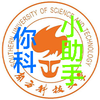

# CS205 C/C++ Programming Final Project
## 项目简介

          
名称：SUSTech_Helper(南科小助手)            
平台：iOS14.2及以上， iPhone版本    
语言：objective-c与C++      
作者：开心      
测试：iPhone12 iOS14.2         
## 目录
- [设计思路与分析](#设计思路与分析)
- [代码](#代码)
- [使用方法](#使用方法)
- [亮点与思考](#程序亮点与思考)
## 设计思路
#### 图标
通过Xcode可以很简单的插入图标，这里选用的是自制的图标如下       

#### 载入界面
载入界面我们使用了自制的如下界面，由于在新款iPhone上并没有home键，所以图

## 代码
由于iOS开发使用objective-c，图形界面部分代码并不是能获取的，所以在代码部分我们只会列出一部分主要的代码框架
