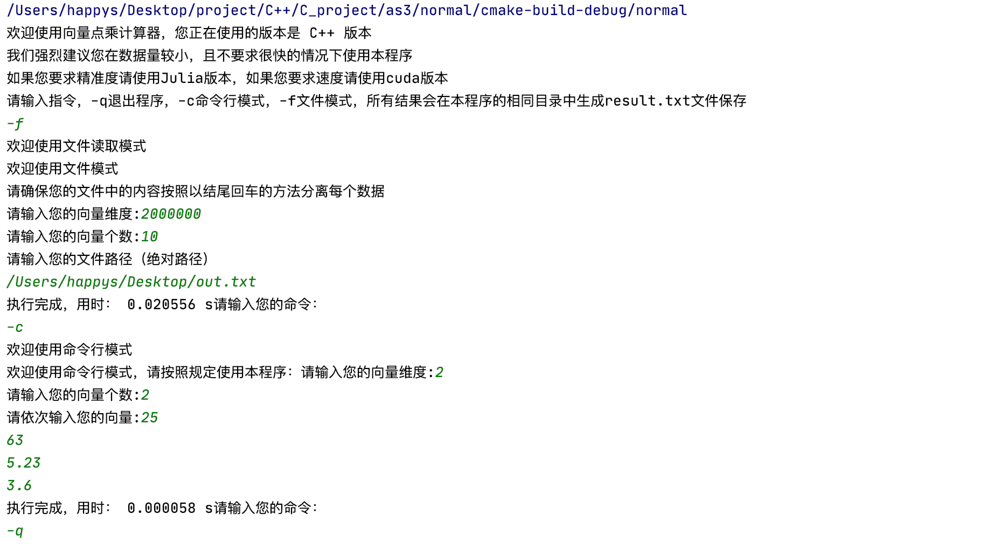
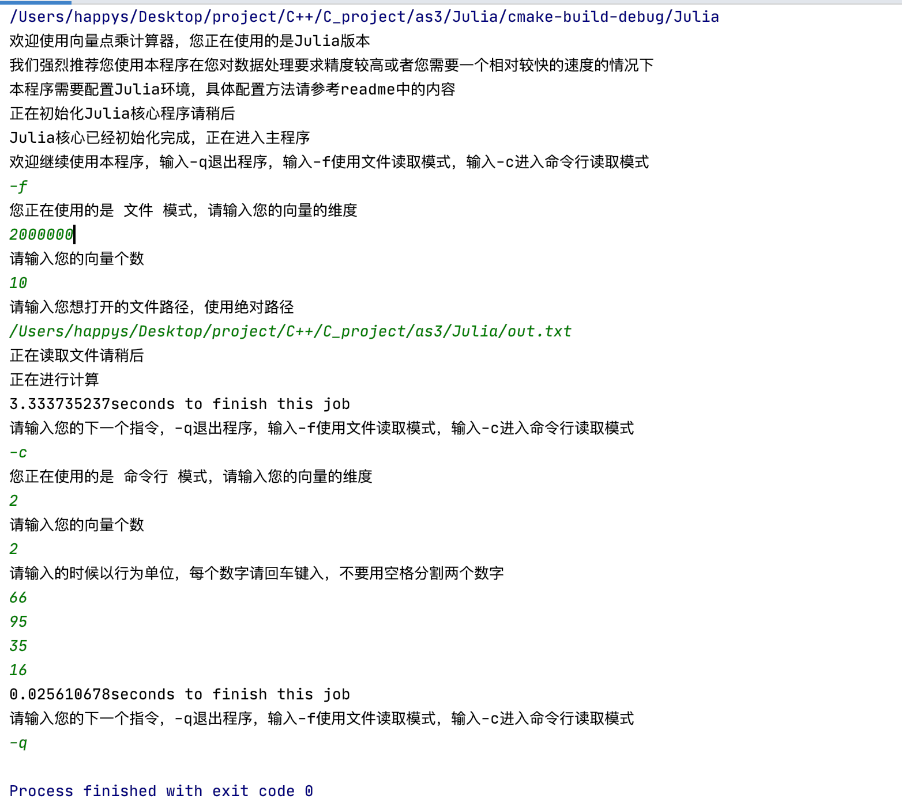

# CS205 C/C++ Programming Assignment 3


# 目录
- [设计思路与分析](#设计思路)
- [测试情况](#测试)
- [代码](#程序代码)
- [亮点](#程序亮点)
- [相关思考](#相关思考)
# 设计思路
由于本程序中设计较多的浮点数内容的乘法运算，通常情况下CPU的浮点能力是较弱的，而GPU就会强的很多，所以本程序的主要部分是围绕于GPU的运算。   
在制作时候考虑到用户可能并不会都在有CUDA核心上都计算机运行本程序，所以本程序进行了多个不同情况都开发。鉴于不同环境的不同，所以本程序分成了以下的版本，分别在不同的文件夹中存放相关的可执行以及源代码：   
- 普通版本：这是最基础的C++版本，不支持高精度的浮点数，只能在数据量不算特别高的情况下加速运算。   
- CUDA版本：本版本进行了针对英伟达核心的GPU运算，属于两个版本中运算速度最快的程序。   
- Julia版本：本版本相对较慢，但是实现了高精度的浮点数运算，这里理论上可以支持超过50位小数以上的计算。     
**本程序中的数据量除了指总量以外更关注的是维度，如果维度较高则认为数据量高，同时，本程序运行时认为求点积是相邻两个向量运算，例如向量1和向量2，向量3和向量4**  
*所有程序运行完的结果均输出在您运行程序的根目录下的result.txt文件中*    
**注意：在运行新的运算的时候会覆盖原有的result，如果需要保留请先复制文件到其他地方**      
**这里存储的文件目录指的是您控制台的所在目录，如下代码：**
```shell
happys@kaixindeMacBook-Pro ~ % /Users/happys/Desktop/project/C++/C_project/as3/normal/cmake-build-debug/normal ; exit;
```
您的结果将保存于~目录下（也就是macOS中的用户根目录）      
同理在windows中也是一样的目录。             
### 概况
三个不同版本中，有一些共同的特点，这里进行说明：    
三个版本的输入格式基本相同，支持两种不同模式：
- 命令行模式  
本模式下，你可以通过命令行录入数据，你需要先录入你的向量维度，然后是向量的个数，在录入完成后要求你录入向量的内容，这里录入的格式如下：      
例如向量（1，0）（2，5）两个    
那么你在录入的时候，请先录入维度2，个数2，然后依次输入里面的数字，通过回车分割开每个数据：      
即：      
1     
0      
2     
5
- 文件模式          
在本模式下，我们需要先和命令行模式下一样，输入维度和个数，然后我们只需要输入你需要读取文件的**绝对路径**即可            
文件内容请和命令行模式下输入的格式相同，**以换行来分割数据**。
### 普通版本
这里是最简单的版本，只实现了跨平台和CPU上的运算。效率是三个版本中中等的，不能支持高精度大数运算。  
基础思路是利用二维数组实现，所以开了一个vectors的二维数组，然后利用二维数组进行传递参数。    
优化算法是将维度高于8以上的数据进行一次运算就可得出结果，这样可以降低一定程度的运算量。    
优化部分代码实现如下  
```cpp
for(int j=0;j<k;j++){
        for(int i=dim-1;i>0;i--){
            if(i>=8){
                result += (
                        vectors[2*j][i]*vectors[2*j+1][i]+
                        vectors[2*j][i-1]*vectors[2*j+1][i-1]+
                        vectors[2*j][i-2]*vectors[2*j+1][i-2]+
                        vectors[2*j][i-3]*vectors[2*j+1][i-3]+vectors[2*j][i-4]*vectors[2*j+1][i-4]+
                        vectors[2*j][i-5]*vectors[2*j+1][i-5]+vectors[2*j][i-6]*vectors[2*j+1][i-6]+
                        vectors[2*j][i-7]*vectors[2*j+1][i-7]+vectors[2*j][i-8]*vectors[2*j+1][i-8]
                );
                i -= 8;
                continue;
            }
            result += (vectors[2*j][i]*vectors[2*j+1][i]);
        }
        out<<result<<endl;
    }
```
通过循环即可计算出本程序的答案。     
最后我们程序实现了一下简单的gc（内存回收）机制，主要针对本程序中的二维数组问题，很容易过长，所以就采取了**每次运算完成后删除数组**            
实现代码如下
```cpp
void free(double** needtofree,int n){
    for (int i=0;i<n;i++){
        delete []needtofree[i];
    }
    delete []needtofree;
    needtofree = NULL;
}
```
通过这种方法，我们保证了在多次处理很多数据的时候可以及时的释放内存       
```cpp
 free(vectors);
```
这里给出命令行模式下的基本模式一部分函数
```cpp
void commandmode(){
    printf("欢迎使用命令行模式，请按照规定使用本程序：");
    int n=0;
    int dim=0;
    printf("请输入您的向量维度:");
    scanf("%d",&dim);
    printf("请输入您的向量个数:");
    scanf("%d",&n);
    if(n%2!=0){
        Wronglinenum(n);
        return;
    }
    double **vectors= new double *[n];
    for(int j=0;j<n;j++){
        vectors[j]=new double [dim];
    }
    double temp=0;
    printf("请依次输入您的向量:");
    for(int i=0;i<n;i++){
        for(int j=0;j<dim;j++){
            scanf("%lf",&temp);
            vectors[i][j]=temp;
        }
    }
    completed(n,dim,vectors);
    free(vectors);
}
```
简单说明一下思路，先进行读取两个数据，分别是代表向量维度和向量个数，然后依次开辟相应的二维数组，
然后依次读取相应的向量，在completed函数中进行运算
```cpp
void completed(int n,int dim,double **vectors){
    ofstream out("result.txt");
    clock_t start, finish;
    int k=n/2;
    double result = 0;
    start=clock();
    for(int j=0;j<k;j++){
        for(int i=dim-1;i>0;i--){
            if(i>=8){
                result += (
                        vectors[2*j][i]*vectors[2*j+1][i]+
                        vectors[2*j][i-1]*vectors[2*j+1][i-1]+
                        vectors[2*j][i-2]*vectors[2*j+1][i-2]+
                        vectors[2*j][i-3]*vectors[2*j+1][i-3]+vectors[2*j][i-4]*vectors[2*j+1][i-4]+
                        vectors[2*j][i-5]*vectors[2*j+1][i-5]+vectors[2*j][i-6]*vectors[2*j+1][i-6]+
                        vectors[2*j][i-7]*vectors[2*j+1][i-7]+vectors[2*j][i-8]*vectors[2*j+1][i-8]
                );
                i -= 8;
                continue;
            }
            result += (vectors[2*j][i]*vectors[2*j+1][i]);
        }
        out<<result<<endl;
    }
    finish = clock();
   printf("执行完成，用时： %f s",(double) (finish-start)/CLOCKS_PER_SEC );
}
```
这个函数实现了整个向量循环点积运算，优化是通过对8个为一组计算的，提高了一定程度的运算效率。
### Julia版本
普通版本采用Julia做为主要的计算部分，这里还是通过上次的跨平台方法解决。   
C语言部分以跨平台实现为主要内容：    
```cpp
#ifndef AS3_CROSS_SYSTEM_H
#define AS3_CROSS_SYSTEM_H
/* 这部分函数负责对平台进行识别，如果发现是windows平台就会更改控制台为UTF-8编码，以此来实现中文支持
 * */
#include<string>
using namespace std;
#if defined(__APPLE__)
# include <TargetConditionals.h>
# if defined(TARGET_OS_MAC) && TARGET_OS_MAC
#   define MAC
# endif
#elif defined(__linux__) || defined(__linux)
#   define LINUX
#elif !defined(SAG_COM) && (defined(WIN32) || defined(_WIN32) || defined(__WIN32__) || defined(__NT__))
# define WIN32
#endif
string findout()
{
#if defined MAC
    return "mac";
#elif defined WIN32
    #define __FILE_NAME__ __FILE__
    return "windows";
#elif defined LINUX
    #define __FILE_NAME__ __FILE__
    return "linux";
#else
    return "unknown";
#endif
}
void changetheconsle(){
    string sy=findout();
    if(sy=="windows"){
        system("chcp 65001");
        system("cls");
    }
    if (sy=="unknown"){
        printf("Error: unknown system! please connect with the author(happys2333@outlook.com)");
        exit(1);
    }
}
#endif //AS3_CROSS_SYSTEM_H
```
值得声明的是，本程序的跨平台是通过不同平台进行不同的动态链接库编译实现，所以你可以利用如下方法在gcc中实现：
例如 Julia 被安装到 $JULIA_DIR，则可以用 gcc 来编译上面的测试程序 main.cpp:
```shell
gcc -o test -fPIC -I$JULIA_DIR/include/julia -L$JULIA_DIR/lib -Wl,-rpath,$JULIA_DIR/lib main.cpp - ljulia
```
本程序然后进行了调用Julia的方法
```cpp
jl_eval_string(path.c_str());
```
在Julia这门语言中，拥有BigFloat特殊的数据类型，这个类型可以支持较长的浮点数，理论上可以支持长达五六十位的浮点数
这样远比float和double精准度高的多      
**这里说明一下：float的缺点是精度较低，如果你想实现更多的小数点后精确位数，那么使用double更合适**
但是正因为如此，我们不得不牺牲了很多运算效率大概要比C语言慢十倍以上，但是我们这个版本只推荐您进行高精度运算。
### CUDA版本
**由于英伟达的限制，本版本的程序只能支持window10 64位系统和Linux进行运行，且应该在运行或者编译前配置好cuda环境**
思路较为简单，采取类似普通版本的思路，通过文件读写，实现本次运行的数据读取.
在这里选择GPU加速核心数目的时候采用了尽可能自行控制的原则，以960个核心同时计算为一组。
cuda的核心函数是对向量的相乘
```cpp
__global__ void dot(double *c, const double *a, const double *b,int k)
{
    int i = threadIdx.x+k*960;
    c[i] = a[i] * b[i];
}
```
cuda版本更推荐使用数据量更大的情况下，亿以上的数据量是进行cuda计算的准入门槛
在数据量比较低的情况下，我们并不推荐使用CUDA版本，因为每次需要对数组进行拷贝，需要一定时间。
如果你有一个更大的数据（维度在亿以上），你可以发挥CUDA更大的效率。
我们在测试的时候，发现两亿的数据只利用了GPU不到5%的效率，所以我们想发挥更好的效率的时候应该进一步扩大运算量。       
CUDA运算的时候我们规定了只能同时运行960组并行计算，在RTX单卡平台上极限只能进行1024组，但是GPU性能最大的情况下应该是32的整数组，所以我采取了960组进行运算。            
CUDA里面和C语言中区分了两块存储位置，一个是共享内存，一个是GPU显存，另一个是CPU的内存。这三块区别如下：           
- 共享内存 ： GPU使用，是提取效率最高的存储地区         
- GPU显存：GPU使用，在GPU运算的时候效率较高，但是低于共享内存            
- CPU内存：只能在CPU中使用，不能用GPU访问          
所以我们必须在每次把数据拷贝到GPU的显存中
```cpp
cudaError_t dodot(double *c, const double *a, const double *b, unsigned int size)
{
    double *dev_a = 0;
    double *dev_b = 0;
    double *dev_c = 0;
    cudaError_t cudaStatus;

    // Choose which GPU to run on, change this on a multi-GPU system.
    cudaStatus = cudaSetDevice(0);


    // Allocate GPU buffers for three vectors (two input, one output)    .
    cudaStatus = cudaMalloc((void**)&dev_c, size * sizeof(double));


    cudaStatus = cudaMalloc((void**)&dev_a, size * sizeof(double));


    cudaStatus = cudaMalloc((void**)&dev_b, size * sizeof(double));


    // Copy input vectors from host memory to GPU buffers.
    cudaStatus = cudaMemcpy(dev_a, a, size * sizeof(double), cudaMemcpyHostToDevice);


    cudaStatus = cudaMemcpy(dev_b, b, size * sizeof(double), cudaMemcpyHostToDevice);

    int num = size/960;
    int remin =size%960;

    for(int i = 0; i <num;i++){
        dot<<<1,960>>>(dev_c, dev_a, dev_b,i);
    }
    dot<<<1,remin>>>(dev_c, dev_a, dev_b,num);
    cudaStatus = cudaGetLastError();

    cudaStatus = cudaDeviceSynchronize();

    cudaStatus = cudaMemcpy(c, dev_c, size * sizeof(double), cudaMemcpyDeviceToHost);


    Error:
    cudaFree(dev_c);
    cudaFree(dev_a);
    cudaFree(dev_b);
    return cudaStatus;
}
```
运行结束后释放了GPU中的占据的显存。
本程序的内存管理机制更加优秀，在不需要的情况下及时释放了内存与显存，增强代码的稳定。
# 测试
测试平台说明：鉴于本程序有多种版本，我们在测试的时候使用了两台不同电脑进行测试。两台电脑的配置如下：          
#### 测试Julia和C++版本的计算机：      
系统：macOS 10.15.7        
MacBook pro 2020 十三寸版本          
CPU：2 GHz 四核Intel Core i5   
内存：16 GB
#### 测试CUDA版本的计算机：
系统： Windows10 x64      
CPU ：Intel Core i5 9400       
内存：16 GB        
GPU：RTX2070         
### 测试模板
由于三种版本均有不同的擅长领域，所以提供了两个测试样例的文件，分别是两千万组数据和两亿组数据的两种版本，对于
测试模版为如下：
```shell
欢迎使用向量点乘计算器，您正在使用的是Julia版本
我们强烈推荐您使用本程序在您对数据处理要求精度较高或者您需要一个相对较快的速度的情况下
本程序需要配置Julia环境，具体配置方法请参考readme中的内容
正在初始化Julia核心程序请稍后
Julia核心已经初始化完成，正在进入主程序
欢迎继续使用本程序，输入-q退出程序，输入-f使用文件读取模式，输入-c进入命令行读取模式
-f
您正在使用的是 文件 模式，请输入您的向量的维度
2000000
请输入您的向量个数
10
请输入您想打开的文件路径，使用绝对路径
/Users/happys/Desktop/project/C++/C_project/as3/Julia/out.txt
正在读取文件请稍后
正在进行计算
3.333735237seconds to finish this job
请输入您的下一个指令，-q退出程序，输入-f使用文件读取模式，输入-c进入命令行读取模式
-c
您正在使用的是 命令行 模式，请输入您的向量的维度
2
请输入您的向量个数
2
请输入的时候以行为单位，每个数字请回车键入，不要用空格分割两个数字
66
95
35
16
0.025610678seconds to finish this job
请输入您的下一个指令，-q退出程序，输入-f使用文件读取模式，输入-c进入命令行读取模式
-q
```
本程序使用的两个不同测试样例文件下载：         
**两亿数据版本**链接: https://pan.baidu.com/s/1FGq8Kkj24Q7L9HsFvh6a1g  密码: 3mut         
**两千万数据版本**链接: https://pan.baidu.com/s/1LSKRSwMQkoPm_7zfiNMJUQ  密码: q4qe    
### 普通版本
普通版本使用的是两千万数据测试

整体上在数据量比较低的情况下运行，会有极高的效率。
### Julia版本

整体上这个版本效率最低，但是能实现更高的精度运行111
# 程序代码
### 普通版本
```cpp
/* main.cpp
 * */
/****
 *
 * normal version for the dot vectors
 * speed : not so fast
 * difficulty to use : easy
 * system :Windows Linux Mac OS
 * author : happys
 * date : 2020-10-11
 * ****/
#include <iostream>
#include "cross_system.h"
#include "main.h"

int main() {
    changetheconsle();
    printf("欢迎使用向量点乘计算器，您正在使用的版本是 C++ 版本\n"
           "我们强烈建议您在数据量较小，且不要求很快的情况下使用本程序\n"
           "如果您要求精准度请使用Julia版本，如果您要求速度请使用cuda版本\n"
           "请输入指令，-q退出程序，-c命令行模式，-f文件模式，所有结果会在本程序的相同目录中生成result.txt文件保存\n");
    string cmd;
    cin>>cmd;
    while(cmd!="-q"){
        if(cmd[0]!='-'){
            Wrongcmd(cmd);
        }else if(cmd[1]=='c'){
            printf("欢迎使用命令行模式\n");
            commandmode();
        }else if(cmd[1]=='f'){
            printf("欢迎使用文件读取模式\n");
            fileMode();
        }else{
            Wrongcmd(cmd);
        }
        printf("请输入您的命令：\n");
        cin>>cmd;
    }
}
/* main.h
 * */
//main function for the NORMAL version
//date : 2020-10-11
// written by : happys2333
#ifndef NORMAL_MAIN_H
#define NORMAL_MAIN_H
#include<fstream>
#include<string>
#include<iostream>
#include <ctime>
#include "CodeError.h"
void free(double** needtofree,int n){
    for (int i=0;i<n;i++){
        delete []needtofree[i];
    }
    delete []needtofree;
    needtofree = NULL;
}
void completed(int n,int dim,double **vectors){
    ofstream out("result.txt");
    clock_t start, finish;
    int k=n/2;
    double result = 0;
    start=clock();
    for(int j=0;j<k;j++){
        for(int i=dim-1;i>0;i--){
            if(i>=8){
                result += (
                        vectors[2*j][i]*vectors[2*j+1][i]+
                        vectors[2*j][i-1]*vectors[2*j+1][i-1]+
                        vectors[2*j][i-2]*vectors[2*j+1][i-2]+
                        vectors[2*j][i-3]*vectors[2*j+1][i-3]+vectors[2*j][i-4]*vectors[2*j+1][i-4]+
                        vectors[2*j][i-5]*vectors[2*j+1][i-5]+vectors[2*j][i-6]*vectors[2*j+1][i-6]+
                        vectors[2*j][i-7]*vectors[2*j+1][i-7]+vectors[2*j][i-8]*vectors[2*j+1][i-8]
                );
                i -= 8;
                continue;
            }
            result += (vectors[2*j][i]*vectors[2*j+1][i]);
        }
        out<<result<<endl;
    }
    finish = clock();
   printf("执行完成，用时： %f s",(double) (finish-start)/CLOCKS_PER_SEC );
}
void commandmode(){
    printf("欢迎使用命令行模式，请按照规定使用本程序：");
    int n=0;
    int dim=0;
    printf("请输入您的向量维度:");
    scanf("%d",&dim);
    printf("请输入您的向量个数:");
    scanf("%d",&n);
    if(n%2!=0){
        Wronglinenum(n);
        return;
    }
    double **vectors= new double *[n];
    for(int j=0;j<n;j++){
        vectors[j]=new double [dim];
    }
    double temp=0;
    printf("请依次输入您的向量:");
    for(int i=0;i<n;i++){
        for(int j=0;j<dim;j++){
            scanf("%lf",&temp);
            vectors[i][j]=temp;
        }
    }
    completed(n,dim,vectors);
    free(vectors);
}
void fileMode(){
    printf("欢迎使用文件模式\n"
           "请确保您的文件中的内容按照以结尾回车的方法分离每个数据\n");
    int n=0;
    int dim=0;
    printf("请输入您的向量维度:");
    scanf("%d",&dim);
    printf("请输入您的向量个数:");
    scanf("%d",&n);
    if(n%2!=0){
        Wronglinenum(n);
        return;
    }
    printf("请输入您的文件路径（绝对路径）\n");
    string filepath;
    cin>>filepath;
    ifstream in(filepath);
    char line[1024];
    auto **vectors= new double *[n];
    for(int j=0;j<n;j++){
        vectors[j]=new double [dim];
    }
    if(!in){
        failtoread();
    }
    for(int i=0;i<n;i++){
        for(int j=0;j<dim;j++){
            in.getline(line,1024);
            vectors[i][j]=stod(line);
        }
    }
    completed(n,dim,vectors);
    free(vectors);
}
#endif //NORMAL_MAIN_H
/* cross_system.h
 * */
```
### Julia版本
```julia
```
```cpp
```
### CUDA版本
```cpp
```
# 程序亮点
- 优秀的内存管理机制，保证无用的数组及时清理
- 没有使用float类型，而是通过double以及Julia自带高精度方法进行运算，提高精确度，支持较长的小数运算如超过16位以上的小数
- 通过并行GPU运算成倍提高程序运行效率
- 在用户没有相应的GPU环境的时候，可以选择普通的CPU运行模块来运行
- 支持中文输出
- 更好的数据结构，让用户可以更高效的利用空间
- 源代码与主要代码的分离，便于代码的开发与维护
- 支持多种不同模式运行，多个程序让用户可以直接选择
- Julia版本支持高精度大数运算
- 直接输出文件，可以多种模式输入，增强程序的效率           
# 相关思考
- float的缺点是在相对精确度较高的情况下会丢失很多精确度，所以使用double会提高精确度，本程序中的Julia模板使用了BigFloat来进一步提高精确度
- 相对来说，Julia的运算效率即使是很快的一种编程语言（因为本来就是以科学计算主打的）但是仍然在对比中远慢于c语言本身，在两千万数据量情况下
