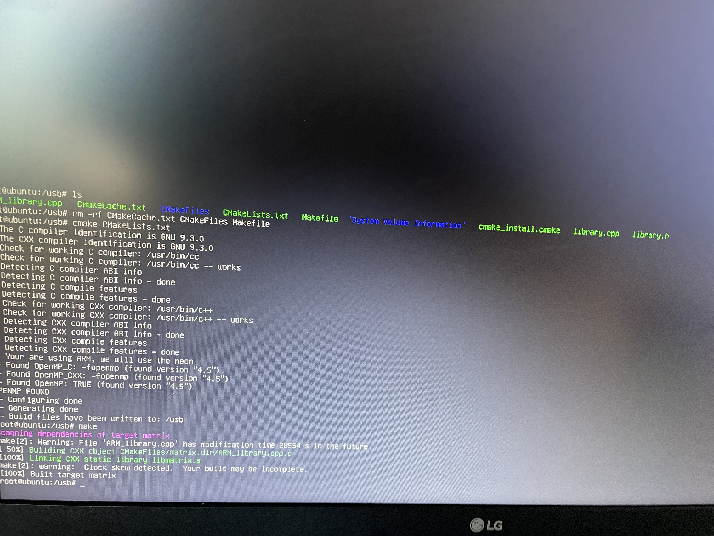

# CS205 C/C++ Programming Assignment 4
## 概况

##### 测试平台：`Linux macOS Windows ARM(ubuntu)`
#### 上次作业中，我们实现了对矩阵乘法的优化与实现，我们也对一部分的运算符进行了重载，但是我们认为应该本着<font color=red>用户至上</font>的思想进一步让我们的代码进行完备，所以我们制作了本版
#### 目录
- [相关修正](#相关修正)       	
- [新功能](#新功能)      	
- [新代码](#新代码)      	
- [运行效果](#运行效果)     	
- [安装方法](#安装方法)
## 相关修正
##### macOS防止误用cmake
在上一版的程序中，我们发现在macOS中存在编译失败的问题，这是因为macOS中系统会默认使用Clang编译器而不使用Gcc编译器，所以我们对cmake中添加了一部分代码进行阻止在macOS下进行编译.				
<font color =green>由于部分用户使用的Cmake版本并不是原来使用的3.17版本，所以本版程序中，我们降低了cmake版本限制，您现在只需要3.15版本以上即可运行</font>
```cmake
IF (WIN32)
	MESSAGE(STATUS "Your are using Windows")
ELSEIF (APPLE)
	MESSAGE(STATUS "Your are using MacOS ,this cmake can't be used in MacOS because clang will stop this project for using gcc")
    message(FATAL_ERROR "Error: We don't suppose the MacOS, please use the terminal to compile this program")
ELSEIF (UNIX)
	MESSAGE(STATUS "Your are using Linux")
ENDIF ()
```
这样避免因不知晓而导致的误操作。					
对于macOS用户在使用的时候仍然建议以gcc命令行模式下运行，clang对于指令集的支持我们不再进行教授修改方法。		
##### ARM指令集支持
增加了对ARM的支持，cmake中添加了arm专属对设置，当您在arm上编译的时候我们会采用arm上专用的指令集neno来进行加速。
由于arm平台下的限制，我们在适配arm的时候只能通过一次四位整数的思想进行运行，采用了arm上的自带指令集以及现在arm对openmp都有所适配所以我们没有让openmp失效
通过使用NENO指令集加速了我们在arm平台下的运行，同时保证了arm下的使用正常，在树莓派的ubuntu系统中我们进行编译后正常的图片如下
				
##### 代码安全
对于上一版中，我们发现一些容易出现的问题，比如说在调用析构函数的时候会误删除另一个使用的情况，所以我们仿照OPENCV使用了一个值来表示当前的使用量
```cpp
int usethis = 1;
```
然后对等号重载
```cpp
Matrix &Matrix::operator=(Matrix &right) {
    this->~Matrix();
    right.usethis++;
    this->matrix = right.matrix;
    this->usethis = right.usethis;
    this->row = right.row;
    this->col = right.col;
    return *this;
}
```
## 新功能
- 随机矩阵			
为了方便您测试某些数据的需要，我们增加了随机矩阵的支持，您现在只需要使用random函数即可对您的当前矩阵随机生成一个符合要求的矩阵			
- 填充矩阵			
将您的矩阵填充满您所指定的元素，如果您没有设置那么将自动填充为0			
- reshape 			
重新修改矩阵样式，必须保持原有中的数据量和新的矩阵量相同
- cout模块			
对cout模块进行了支持，支持输出一个矩阵			
- ARM下的支持			
我们讲arm下的程序进行了重构，实现可以编译运行arm下的程序,并将代码库加入到您到程序中
## 新代码
CMAKE的调整
```cmake
# suppose you use the lib in arm
option(ARM_platform "if you use arm set it ON" OFF)
IF(ARM_platform )
	MESSAGE(STATUS "Your are using ARM, we will use the neon")
	FIND_PACKAGE( OpenMP REQUIRED)
	if(OPENMP_FOUND)
	    message("OPENMP FOUND")
	    set(CMAKE_C_FLAGS "${CMAKE_C_FLAGS} ${OpenMP_C_FLAGS} -O3")
	    set(CMAKE_CXX_FLAGS "${CMAKE_CXX_FLAGS} ${OpenMP_CXX_FLAGS} -O3")
	    set(CMAKE_EXE_LINKER_FLAGS "${CMAKE_EXE_LINKER_FLAGS} ${OpenMP_EXE_LINKER_FLAGS} -O3")
	endif()
	set(CMAKE_CXX_STANDARD 14)
	add_library(matrix ARM_library.cpp library.h)
# ban macOS clang
IF (WIN32)
	MESSAGE(STATUS "Your are using Windows")
ELSEIF (APPLE)
	MESSAGE(STATUS "Your are using MacOS ,this cmake can't be used in MacOS because clang will stop this project for using gcc")
    message(FATAL_ERROR "Error: We don't suppose the MacOS, please use the terminal to compile this program")
ELSEIF (UNIX)
	MESSAGE(STATUS "Your are using Linux")
ENDIF ()
```
ARM使用的新的指令集
```cpp
for(int k = 0;k<rrow;++k){
	float32x4_t r,bt,c0;
	r = vld1q_f32(&matrix[i * col + k]);
	b0 = &right->matrix[k * right->col];
	for (int j = 0; j < rcol; ++j) {
		if (rcol - j >= 4) {
			r0 = &result->matrix[i * result->col]+j;
			c0 = vld1q_f32(r0);
			bt = vld1q_f32(b0);
			c0 += (r*bt);
			*r0=vgetq_lane_f32(c0,0);
			r0++;
			*r0=vgetq_lane_f32(c0,1);
			r0++;
			*r0=vgetq_lane_f32(c0,2);
			r0++;
			*r0=vgetq_lane_f32(c0,3);
			j += 3;
			b0+=4;
		} else {
			result->matrix[i * result->col + j] += (matrix[i * col + k] *
													right->matrix[k * right->col + j]);
		}
	}
}
```
为了用户方便使用我们定义了一部分变量来辅助控制模式
```cpp
	const int Matrix_normal_mode=0;
    const int Matrix_quick_mode =1;
    const int Matrix_openMP_mode =2;
    const int Matrix_open_mode =3;
    const int Matrix_openSuper_mode =4;
    const int Matrix_super_MP_mode =5;
```
实现了随机生成函数
```cpp
void Matrix::random() {
    if(row ==0|col ==0){Error(0);
        return;
    }
    int len = row*col;
    if(len>=10000){
        for(int i=0;i<len;i++){
            srand((unsigned)time(NULL));
            matrix[i] = rand();
        }
        return;
    }
    srand((unsigned)time(NULL));
    for(int i=0;i<len;i++){
        matrix[i] = rand();
    }
}
```
## 运行效果
本版程序并没有对速度进行优化，所以我们测试数据均以方便展示为主，采取一个简单的10x10矩阵进行测试,其中实现均用随机矩阵。


## 安装方法
Windows和macOS以及Linux 在Intel构架下的安装过程和上次相同
可以访问如下的链接进行查看
