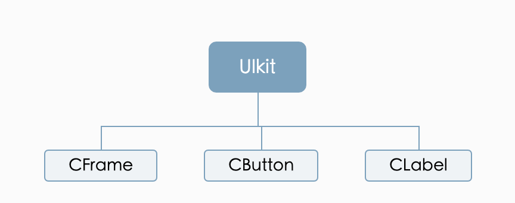
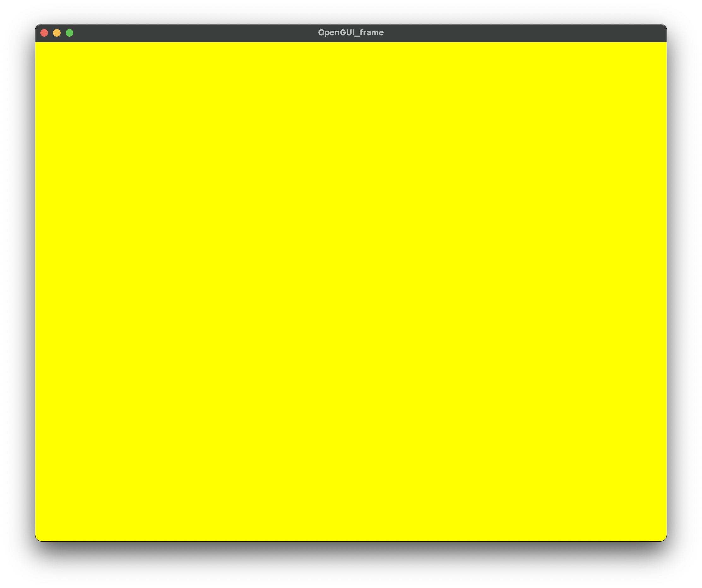
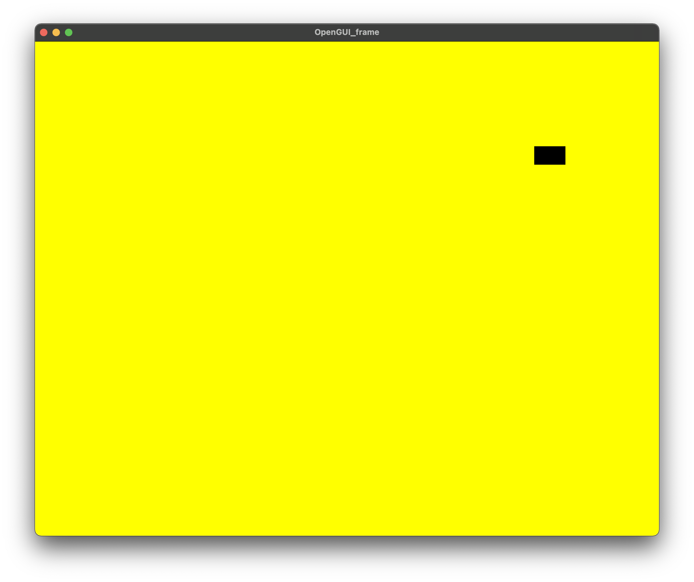
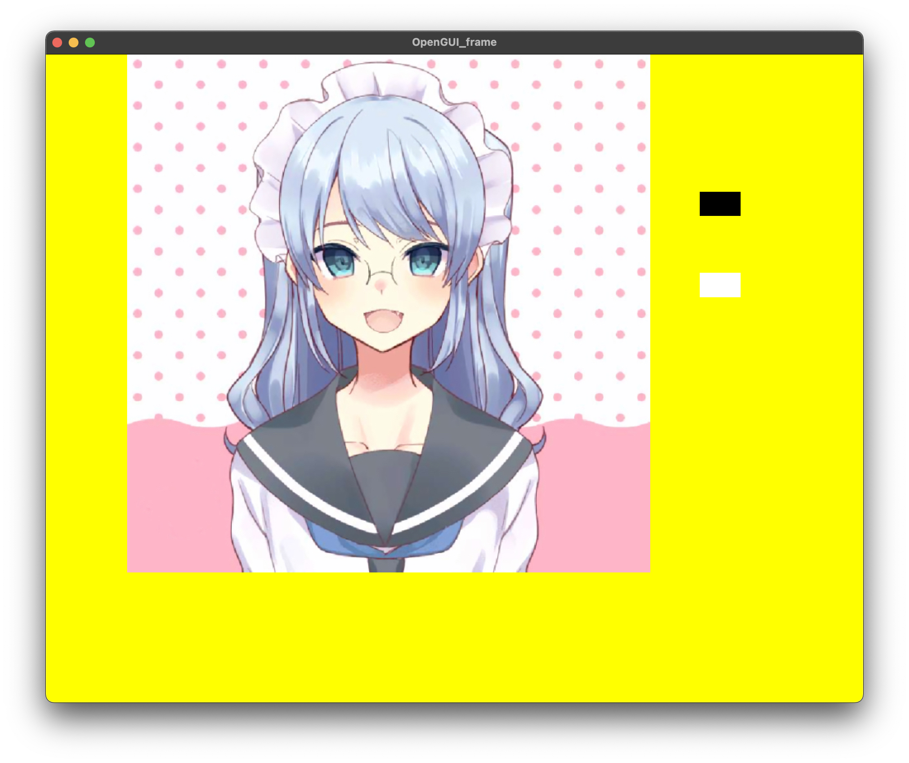
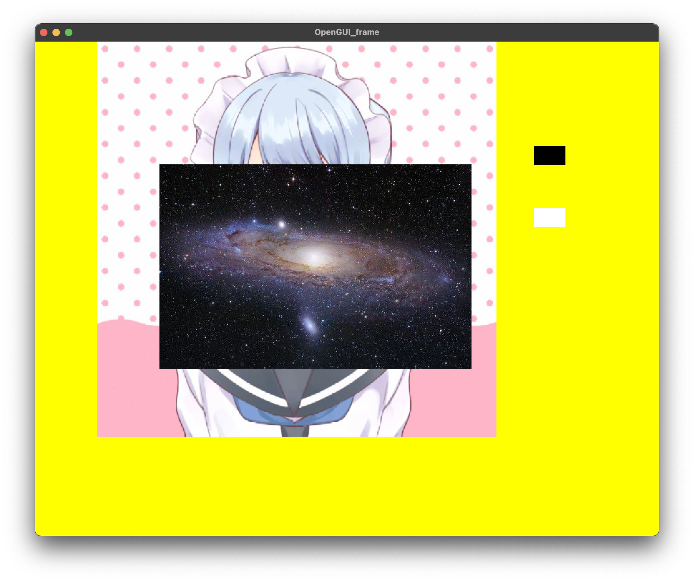
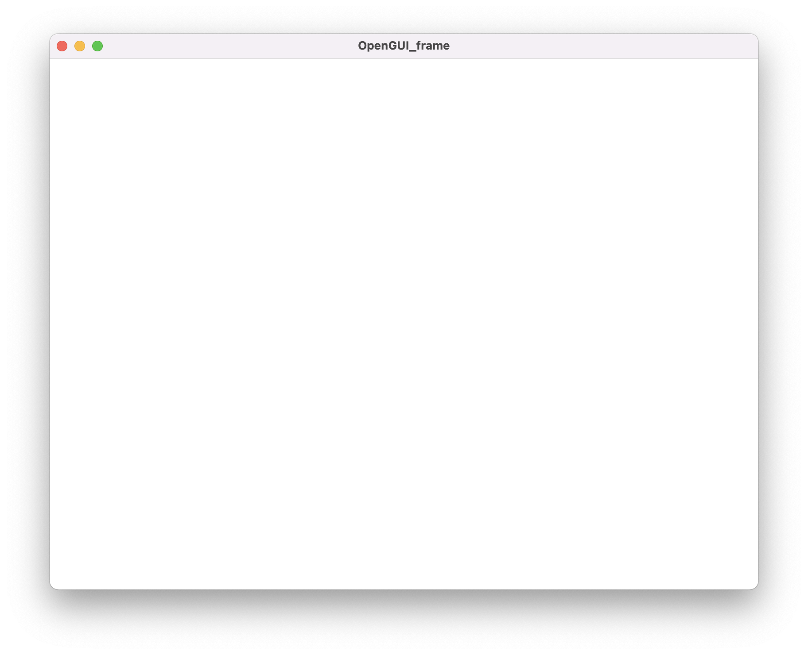
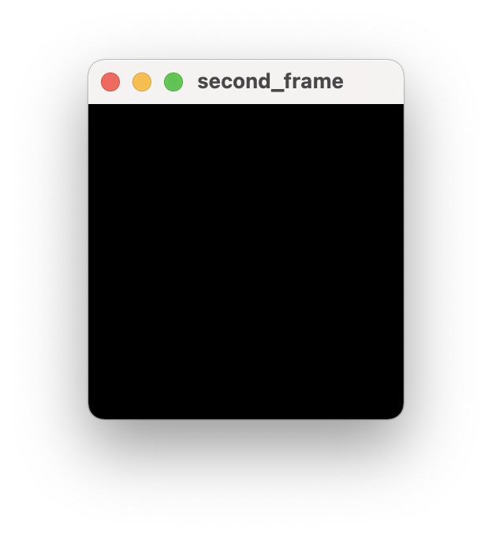

# CS205 C/C++ Final Project——OpenGUI

## 概况


#### 使用库：OpenGL glfw glew OpenCV

##### 测试平台：`macOS BigSur`

### 版本号：v1.01

## C++程序设计课程期末大作业，基于OpenGL实现的macOS专属UI开发库

由于时间较为紧张，本库可能以后会作为我*个人项目*独立出来继续开发，但是目前我们仅实现部分功能。
**特别鸣谢：OpenGUI基于glfw，glew和opencv等著名开源库实现，在此表示相关的开发人员表示感谢**
# 目录

- [使用方法](#使用方法)
- [功能简介](#功能简介)
- [代码框架](#代码框架)
- [优点](#优点)
- [版本变动](#版本变动)

# 功能简介

本版程序目的希望实现在macOS下使用C++可以十分流畅自然的编写一套可以随时套用的图形化界面库，避免任何可能因此导致冗余的问题本程序完全基于C++代码开发，并不使用XML等描述性语言。           
初代版本计划实现的内容为四个模块：创建窗口，添加按钮，实现图像显示，实现鼠标键盘交互，下面对四个方面进行依次的讲解开发，并讲解我们的易用性。      
- **完美的cmake使用**
  本项目为了所有使用库的用户考虑，尽可能将我们的CMake编写较为详细，让您可以无忧使用本库。
  如下cmake可以让您在遇到各种情况下的问题都可以轻松自如的解决

```cmake
cmake_minimum_required(VERSION 3.12)
project(OpenGUI)
if(APPLE)
    message(STATUS "Welcome to use OpenGUI, your system is MacOS!")
else()
    message(FATAL_ERROR "We haven't supported your system yet")
endif()
set(CMAKE_CXX_STANDARD 14)
message(STATUS "Your path is ${PROJECT_SOURCE_DIR}")
set(OpenGL_Path ${PROJECT_SOURCE_DIR}/OpenGL)#local opengl path
message(STATUS "Finding the OpenGL...")
if(OpenGL_Path)
    message(STATUS "Found the OpenGL")
else()
    message(FATAL_ERROR "No OpenGL found!")
endif()
message(STATUS "Linking to the library...")
set(GLEW_H ${PROJECT_SOURCE_DIR}/OpenGL/glew/2.2.0/include/GL)
set(GLFW_H ${PROJECT_SOURCE_DIR}/OpenGL/glfw/3.3.2/include/GLFW)
set(GLTOOLS_H ${PROJECT_SOURCE_DIR}/OpenGL/GLTools)
find_package(OpenCV REQUIRED)
set(FreeType_H ${PROJECT_SOURCE_DIR}/OpenGL/FreeText/include/freetype2)
include_directories(${GLTOOLS_H} ${GLFW_H} ${GLEW_H} ${FreeType_H})
message(STATUS "Creating the Library...")
set(GLEW_LIB ${PROJECT_SOURCE_DIR}/OpenGL/glew/2.2.0/lib/libGLEW.2.2.dylib)
set(GLFW_LIB ${PROJECT_SOURCE_DIR}/OpenGL/glfw/3.3.2/lib/libglfw.3.dylib)
set(GLTOOLS_LIB ${PROJECT_SOURCE_DIR}/OpenGL/GLTools/libgltools.dylib)
set(FreeType_Lib ${PROJECT_SOURCE_DIR}/OpenGL/FreeText/lib/libfreetype.6.dylib)
link_libraries(${OPENGL} ${GLFW_LIB} ${GLTOOLS_LIB} ${GLEW_LIB} ${FreeType_Lib})

add_library(OpenGUI Header/OpenGUI_frame.hpp Frame/OpenGUI_frame.cpp Frame/OpenGUI_Button.cpp Header/OpenGUI_Button.hpp Frame/OpenGUI_label.cpp Header/OpenGUI_label.hpp Header/Func.hpp Header/GUIroot.hpp Header/KeyBorad.hpp Header/Color.hpp)
message(STATUS "Linking the OpenGL...")
target_link_libraries(OpenGUI "-framework OpenGL")
target_link_libraries(OpenGUI "-framework GLUT")
target_link_libraries(OpenGUI ${OpenCV_LIBS})

message(STATUS "Enjoy your GUI trip")
```
- 创建窗口
您可以很简单的绘制一个简单的窗口
使用如下的窗口绘制函数可以让您很简单的绘制一个窗口。
```cpp
#include <OpenGUI_frame.hpp>
CFrame test(1000,800,0,0,"OpenGUI_frame");
test.setExitButton(KEY_ESCAPE);
test.setBackgroundColor(1,1,0,0);
test.visualize();
```
我们使用CFrame为本程序的基本窗口，所有本库实现都基于另一个父类文件UIkit的拓展，其代码关系图如下：          

UIkit下实现了基本的内容，并可以被继承，主要是xy坐标，颜色等内容。
CFrame作为本程序的基础框架之一，其的基本函数情况如下
```cpp
    ~CFrame();//析构函数，可以释放内存
    void setExitButton(int button);//设置退出窗口的按键
    explicit CFrame(GLint weight=800,GLint height=600,GLint x=0,GLint y=0,std::string title="OpenGUI_frame");//构造函数，以此是窗口宽度，窗口高度，窗口相对屏幕的xy坐标，窗口标题
    void addLable(const CLabel &l);//添加一个标签（显示信息）
    void addButton(const CButton &b);//添加进一个按钮
    void visualize();//视窗可视化(显示视窗)
    void BigScreen();//全屏模式
    void SmallScreen();//小屏模式
    void Setsize(GLint width,GLint height);//重新设置窗口大小
    void setBackgroundColor(float red,float green,float blue,float alpha);//设置窗口背景颜色
```
本程序中一切颜色均是0-1rgba颜色，并不支持255色，请自行修改。
如前文代码我们可以实现如下效果      
当然我们也可以全屏模式显示   
##### 值得声明的是，当您让窗口可视化后，直到您退出窗口，我们的代码都不会继续运行，如果您想保证不被干扰，请您使用多线程技术，本库支持多线程技术下的运行
- 添加按钮              
基于上文代码我们可以进一步拓展，我相信没有人想单纯的创建几个窗口，所以我为程序可以添加一个按钮，沿用Java中的命名规则，按钮的名字为CButton，您可以非常简单的去创建一个按钮，如下代码可以让您创建一个按钮。
```cpp
CButton button("hi",50,30,800,200);
```
由于Button的特点，我们为Button制定了很多好用的方法
```cpp
    ~CButton();//析构函数，释放内存
    CButton(std::string title="Button",unsigned width=100,unsigned int height=50,unsigned int x=0,unsigned int y=0);//构造函数，从左到右依次是按钮名称，按钮宽度，按钮高度，xy坐标（相对窗口左上角）
    void setBackgroundColor(float red,float green,float blue,float alpha);//设置按钮颜色
    bool isClick(int MouseX,int MouseY);//是否点击这个按钮
    void SetButtonFun(ButtonFun f);//设置按钮函数
```
**本库以左上角为起始坐标原点，并使用屏幕坐标长度，依次对应**
这里需要注意的是按钮函数为一个bool返回值没有传入值的函数指针例如：
```cpp
bool Empty(){
    return true;
}
```
这个函数应该返回true否则程序将会自行退出程序，这也能帮您解决可能存在的bug。         
通过如下代码我们可以继续实现按钮
```cpp
bool Test1(){
    using namespace std;
    cout << "Testing1"<<endl;
    return true;
}
CButton button("hi",50,30,800,200);
button.setBackgroundColor(0,0,0,0);
    button.SetButtonFun(Test1);
    test.addButton(button);
    test.visualize();
```

黑色框为按钮，点击后会在控制台输出
```shell
Testing1
```
- 画图            
总有人会不满足，简单的一个按钮或许并不能满足您的日常使用，所以我们实现了一个可以在屏幕上进行任意绘制图像的代码，如果结合之前的代码，我们可以实现，按下按钮后进行绘图，绘图的内容由CLabel实现,通过如下代码实现您的CLabel
```cpp
CLabel label("../img/test.bmp",true,100,0,640,640);
```
CLabel目前由于暂时受限并不支持文字输出，所以只能进行绘图。
CLabel支持如下功能
```cpp
CLabel(std::string str= "", bool img = false, unsigned int x=0, unsigned int y=0, unsigned int width=50, unsigned int height=30);//构造函数，str代表图像目录，支持所有格式
void free();//释放多余内存
```
**注意当不使用CLabel的时候一定要释放内存**
bool类型的img目前只能为true，不支持false
- 鼠标键盘交互            
基于代码的优秀实用性，我们允许用户直接设置退出按钮，所有退出按钮的定义在KeyBorad.h中         
同时我们可以支持您的点击，实现了最基本的交互界面。
- 总的测试代码
所有测试代码为如下：
```cpp
#include <OpenGUI_label.hpp>
#include <OpenGUI_frame.hpp>
#include <OpenGUI_Button.hpp>
#include <KeyBorad.hpp>
CLabel label2("../img/timg1.jpeg",true,200,200,500,330);
CFrame test(1000,800,0,0,"OpenGUI_frame");
bool Test1(){
    using namespace std;
    cout << "Testing1"<<endl;
    return true;
}
bool Test2(){
    test.addLable(label2);
    return true;
}
int main(){
//    test.BigScreen();
    test.setExitButton(KEY_ESCAPE);
    test.setBackgroundColor(1,1,0,0);
    CButton button("hi",50,30,800,200);
    CButton button2("hi",50,30,800,300);
    button.setBackgroundColor(0,0,0,0);
    button.SetButtonFun(Test1);
    button2.setBackgroundColor(1,1,1,1);
    button2.SetButtonFun(Test2);
    test.addButton(button);
    test.addButton(button2);
    CLabel label("../img/test.bmp",true,100,0,640,640);
    test.addLable(label);
    test.visualize();
}
```
运行效果

点击白色按钮后

# 使用方法
### 本程序目前只支持macOS下的运行，程序自带代码库支持macOS Bigsur版本，如果非此版本的，请将您版本对应的*OpenGL*安装后替换程序下的lib中的文件即可。
经常更新您的macOS系统将会让您在编程的路上一路顺风我们给出两种运行本程序的方法：
- 使用已经编译好的程序库，将release下的OpenGUI文件拷贝到您的工程项目下
- 进入我们的sorce文件下使用如下命令
```shell
cmake .
make
```
当您看到
```bash
-- Enjoy your GUI trip!
```
即为库的编译成功
将获得的libOpenGUI.a和Header文件夹放入您的工程目录下，并将您的编译器链接到本库文件中，同时由于其他原因，我们也需要链接您本地支持的OpenGL，glfw，glew以及opencv
我们给出了一个test代码程序，您可以参考test中的代码使用程序，请自行链接相应的库代码程序请务必链接后编译，暂时并不能脱离相关环境(由于头文件的使用问题)
这里给出一个可以正常使用的cmake版本
```cmake
cmake_minimum_required(VERSION 3.12)
project(test)
set(CMAKE_CXX_STANDARD 14)
set(GLEW_H ${PROJECT_SOURCE_DIR}/OpenGUI/OpenGL/glew/2.2.0/include/GL)
set(GLFW_H ${PROJECT_SOURCE_DIR}/OpenGUI/OpenGL/glfw/3.3.2/include/GLFW)
set(GLTOOLS_H ${PROJECT_SOURCE_DIR}/OpenGUI/OpenGL/GLTools)
add_compile_options(-lstdc++)
set(GLM_H ${PROJECT_SOURCE_DIR}/OpenGUI/OpenGL/glm/0.9.9.8/include/glm)
set(FreeType_H ${PROJECT_SOURCE_DIR}/OpenGUI/FreeText/include/freetype2)
include_directories(${GLTOOLS_H} ${GLM_H} ${GLFW_H} ${GLEW_H} ${FreeType_H})
message(STATUS "Creating the Library...")
set(GLEW_LIB ${PROJECT_SOURCE_DIR}/OpenGUI/OpenGL/glew/2.2.0/lib/libGLEW.2.2.dylib)
set(GLFW_LIB ${PROJECT_SOURCE_DIR}/OpenGUI/OpenGL/glfw/3.3.2/lib/libglfw.3.dylib)
set(GLTOOLS_LIB ${PROJECT_SOURCE_DIR}/OpenGUI/OpenGL/GLTools/libgltools.dylib)
find_package(GLM REQUIRED)
set(FreeType_Lib ${PROJECT_SOURCE_DIR}/OpenGUI/FreeText/lib/libfreetype.6.dylib)
link_libraries(${OPENGL} ${GLFW_LIB} ${GLTOOLS_LIB} ${GLEW_LIB} ${FreeType_Lib})
set(Header ${PROJECT_SOURCE_DIR}/OpenGUI/Header)
include_directories(${Header})
find_package(OpenCV REQUIRED)
set(LIB ${PROJECT_SOURCE_DIR}/OpenGUI/lib)#本库的位置
link_libraries(${LIB})
add_executable(test main.cpp)
target_link_libraries(test ${PROJECT_SOURCE_DIR}/OpenGUI/lib/libOpenGUI.a ${OpenCV_LIBS} ${Glm_LIBS})#链接库
target_link_libraries(test "-framework OpenGL")
target_link_libraries(test "-framework GLUT")
```
本程序理论上支持跨平台运行，但是目前出于测试简易性并不支持其他平台运行，请期待未来版本
# 代码框架
基于C++语言特性，我们实现了易于维护的基本框架，所有常用函数均由.h文件进行提供，.cpp文件进行书写，并使得有所有框架基于总类（UIkit）使得需要维护的时候只需要对UIkit修改即可达到目的，使用了类似Java的名称命名，让代码更加具有易读性。
# 优点
- 使用很简单的代码即可绘制您想要的图形界面
  例如一个800x600的窗口
  
  或者一个200x200的窗口
  
  当然您可以看出我们可以非常方便的可以创造任意您想创造的窗口
- 简单的传入您的按钮函数
我们通过ButtonFun的函数指针让您可以非常简单的传入您想实现的内容
- 高效的内存管理           
析构函数的实现让内存不会过度使用
- 优秀的代码结构           
通过继承保证了代码的稳定性与易维护性
- 简易性可读性
仿照Java的库函数命名方法，让程序具有极高的易读性，可维护性以及简单使用性
# 版本变动
- v 1.00:此版本作为程序第一次可以正常运行的初代版本，功能尚不完善，只能简单创建窗口
- v 1.01:实现了画图等内容，可以支持跨平台运行
