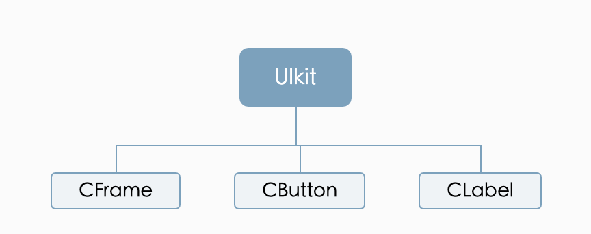
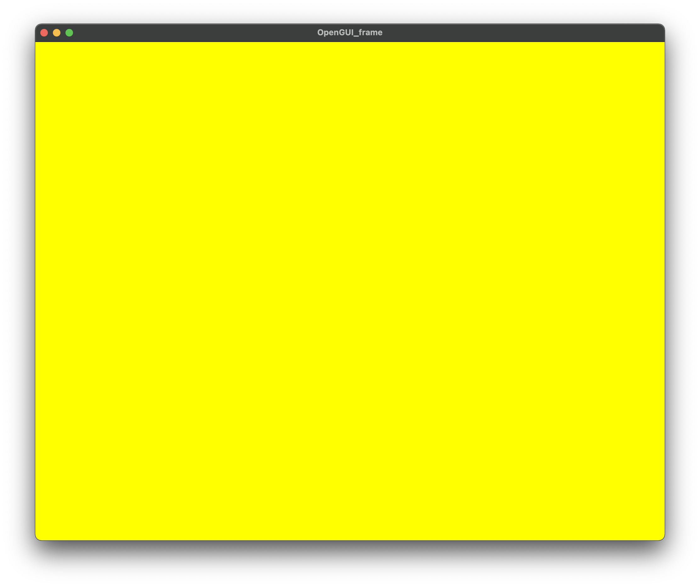
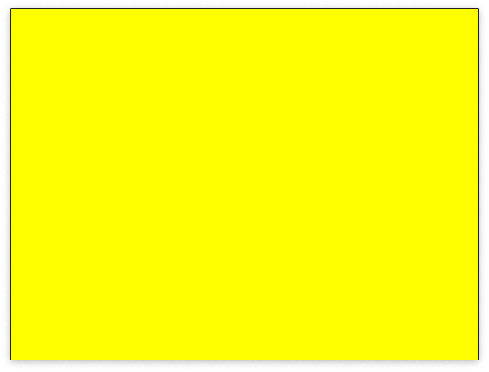
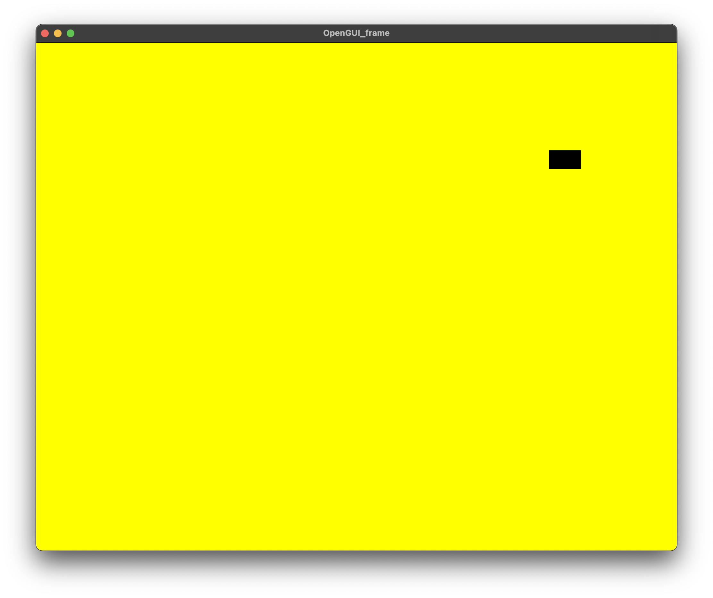
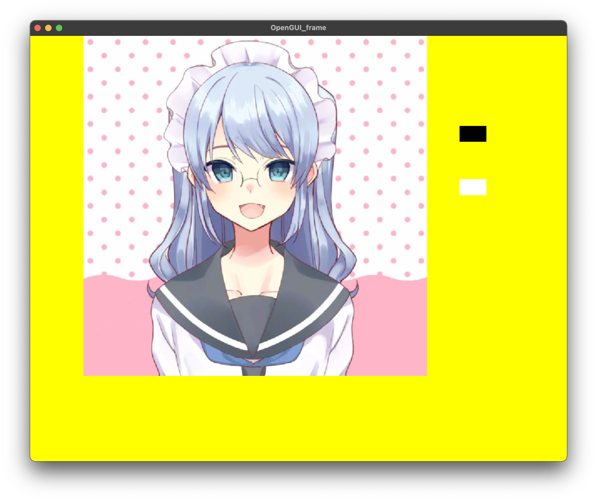
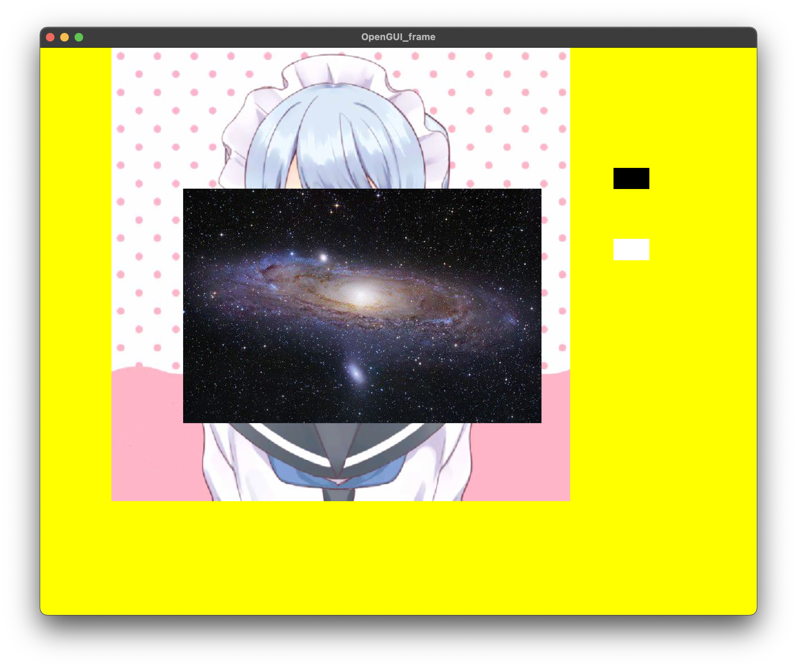
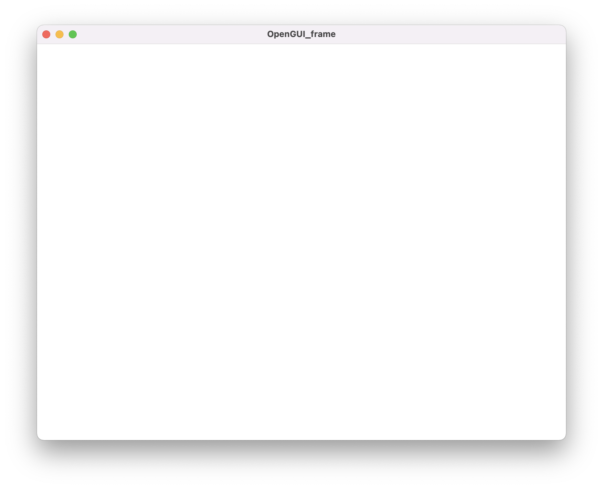
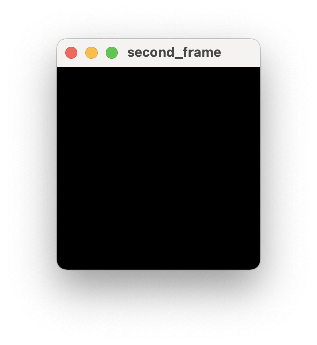

# CS205 C/C++ Final Project——OpenGUI

## 概况


#### 使用库：OpenGL / GLFW / GLEW / OpenCV / FreeType

##### 测试平台：`macOS BigSur`

### 版本号：v1.02

## C++ 程序设计课程期末大作业，基于 OpenGL 实现的 macOS 专属 UI 开发库

由于时间较为紧张，本库可能以后会作为我*个人项目*独立出来继续开发，但是目前我们仅实现部分功能。  
**特别鸣谢：OpenGUI 基于 GLFW、GLEW 和 OpenCV 等著名开源库实现，在此向相关开发人员表示感谢。**

---

# 目录

- [使用方法](#使用方法)
- [功能简介](#功能简介)
- [代码框架](#代码框架)
- [优点](#优点)
- [版本变动](#版本变动)

---

# 功能简介

本版程序目的希望实现在 macOS 下使用 C++ 可以十分流畅自然地编写一套可以随时套用的图形化界面库，避免任何可能因此导致冗余的问题。本程序完全基于 C++ 代码开发，并不使用 XML 等描述性语言。

初代版本计划实现的内容为四个模块：创建窗口、添加按钮、实现图像显示、实现鼠标键盘交互，下面对四个方面进行依次讲解。

- **完善的 CMake 支持**

  本项目为了所有使用库的用户考虑，尽可能将 CMake 编写较为详细，让您可以无忧使用本库。

```cmake
cmake_minimum_required(VERSION 3.12)
project(OpenGUI)
if(APPLE)
    message(STATUS "Welcome to use OpenGUI, your system is MacOS!")
else()
    message(FATAL_ERROR "We haven't supported your system yet")
endif()
set(CMAKE_CXX_STANDARD 14)
message(STATUS "Your path is ${PROJECT_SOURCE_DIR}")
set(OpenGL_Path ${PROJECT_SOURCE_DIR}/OpenGL)
message(STATUS "Finding the OpenGL...")
if(OpenGL_Path)
    message(STATUS "Found the OpenGL")
else()
    message(FATAL_ERROR "No OpenGL found!")
endif()
message(STATUS "Linking to the library...")
set(GLEW_H ${PROJECT_SOURCE_DIR}/OpenGL/glew/2.2.0/include/GL)
set(GLFW_H ${PROJECT_SOURCE_DIR}/OpenGL/glfw/3.3.2/include/GLFW)
set(GLTOOLS_H ${PROJECT_SOURCE_DIR}/OpenGL/GLTools)
find_package(OpenCV REQUIRED)
set(FreeType_H ${PROJECT_SOURCE_DIR}/OpenGL/FreeText/include/freetype2)
include_directories(${GLTOOLS_H} ${GLFW_H} ${GLEW_H} ${FreeType_H})
message(STATUS "Creating the Library...")
set(GLEW_LIB ${PROJECT_SOURCE_DIR}/OpenGL/glew/2.2.0/lib/libGLEW.2.2.dylib)
set(GLFW_LIB ${PROJECT_SOURCE_DIR}/OpenGL/glfw/3.3.2/lib/libglfw.3.dylib)
set(GLTOOLS_LIB ${PROJECT_SOURCE_DIR}/OpenGL/GLTools/libgltools.dylib)
set(FreeType_Lib ${PROJECT_SOURCE_DIR}/OpenGL/FreeText/lib/libfreetype.6.dylib)
link_libraries(${GLFW_LIB} ${GLTOOLS_LIB} ${GLEW_LIB} ${FreeType_Lib})

add_library(OpenGUI
    Header/OpenGUI_frame.hpp Frame/OpenGUI_frame.cpp
    Frame/OpenGUI_Button.cpp Header/OpenGUI_Button.hpp
    Frame/OpenGUI_label.cpp  Header/OpenGUI_label.hpp
    Header/Func.hpp Header/GUIroot.hpp Header/KeyBorad.hpp Header/Color.hpp)
message(STATUS "Linking the OpenGL...")
target_link_libraries(OpenGUI "-framework OpenGL")
target_link_libraries(OpenGUI "-framework GLUT")
target_link_libraries(OpenGUI ${OpenCV_LIBS})

message(STATUS "Enjoy your GUI trip")
```

- **创建窗口**

  您可以很简单地绘制一个窗口：

```cpp
#include <OpenGUI_frame.hpp>
CFrame test(1000, 800, 0, 0, "OpenGUI_frame");
test.setExitButton(KEY_ESCAPE);
test.setBackgroundColor(1, 1, 0, 1);
test.visualize();
```

我们使用 `CFrame` 作为本程序的基本窗口，所有本库实现都基于父类 `UIkit` 拓展，其代码关系图如下：



`UIkit` 下实现了基本的内容（xy 坐标、颜色等），可被公有继承。`CFrame` 作为本程序的基础框架，其主要函数如下：

```cpp
// 构造函数：窗口宽度, 窗口高度, 窗口相对屏幕 xy 坐标, 窗口标题
explicit CFrame(GLint width=800, GLint height=600, GLint x=0, GLint y=0, std::string title="OpenGUI_frame");

~CFrame();                                              // 析构函数，自动释放内存
void setExitButton(int button);                         // 设置退出窗口的按键
void addLabel(const CLabel &l);                         // 添加一个标签（显示图像）
void addButton(const CButton &b);                       // 添加一个按钮
void visualize();                                       // 窗口可视化（显示窗口）
void BigScreen();                                       // 全屏模式
void SmallScreen();                                     // 小屏模式
void Setsize(GLint width, GLint height);                // 重新设置窗口大小
void setBackgroundColor(float r, float g, float b, float a); // 设置背景颜色
```

本程序中一切颜色均使用 0–1 的 RGBA 浮点值，不支持 0–255 整数色。

如前文代码可以实现如下效果：



当然也可以全屏模式显示：



> **注意**：调用 `visualize()` 后，该函数会阻塞直到用户关闭窗口。如果需要并行执行其他逻辑，请使用多线程技术；本库支持多线程环境下运行。

---

- **添加按钮**

  通过如下代码即可创建一个按钮：

```cpp
CButton button("hi", 50, 30, 800, 200);
```

`CButton` 的主要函数如下：

```cpp
// 构造函数：按钮名称, 宽度, 高度, xy 坐标（相对窗口左上角）
CButton(std::string title="Button", unsigned width=100, unsigned int height=50,
        unsigned int x=0, unsigned int y=0);

~CButton();
void setBackgroundColor(float r, float g, float b, float a); // 设置按钮颜色
bool isClick(int MouseX, int MouseY);                        // 判断是否点击该按钮
void SetButtonFun(ButtonFun f);                              // 设置点击回调函数
```

**本库以左上角为坐标原点，使用屏幕像素坐标。**

按钮回调函数类型为 `bool (*)()` 的函数指针，例如：

```cpp
bool MyCallback() {
    std::cout << "Button clicked!" << std::endl;
    return true;
}
```

> 回调函数的返回值由您的业务逻辑决定，库本身不会因返回 `false` 而退出程序。

完整按钮示例：

```cpp
bool Test1() {
    std::cout << "Testing1" << std::endl;
    return true;
}

CButton button("hi", 50, 30, 800, 200);
button.setBackgroundColor(0, 0, 0, 1);
button.SetButtonFun(Test1);
test.addButton(button);
test.visualize();
```



黑色框为按钮，点击后会在控制台输出：

```shell
Testing1
```

---

- **图像显示**

  `CLabel` 支持在窗口中显示图像，通过如下代码创建：

```cpp
CLabel label("../img/test.bmp", true, 100, 0, 640, 640);
```

`CLabel` 的主要函数如下：

```cpp
// 构造函数：图像路径, img=true 表示图像模式, x, y, 宽度, 高度
CLabel(std::string str="", bool img=false, unsigned int x=0, unsigned int y=0,
       unsigned int width=50, unsigned int height=30);

void free(); // 提前释放图像内存（析构函数会自动释放，一般无需手动调用）
```

> **说明**：`CLabel` 支持 OpenCV 可读取的所有图像格式（BMP、JPEG、PNG 等）。`img` 参数目前必须为 `true`，文字模式尚未实现。

---

- **鼠标键盘交互**

  通过 `setExitButton` 可直接设置退出键，所有按键宏定义在 `KeyBorad.hpp` 中（例如 `KEY_ESCAPE`）。库内置鼠标点击检测，按钮被点击时自动触发对应回调（上升沿触发，按住不会重复触发）。

---

- **完整示例代码**

```cpp
#include <OpenGUI_label.hpp>
#include <OpenGUI_frame.hpp>
#include <OpenGUI_Button.hpp>
#include <KeyBorad.hpp>

CLabel label2("../img/timg1.jpeg", true, 200, 200, 500, 330);
CFrame test(1000, 800, 0, 0, "OpenGUI_frame");

bool Test1() {
    std::cout << "Testing1" << std::endl;
    return true;
}
bool Test2() {
    test.addLabel(label2);
    return true;
}

int main() {
    test.setExitButton(KEY_ESCAPE);
    test.setBackgroundColor(1, 1, 0, 1);

    CButton button("hi", 50, 30, 800, 200);
    CButton button2("hi", 50, 30, 800, 300);
    button.setBackgroundColor(0, 0, 0, 1);
    button.SetButtonFun(Test1);
    button2.setBackgroundColor(1, 1, 1, 1);
    button2.SetButtonFun(Test2);

    test.addButton(button);
    test.addButton(button2);

    CLabel label("../img/test.bmp", true, 100, 0, 640, 640);
    test.addLabel(label);
    test.visualize();
}
```

运行效果：



点击白色按钮后：



---

# 使用方法

### 本程序目前只支持 macOS，程序自带的库支持 macOS BigSur。如使用其他版本，请将对应版本的 OpenGL 相关 dylib 替换至 `lib` 目录下。

提供两种方式运行本程序：

**方式一：使用预编译库**

将 `release` 目录下的 `OpenGUI` 文件夹复制到您的工程项目中。

**方式二：从源码编译**

进入 `source` 目录，执行：

```shell
cmake .
make
```

看到以下输出即为编译成功：

```bash
-- Enjoy your GUI trip!
```

将生成的 `libOpenGUI.a` 和 `Header` 文件夹放入您的工程目录，并在编译时链接本库与 OpenGL、GLFW、GLEW、OpenCV 依赖。

**工程 CMakeLists.txt 参考**：

```cmake
cmake_minimum_required(VERSION 3.12)
project(test)
set(CMAKE_CXX_STANDARD 14)
set(GLEW_H   ${PROJECT_SOURCE_DIR}/OpenGUI/OpenGL/glew/2.2.0/include/GL)
set(GLFW_H   ${PROJECT_SOURCE_DIR}/OpenGUI/OpenGL/glfw/3.3.2/include/GLFW)
set(GLTOOLS_H ${PROJECT_SOURCE_DIR}/OpenGUI/OpenGL/GLTools)
set(FreeType_H ${PROJECT_SOURCE_DIR}/OpenGUI/FreeText/include/freetype2)
include_directories(${GLTOOLS_H} ${GLFW_H} ${GLEW_H} ${FreeType_H})
set(GLEW_LIB   ${PROJECT_SOURCE_DIR}/OpenGUI/OpenGL/glew/2.2.0/lib/libGLEW.2.2.dylib)
set(GLFW_LIB   ${PROJECT_SOURCE_DIR}/OpenGUI/OpenGL/glfw/3.3.2/lib/libglfw.3.dylib)
set(GLTOOLS_LIB ${PROJECT_SOURCE_DIR}/OpenGUI/OpenGL/GLTools/libgltools.dylib)
set(FreeType_Lib ${PROJECT_SOURCE_DIR}/OpenGUI/FreeText/lib/libfreetype.6.dylib)
link_libraries(${GLFW_LIB} ${GLTOOLS_LIB} ${GLEW_LIB} ${FreeType_Lib})
set(Header ${PROJECT_SOURCE_DIR}/OpenGUI/Header)
include_directories(${Header})
find_package(OpenCV REQUIRED)
add_executable(test main.cpp)
target_link_libraries(test ${PROJECT_SOURCE_DIR}/OpenGUI/lib/libOpenGUI.a ${OpenCV_LIBS})
target_link_libraries(test "-framework OpenGL")
target_link_libraries(test "-framework GLUT")
```

本程序理论上支持跨平台运行，但目前出于测试简易性仅支持 macOS，请期待未来版本。

---

# 代码框架

基于 C++ 语言特性，我们实现了易于维护的基本框架。所有常用函数均由 `.hpp` 头文件提供声明，`.cpp` 文件提供实现，并使所有类公有继承自基类 `UIkit`——维护时只需修改 `UIkit` 即可影响全局。命名风格参照 Java 的类命名规范，让代码具有较高的易读性。

类继承关系：

```
UIkit（基类）
├── CFrame   （窗口）
├── CButton  （按钮）
└── CLabel   （图像标签）
```

---

# 优点

- **极简 API**：几行代码即可绘制出您想要的图形界面

  例如一个 800×600 的窗口：  
  

  或者一个 200×200 的窗口：  
  

- **简单的回调函数绑定**：通过函数指针轻松绑定按钮点击事件，单次点击只触发一次回调

- **安全的内存管理**：采用 RAII 设计，析构函数自动释放所有资源（包括图像像素缓冲区）；实现了完整的拷贝构造与拷贝赋值，容器中存储控件对象时不会发生资源泄漏或双重释放

- **唯一 ID 保证**：每个控件对象在创建时自动分配全局唯一的整型 ID，不受构造顺序影响

- **优秀的代码结构**：通过公有继承保证了代码的稳定性与易维护性；所有子类对 `UIkit` 接口完全可见

---

# 版本变动

- **v 1.00**：程序第一次可以正常运行的初代版本，功能尚不完善，只能简单创建窗口。
- **v 1.01**：实现了图像绘制等内容，支持跨平台编译。
- **v 1.02**：全面修复代码缺陷，主要变更如下：
  - 修复 `CLabel` 析构函数为空导致的图像内存泄漏
  - 修复 `delete` 与 `new[]` 不匹配（改为 `delete[]`）
  - 修复 `_pixel` 未初始化为 `nullptr` 导致的野指针问题
  - 为 `CLabel` 实现拷贝构造函数与拷贝赋值运算符（Rule of Three），修复容器存储时的浅拷贝与双重释放
  - 修复全屏模式下显示器列表空指针解引用崩溃
  - 将全局鼠标坐标变量改为 `CFrame` 实例成员，消除多窗口数据竞争
  - 修复按钮点击命中区域 Y 轴方向判断错误
  - 修复按钮状态存储于副本而非容器内对象，导致点击逻辑失效
  - 改用上升沿检测替代错误的交替触发逻辑，按住不再重复触发
  - 修复 `glColor3f` 中绿色与蓝色通道顺序错误
  - 修复 `LinkedLists::get` 返回值副本改为引用，修复有符号/无符号比较警告
  - 修复 `srand/rand` 全局重置导致所有控件 ID 相同，改用原子递增计数器
  - `UIkit` 析构函数改为 `virtual`，防止多态删除时资源泄漏
  - 所有子类改为 `public` 继承 `UIkit`
  - `Color.hpp` 中多个颜色的 alpha 通道从 0 修正为 1
  - API 重命名：`addLable` → `addLabel`，构造参数 `weight` → `width`
  - 移除 `loadImg` 中冗余的 O(N) 初始化循环；增加图像加载失败检测
