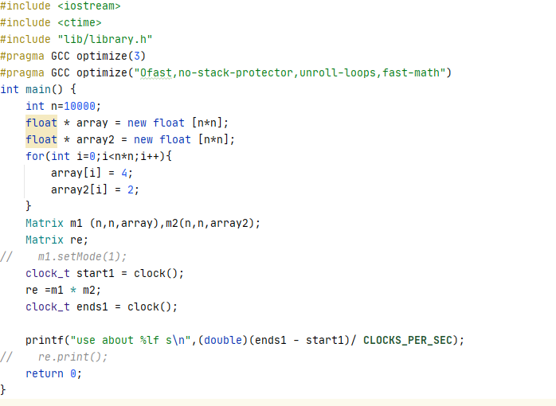
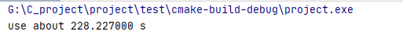
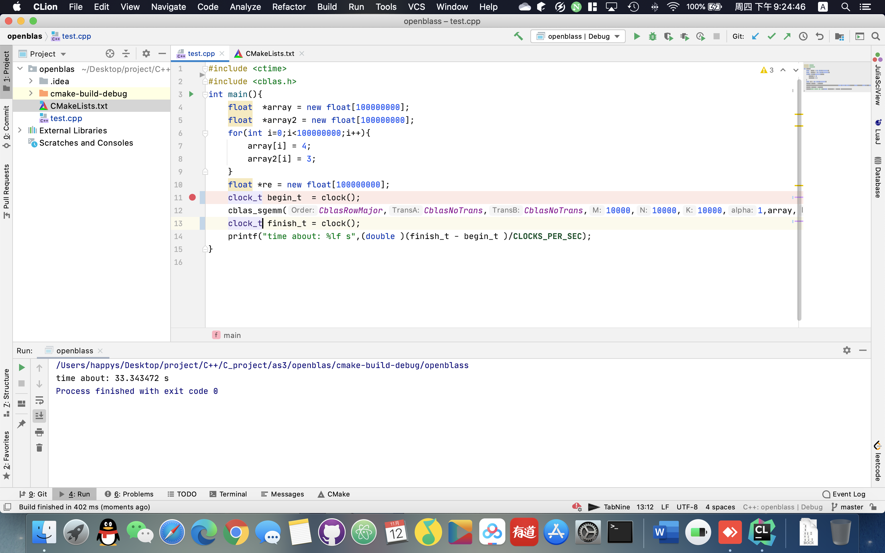

# CS205 C/C++ Programming Mid Project
## 概况


##### 测试平台：`windows10 x64` `macOS 10.15` `linux(Ubuntu)`
##### 编码：`UTF-8`
##### C++标准：`C++14`
## 目录
- [设计思路与分析](#设计思路与分析)
- [代码](#代码)
- [使用方法](#使用方法)
- [亮点与思考](#程序亮点与思考)
## 设计思路与分析
本次作业限制了数据的类型，只能使用float类型，考虑到各种平台的问题，我首先考虑的是跨平台性，同时由于是以库的形式呈现，所以我们在不同平台下均使用C++14标准对程序进行编译。       
##### 测试平台
操作系统：windows10 x64          
CPU： Intel Core i5 9400 （笔记本降频版本）       
内存：16G      
#### 基本框架
我首先实现了一个矩阵，对矩阵进行了简单初始化，为了方便用户使用这个程序，我们对程序的运算符进行了重载，作为一个方便使用的库进行设计。
`本程序是一个矩阵运算的库，并非可以执行的文件，你需要将其调用到你自己的代码中，使用方法可以参考`[使用方法](#使用方法)
#### 基本代码运行函数
本库包括了一个相对完整的矩阵类，你可以通过这个矩阵类实现你想实现的绝大部分矩阵方面的功能，由于库是为了实现通用性，我摒弃了个别不能跨平台的方法，最终设计出了这套矩阵运行库。       
我在做本次库的时候充分考虑了可能遇到的问题以及用户需求的不同，本套库的设计尽可能偏向用户的同时又能保证程序的运行高效自然。      
#### 实现的功能
本程序的函数可以参考library.h中的函数设计与注释（英文版）       
可以调用的函数列表如下：
```cpp
Matrix()：空参构造一个空的矩阵类，里面没有任何元素，不能直接使用       
Matrix(int row , int col,float * array):
构造一个指定内容的矩阵，row为行数，col为列数
Matrix(int row,int col);
构造一个初始化所有元素为0的row行col列的矩阵
~Matrix();
析构函数，保障不会内存溢出
void print();
输出当前矩阵，会按照行列对齐输出
void build(float* array);
对矩阵中的数组进行构建
Matrix& operator*(Matrix& right);
乘法重载，实现了两个矩阵的乘法，返回一个乘好的矩阵
Matrix& operator=(float* array);
等号重载，可以利用等号直接对矩阵进行赋值（注意必须提前规定好行列数目）
Matrix& operator+(Matrix& right);
加号重载，实现两个矩阵相加
Matrix& operator-(Matrix& right);
减号重载，实现两个矩阵相减
float* operator[](int i);
重载一个取值符，返回第i行的行数组
void clear();
清空整个矩阵，腾出内存空间
void set(int col,int row,float element);
设置位于row col位置的值为element
void setMode(int semode);
设置矩阵乘法的模式
一共有六种模式，下面会对这些模式讲解
0-普通模式
1-快速模式（分块）（要求方阵）
2-利用openmp并行
3-展开循环
4-展开更多循环并利用openmp
5-avx2指令集和openmp同时加速
inline float Getelement(int col,int row);
获取row行col列的元素值
```
#### 对于矩阵乘法我们的优化主要是从以下方面进行优化         
- 优化硬件处理（有关访存方面）
- 展开运算（主要是for循环）
- 并行计算（采取了openmp的并行库）
- 针对硬件平台进行优化（使用Intel的SIMD）
- 针对CPU缓存相关处理（处理个别超过cache的矩阵）       
本程序默认打开了编译器的极限最优化设置  
测试代码的截图如下  

所有测试结果均在下文中写出，相关截图也一并给出。
```cpp
#pragma GCC optimize("Ofast,no-stack-protector,unroll-loops,fast-math")
```
矩阵乘法我们首先来看一下最朴素的算法，三层循环嵌套ijk式
```cpp
for (int i = 0; i < f1; i++) //i表示第i行
 {
  for (int j = 0; j < s2; j++) //j表示第j列
  {
   result[i*f2 + j] = 0;  //在这里 result[i][j] = result[i*f2+j];
   for(int p=0;p<f2;p++)
   {
    result[i*f2 + j] +=left[i*f2+p]*right[p*f2+j];
   }
  }
 }
```
利用这个方法，我们可以实现极其简单的矩阵乘法，没有优化，我尝试以此方法运行一个10000*10000的矩阵乘法，运行了大概两个小时仍然没有出结果，选择放弃，证明了直接使用一个标准方法去运算是没有意义的。         
接下来使用第一个优化算法
##### 内存寻址优化
我们经过测试后，发现不同的寻址方法可以对时间有较大的影响，如下表格可以列出：
|顺序|时间|
|-|-|
|ijk|9.6|
|ikj|3.7|
|jik|16.1|
|jki|33.4|
|kij|3.9|
|kji|32.9|
CPU读数据时，并不是直接访问内存，而是先查看缓存中是否有数据，有的话直接从缓存读取。而从缓存读取数据比从内存读数据快很多。       
通过这样修改后，我们可以获取一个较大的提升。

从图中我们可以看出，经过优化后，我们得到了暂时可以接受的时间。
##### openmp模式
在上面程序运行过程中，我们可以发现30-40%的CPU占用率，并不能挤满整个CPU，所以我们需要
##### 循环展开

##### avx指令集

##### 矩阵分块（cache优化）

## 代码
```cpp
/*
* library.h
* author : happys
*/
#ifndef SOURCE_LIBRARY_H
#define SOURCE_LIBRARY_H
//header your should include!
/*
 * normally open O3
 * */
#pragma GCC optimize(3)
#pragma GCC optimize("Ofast,no-stack-protector,unroll-loops,fast-math")
/*
 * report error
 * */
inline void  Error(int type);
class Matrix{
private:
    int col;//column of the matrix
    int row;//row of the matrix
    float* matrix;//matrix itself
    /*
    * The numerical mode represents the mode of operation required by the user
    * 0: normal mode(don't use any advanced method)
    * 1: quick mode
    * 2: open_MP mode(much powerful mode)
    * 3: open mode ( so tricks to speed up )
    * 4: open super (open mode with open MP)
    * 5: super MP_Quick mode
    * */
    int mode = 0;
    void Quick(Matrix* right,Matrix* result);
    void packMatrix(int n, float *A, float *B, float *C,int BLOCKSIZE);
    void open_do(Matrix* right,Matrix* result);
    void open_mp(Matrix* right,Matrix* result);
    void Open_super(Matrix* right,Matrix* result);
    void Super_quick(Matrix* right,Matrix* result);
    void N_do(Matrix* right,Matrix* result);
public:
    //create an empty matrix
    Matrix();
    //Create an matrix with col and row and matrix itself
    Matrix(int row , int col,float * array);
    // Create an matrix with col and row
    Matrix(int row,int col);
    // Delect an matrix
    ~Matrix();
    // Some functions to use
    void print();//print this matrix
    void build(float* array);
    Matrix& operator*(Matrix& right);//multiple
    Matrix& operator=(float* array);//equal
    Matrix& operator+(Matrix& right);//add
    Matrix& operator-(Matrix& right);//minus
    float* operator[](int i);
    void clear();
    void set(int col,int row,float element);
    void setMode(int semode);
    inline float Getelement(int col,int row);

};
#endif //SOURCE_LIBRARY_H
/*
* library.cpp
* author : happys
*/
#include "library.h"
#include <iostream>
#include <omp.h>
#include <immintrin.h>
#define A(i,j) a[ (j)*lda + (i) ]
#define B(i,j) b[ (j)*ldb + (i) ]
#define C(i,j) c[ (j)*ldc + (i) ]
const int ThreadNUM = 16;
#pragma GCC optimize(3)
#pragma GCC optimize("Ofast,no-stack-protector,unroll-loops,fast-math")
inline void Error(int type){
    printf("Error code : %d ",type);
    switch (type) {
        case 1:
            printf("You can't multiply these two matrices!\n");
            break;
        case 2:
            printf("you can't add those two matrices!\n");
            break;
        case 3:
            printf("you can't minus those two matrices!\n");
            break;
        case -2:
            printf("wrong mode number please check your code, this time will use mode 0 to do!\n");
            break;
        case -1:
            printf("Not support, this time will use mode 0 to do!\n");
            break;
        default:
            printf("unknown error!\n");
    }
}

Matrix::Matrix(int row , int col,float * array) {
    this->col = col;
    this->matrix = array;
    this->row = row;
}

void Matrix::setMode(int semode) {
    this->mode = semode;
}
void Matrix::build(float *array) {
    this->matrix = array;
}
void Matrix::N_do(Matrix* right, Matrix* result) {
    /*
     * ikj mode
     * */
    float r ;
    int i,j,k;
    int lrow,rrow,rcol;
    lrow = this->row;
    rrow = right->row;
    rcol = right->col;
    for(i=0;i<lrow;++i){
        for(k = 0;k<rrow;++k){
            r = this->matrix[i*this->col+k];
            for(j=0;j<rcol;++j){
                result->matrix[i*result->col+j] += (r*right->matrix[k*right->col+j]);
            }
        }
    }
}

Matrix& Matrix::operator=(float *array) {
    if(col==0||row==0){
        printf("please set the col and row number before you want to do something! ");
        return *new Matrix();
    } else{
        this->matrix = array;
        return *this;
    }
}

Matrix::Matrix(int row, int col) {
    this->col = col;
    this->row =row;
    int len = col*row;
    matrix = new float [len];
    for(int i=0;i<len;i++){
        matrix[i] =0;
    }
}
Matrix::Matrix() {
    row = 0;
    col = 0;
}
Matrix::~Matrix() {
    delete [] matrix;
}
void Matrix::print() {
    for (int i=0;i<row;i++){
        for(int j=0;j<col;j++){
            printf("%-10f ",matrix[j+i*col]);
        }
        printf("\n");
    }
}
void Matrix::set(int row,int col,float element){
    matrix[(col-1)+(row-1)*this->col] = element;
}
void Matrix::clear() {
    delete [] matrix;
    col = 0;
    row = 0;
    mode = 0;
}

Matrix& Matrix::operator+(Matrix &right){
    if(this->row!=right.row||this->col!=right.col){
        Error(2);
        return *new Matrix();
    } else{
        Matrix *m = new Matrix(this->row, this->col);
        for(int r=0;r<this->row;r++){
            for(int c=0;c<this->col;c++){
                m->set(c+1,r+1,this->matrix[r*this->col+c]+right.matrix[r*right.col+c]);
            }
        }
        return *m;
    }
}
Matrix& Matrix::operator-(Matrix &right) {
    if(this->row!=right.row||this->col!=right.col){
        Error(2);
        return *new Matrix();
    } else{
        Matrix *m= new Matrix(this->row, this->col);
        for(int r=0;r<this->row;r++){
            for(int c=0;c<this->col;c++){
                m->set(c+1,r+1,this->matrix[r*this->col+c]-right.matrix[r*right.col+c]);
            }
        }
        return *m;
    }
}
Matrix& Matrix::operator*(Matrix &right) {
    if (this->col != right.row){
        Error(1);
        return *new Matrix();
    }
    int mode = this->mode;

    Matrix *returnm= new Matrix(this->row,right.col);
    switch (mode) {
        case 0:
            N_do( &right,returnm);
            break;
        case 1:
            Quick(&right,returnm);
            break;
        case 2:
            open_mp(&right,returnm);
            break;
        case 3:
            open_do(&right,returnm);
            break;
        case 4:
            Open_super(&right,returnm);
            break;
        case 5:
            Super_quick(&right,returnm);
            break;
        default:
            Error(-2);
    }
    return *returnm;
}
inline float Matrix::Getelement(int col, int row) {
    return matrix[(col-1)+(row-1)*this->col];
}

float* Matrix::operator[](int i) {
    auto *re = new float [this->col];
    for(int j=0;j<this->col;j++){
        re[j] = matrix[(i-1)*this->col+j];
    }
    return re;
}

void Matrix::open_do( Matrix *right, Matrix *result) {
    float* b0,*r0,r;
    int i,j,k;
    int lrow,rrow,rcol;
    lrow = this->row;
    rrow = right->row;
    rcol = right->col;
#pragma omp parallel for num_threads(ThreadNUM)
    for(i=0;i<lrow;++i){
        for(k = 0;k<rrow;++k){
            r = this->matrix[i*this->col+k];
            for(j=0;j<rcol;++j){
                if (rcol-j>=8){
                    b0 = &right->matrix[k*right->col+j];
                    r0 = &result->matrix[i*result->col+j];
                    *r0 += (r * *b0++);
                    r0++;
                    *r0 += (r * *b0++);
                    r0++;
                    *r0 += (r * *b0++);
                    r0++;
                    *r0 += (r * *b0++);
                    r0++;
                    *r0 += (r * *b0++);
                    r0++;
                    *r0 += (r * *b0++);
                    r0++;
                    *r0 += (r * *b0++);
                    r0++;
                    *r0 += (r * *b0++);
                    r0++;
                    j+=7;
                    continue;
                }
                result->matrix[i*result->col+j] += (r*right->matrix[k*right->col+j]);
            }
        }
    }
}

void Matrix::open_mp( Matrix *right, Matrix *result) {
    float r ;
    int i,j,k;
    int lrow,rrow,rcol;
    lrow = this->row;
    rrow = right->row;
    rcol = right->col;
#pragma omp parallel for num_threads(ThreadNUM)
    for(i=0;i<lrow;++i){
        for(k = 0;k<rrow;++k){
            r = this->matrix[i*this->col+k];

            for(j=0;j<rcol;++j){
                result->matrix[i*result->col+j] += (r*right->matrix[k*right->col+j]);
            }
        }
    }
}

void Matrix::Open_super( Matrix *right, Matrix *result) {
    float* b0,*r0,r;
    int i,j,k;
    int lrow,rrow,rcol;
    lrow = this->row;
    rrow = right->row;
    rcol = right->col;
#pragma omp parallel for num_threads(ThreadNUM)
    for(i=0;i<lrow;++i){
        for(k = 0;k<rrow;++k){
            r = this->matrix[i*this->col+k];
            if(r==0){
                continue;
            }
            for(j=0;j<rcol;++j){
                if (rcol-j>=16){
                    b0 = &right->matrix[k*right->col+j];
                    r0 = &result->matrix[i*result->col+j];
                    *r0 += (r * *b0++);
                    r0++;
                    *r0 += (r * *b0++);
                    r0++;
                    *r0 += (r * *b0++);
                    r0++;
                    *r0 += (r * *b0++);
                    r0++;
                    *r0 += (r * *b0++);
                    r0++;
                    *r0 += (r * *b0++);
                    r0++;
                    *r0 += (r * *b0++);
                    r0++;
                    *r0 += (r * *b0++);
                    r0++;
                    *r0 += (r * *b0++);
                    r0++;
                    *r0 += (r * *b0++);
                    r0++;
                    *r0 += (r * *b0++);
                    r0++;
                    *r0 += (r * *b0++);
                    r0++;
                    *r0 += (r * *b0++);
                    r0++;
                    *r0 += (r * *b0++);
                    r0++;
                    *r0 += (r * *b0++);
                    r0++;
                    *r0 += (r * *b0++);
                    r0++;
                    j+=15;
                    continue;
                }
                else if (rcol-j>=8){
                    b0 = &right->matrix[k*right->col+j];
                    r0 = &result->matrix[i*result->col+j];
                    *r0 += (r * *b0++);
                    r0++;
                    *r0 += (r * *b0++);
                    r0++;
                    *r0 += (r * *b0++);
                    r0++;
                    *r0 += (r * *b0++);
                    r0++;
                    *r0 += (r * *b0++);
                    r0++;
                    *r0 += (r * *b0++);
                    r0++;
                    *r0 += (r * *b0++);
                    r0++;
                    *r0 += (r * *b0++);
                    r0++;
                    j+=7;
                    continue;
                }
                result->matrix[i*result->col+j] += (r*right->matrix[k*right->col+j]);
            }
        }
    }
}

void Matrix::Super_quick(Matrix *right, Matrix *result) {

    int i;
    int lrow;
    int rrow,rcol;
    lrow = this->row;
    rrow = right->row;
    rcol = right->col;
    float r;
    lrow = this->row;
#pragma omp parallel for num_threads(8)
    for(i=0;i<lrow;++i){
        if(i == lrow-1){
            float* b0,*r0,r;
            for(int k = 0;k<rrow;++k){
                r = this->matrix[i*this->col+k];
                if(r==0){
                    continue;
                }
                for(int j=0;j<rcol;++j){
                    if (rcol-j>=8){
                        b0 = &right->matrix[k*right->col+j];
                        r0 = &result->matrix[i*result->col+j];
                        *r0 += (r * *b0++);
                        r0++;
                        *r0 += (r * *b0++);
                        r0++;
                        *r0 += (r * *b0++);
                        r0++;
                        *r0 += (r * *b0++);
                        r0++;
                        *r0 += (r * *b0++);
                        r0++;
                        *r0 += (r * *b0++);
                        r0++;
                        *r0 += (r * *b0++);
                        r0++;
                        *r0 += (r * *b0++);
                        r0++;
                        j+=7;
                        continue;
                    }
                    result->matrix[i*result->col+j] += (r*right->matrix[k*right->col+j]);
                }
            }

        }else{
            const float* b0;
            float *r0;
            for(int k = 0;k<rrow;++k){
                __m256 r;
                __m256 bt;
                __m256 c0;
                r = _mm256_loadu_ps(&matrix[i * col + k]);
                b0 = &right->matrix[k * right->col];
                for (int j = 0; j < rcol; ++j) {
                    if (rcol - j >= 8) {
                        r0 = &result->matrix[i * result->col];
                        c0 = _mm256_loadu_ps(r0 + j);
                        bt = _mm256_loadu_ps(b0 + j);
                        c0 += (r*bt);
                        _mm256_storeu_ps(r0 + j, c0);
                        j += 7;
                    } else {
                        result->matrix[i * result->col + j] += (matrix[i * col + k] *
                                                                right->matrix[k * right->col + j]);
                    }
                }
            }
        }
    }
}
void Matrix::packMatrix(int n, float *A, float *B, float *C,int BLOCKSIZE) {
    for(int i = 0; i < BLOCKSIZE; i++)

    {
        for(int j = 0; j < BLOCKSIZE; j++)

        {
            float cij = C[i*n+j];
            for(int k = 0; k < BLOCKSIZE; k++ ){
                if(BLOCKSIZE - k>=8){
                    __m256 r;
                    __m256 bt;
                    __m256 c0;
                    r = _mm256_loadu_ps(&A[i*n]+k);
                    bt = _mm256_loadu_ps(&B[j]+k*n);
                    c0 += r*bt;
                    cij += (c0[1]+c0[2]+c0[0]+c0[3]+c0[4]+c0[5]+c0[6]+c0[7]);
                    k+=7;
                    continue;
                }
                cij +=A[i*n+k] * B[k*n + j];
            }
            C[i*n+j] = cij;

        }

    }
}

void Matrix::Quick(Matrix *right, Matrix *result) {
    int BLOCKSIZE = 0;
    float *A,*B,*C;
    int n = result->col;
    A = matrix;
    B = right->matrix;
    C = result->matrix;
    if(n<1000){BLOCKSIZE = n;}
    else{
        if (n%200 ==0){BLOCKSIZE=200;}
        else if(n%160 == 0){BLOCKSIZE=160;}
        else if (n%80 == 0){BLOCKSIZE =80;}
        else if(n%40 == 0){BLOCKSIZE = 40;}
        else if(n%32 == 0){BLOCKSIZE = 32;}
        else if(n%24 == 0){BLOCKSIZE = 24;}
        else if(n%16 == 0){BLOCKSIZE = 16;}
        else if(n%10 == 0){BLOCKSIZE = 10;}
        else if(n%8 == 0){BLOCKSIZE = 8;}
        else if (n%5 == 0){BLOCKSIZE = 5;}
        else if (n%3 == 0){BLOCKSIZE = 3;}
       else if(n%2==0){BLOCKSIZE = 2;}
       else {
           Super_quick(right,result);
            return;
       }
    }
#pragma omp parallel for num_threads(8)
    for ( int sj = 0; sj < n; sj += BLOCKSIZE )
#pragma omp parallel for num_threads(8)
        for ( int si = 0; si < n; si += BLOCKSIZE )
#pragma omp parallel for num_threads(8)
            for ( int sk = 0; sk < n; sk += BLOCKSIZE )
                packMatrix(n, A+si*n+sk, B+sk*n+sj,  C+si*n+sj,BLOCKSIZE);

}
```
```cmake
# cmakeList
cmake_minimum_required(VERSION 3.17)
project(matrix)
FIND_PACKAGE( OpenMP REQUIRED)
if(OPENMP_FOUND)
    message("OPENMP FOUND")
    set(CMAKE_C_FLAGS "${CMAKE_C_FLAGS} ${OpenMP_C_FLAGS} -mfma")
    set(CMAKE_CXX_FLAGS "${CMAKE_CXX_FLAGS} ${OpenMP_CXX_FLAGS} -mfma")
    set(CMAKE_EXE_LINKER_FLAGS "${CMAKE_EXE_LINKER_FLAGS} ${OpenMP_EXE_LINKER_FLAGS} -mfma ")
endif()
set(CMAKE_CXX_STANDARD 14)


add_library(matrix library.cpp library.h)
```
## 使用方法
`本程序采用的Cmake版本为3.17与现有部分操作系统上的版本有所不同，请自行更新您的cmake版本`
本次代码采取了封装为库的思路，通过将代码进行库封装，可以非常简单的进行代码迁移，本程序的test文件中示范了一个简单的方法将程序加入到您的工程之中，并不会影响您的其他代码。
您的可以采用两种方法来使用本程序：
- 通过本地的cmake编译器对源代码进行编译（强烈推荐）
- 通过已经打包好的三种库进行运行（不能保证其他平台的运行正常）
本地编译请将您的控制台（终端）程序定位到本程序的source文件下通过以下指令编译我们生成的库
```shell
cmake CMakeLists.txt
make
```
`我们这里需要强调的是，由于macOS下自带的clang编译器并不支持我们使用的openmp，所以这里给出了一个教程帮助您在您的Mac上构建您的程序`
- 将您的控制台移动到source的文件下
- 安装gcc
```shell
brew install gcc
```
- 使用如下命令编译我们的库
```shell
gcc-10  -c -fopenmp -mfma library.cpp -o libmatrix.o
ar rcs libmatrix.a *.o
```
这样您就可以在您的Mac上使用这个库了
对于windows和Linux只需要在您的PC上安装好即可，自带默认会打开openmp和Intel的优化
`本程序目前暂时不全面支持apple silicon以及arm构架的芯片，这与我们使用了Intel的指令集有关系，预期会在下一个版本进行更新`
## 程序亮点与思考
#### 与openblas对比学习
本次程序完成之后，对openblas的效率和我进行了对比

由此可见，我们和openblas的差距较大，我参考了一部分的openblas思路,如下链接中提供了很多思路
[openblas矩阵乘法](#https://www.leiphone.com/news/201704/Puevv3ZWxn0heoEv.html)         
尽管尽可能的去贴近openblas中的思路，但是效率仍然差了几倍效率，可能是针对不同CPU的优化不能做到，主要是对底层对内容不能熟练运用，包括汇编语言不会使用。
#### float和double
这次做实验我看出了float和double的不同差距，尤其是运算效率上，可能是float本身的数据量比较小，就会更加容易运算
#### 底层影响
这次实验中最影响的地方是一个过去很少关注，尤其是用惯了Java等编程语言时没有关注过的一个地方，就是对CPU读取的理解，尤其是访存等方面。
#### 大小数据差异
本次程序运行的时候，会明显发现大数据和小数据的差异，在1000x1000的矩阵乘法的时候，运行时间远低于s这个单位，但是仅仅是扩大了十倍，10000x10000就达到了惊人的百秒，这也让我知道在以后写代码进行调试的时候应该采用更大的数据量运行
#### 兼容性与效率
本次程序在设计之初的目的是实现一个更加通用的矩阵乘法计算库，我认为不能被平台，硬件等方面对程序本身造成限制，所以我在设计这个库的时候，直接放弃了CUDA设计，转向单纯对CPU的优化，CUDA的设计虽然会成千上万的提高程序效率，但是这样也限制了硬件的英伟达显卡，由于我本身就是macOS的用户，所以我并不希望被这个限制，所以一开始就没有去设计CUDA版本，兼容性和效率之间妥协完成了本通用库。
#### 